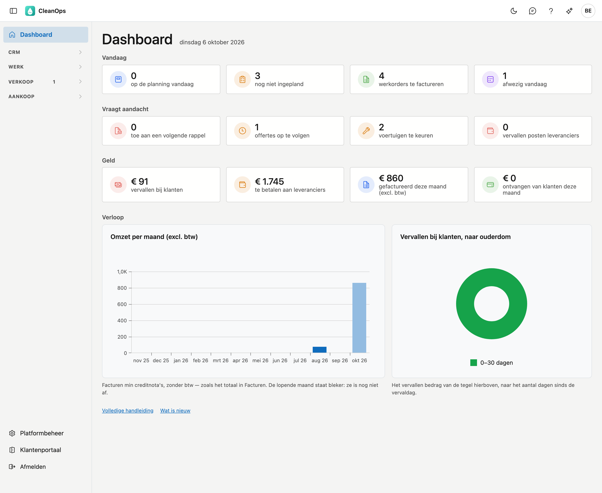

# Dashboard

Het dashboard is het eerste scherm na het aanmelden. U ziet in één oogopslag wat er vandaag gebeurt, wat uw aandacht
vraagt, hoe het met het geld staat en hoe de laatste twaalf maanden verliepen. Elke tegel is een snelkoppeling: één klik
opent de lijst die precies dat getal toont.

## Het scherm openen

Het dashboard opent vanzelf na het aanmelden. Van elders bereikt u het via **Dashboard**, bovenaan het menu links.

Bovenaan staat de datum van vandaag. Alle cijfers gaan over die dag.

## Vandaag

| Tegel | Wat het telt | Een klik opent |
|---|---|---|
| op de planning vandaag | de werkorders die vandaag gepland staan en nog niet uitgevoerd zijn | de [planningslijst](planning.md#de-planningslijst) op de dag van vandaag |
| nog niet ingepland | de werkorders met de status **Ingegeven** | de [werkorders](werkorders.md) op de status **Ingegeven** |
| werkorders te factureren | het uitgevoerde werk dat op een factuur wacht, tot en met vandaag — zonder wat contant betaald werd | [Facturatie](facturatie.md) |
| afwezig vandaag | de medewerkers die vandaag verlof hebben | de [verlofkalender](verlofkalender.md) |

## Vraagt aandacht

| Tegel | Wat het telt | Een klik opent |
|---|---|---|
| toe aan een volgende rappel | de posten die al een rappel kregen en aan de volgende toe zijn — hetzelfde getal als in het menu | de [openstaande posten](openstaande-posten.md) op **Volgende rappel** |
| offertes op te volgen | de verstuurde offertes waarvan de opvolgdatum vandaag is of voorbij | de [offertes](offertes.md) op **Op te volgen** |
| voertuigen te keuren | de voertuigen waarvan de keuring verlopen is of binnen 30 dagen valt | de [voertuigen](beheer/voertuigen.md) op **Te keuren** |
| vervallen posten leveranciers | de aankoopdocumenten waarvan de vervaldag voorbij is en die nog open staan | de [openstaande posten leveranciers](openstaande-posten-leveranciers.md) op **Vervallen** |

Een **0** blijft staan: ook "niets te doen" is een antwoord.

## Geld

| Tegel | Wat het telt | Een klik opent |
|---|---|---|
| vervallen bij klanten | het openstaande bedrag van de posten op **Vervallen** | de [openstaande posten](openstaande-posten.md) op **Vervallen** |
| te betalen aan leveranciers | wat u uw leveranciers nog verschuldigd bent, min de creditnota's die zij u nog moeten terugbetalen | de [openstaande posten leveranciers](openstaande-posten-leveranciers.md) |
| gefactureerd deze maand (excl. btw) | de facturen min de creditnota's van de lopende maand, zonder btw | de [facturen](facturen.md) op **Deze maand** |
| ontvangen van klanten deze maand | de betalingen van klanten in de lopende maand, min de terugbetalingen | de [betalingen](betalingen.md) op **Deze maand**, enkel de klanten |

Bedragen staan op het dashboard in hele euro's. De lijst toont hetzelfde bedrag tot op de cent.

!!! note "Te betalen staat in de lijst met een min"
    In de openstaande posten leveranciers staan de bedragen zoals op uw bankuittreksel: een factuur die u nog moet
    betalen, is negatief. Het saldo onderaan is dus een negatief bedrag. Op het dashboard heet hetzelfde bedrag
    *te betalen*, zonder min.

## Verloop

Twee grafieken over de laatste twaalf maanden. De lopende maand staat **bleker**: ze is nog niet af.

- **Omzet per maand (excl. btw)** — per maand de facturen min de creditnota's, zonder btw. De laatste staaf is het bedrag
  van de tegel *gefactureerd deze maand*.
- **Vervallen bij klanten, naar ouderdom** — het bedrag van de tegel *vervallen bij klanten*, verdeeld naar het aantal
  dagen sinds de vervaldag: 0–30 dagen, 31–60, 61–90, 91–365 en meer dan een jaar. Van groen naar donkerrood: hoe
  langer vervallen, hoe ernstiger.

Mag u geen facturatie zien maar wel de werkorders, dan staat links **Werkorders per maand**: de werkorders met een
planningsdatum in die maand, ongeacht hun status.

## Wat u ziet, hangt af van uw rechten

U ziet enkel de tegels en grafieken van de lijsten die u mag openen. Een tegel die u ziet, kunt u dus altijd aanklikken.
Een blok zonder één tegel verschijnt niet. Hebt u voor geen enkel blok een recht, dan ziet u enkel een welkomstzin; het
menu links toont de schermen die u wél mag openen.

## Veelgemaakte fouten

!!! warning "Het getal op de tegel verschilt van de lijst"
    De tegel opent de lijst met de juiste filter. Wijzigt u daarna een filter of het zoekveld, dan toont de lijst iets
    anders. Klik opnieuw op de tegel om met dezelfde selectie te beginnen.

!!! warning "Er staat … in plaats van een getal"
    Dat cijfer kon niet berekend worden, en dan staat er de melding *mogelijk onvolledig*. CleanOps toont dan bewust
    geen 0, want een 0 zou een rustige dag beloven die misschien geen rustige dag is. Laad het scherm na een ogenblik
    opnieuw.

!!! warning "De lopende maand lijkt laag"
    Ze is nog niet af. Daarom staat ze bleker in de grafiek. Vergelijk ze pas met een vorige maand als ze voorbij is.

## Zie ook

- [Werkorders](werkorders.md)
- [Planning](planning.md)
- [Openstaande posten](openstaande-posten.md)
- [Openstaande posten leveranciers](openstaande-posten-leveranciers.md)
- [Facturen](facturen.md)
- [Betalingen](betalingen.md)
