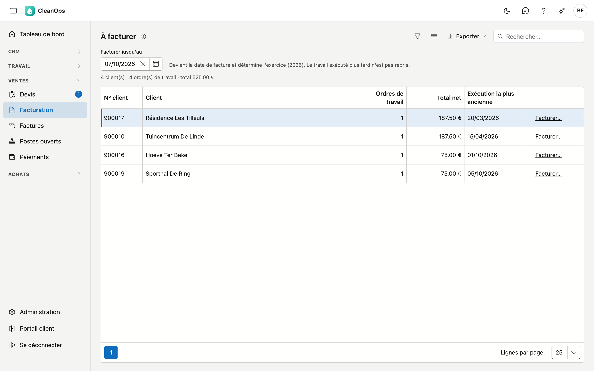
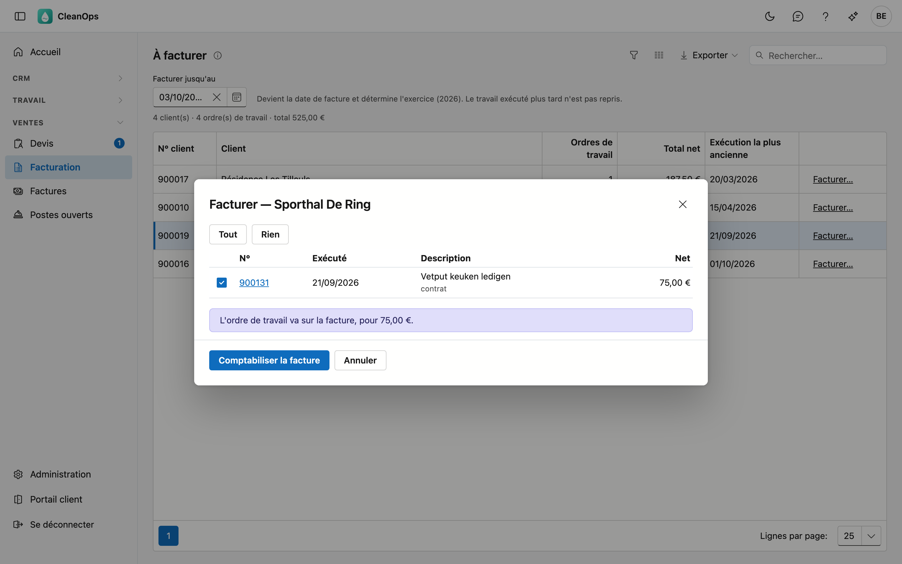

# Facturation

Sur Facturation, vous facturez le travail exécuté. Vous voyez par client les ordres de travail à facturer, vous choisissez ce
qui va sur la facture et vous la comptabilisez. La facture reçoit immédiatement son numéro, son échéance et sa communication
structurée.

## Ouvrir l'écran

Dans le menu de gauche, sous **Ventes**, cliquez sur **Facturation**. Vous le voyez avec le rôle **Financieel** ou en tant
qu'administrateur. Comptabiliser des factures demande en plus le droit *Établir des factures* ; par défaut, seul l'administrateur
l'a.

## Ce qu'il y a à facturer

La liste affiche par client les ordres de travail au statut **À facturer** : du travail avec une date d'exécution qui ne figure
pas encore sur une facture. Le travail payé au comptant n'y figure pas, car il est déjà payé.

| Colonne | Contenu |
|---|---|
| N° client, Client | Pour qui. Double-cliquez pour ouvrir la fiche client. |
| Ordres de travail | Le nombre d'ordres de travail à facturer pour ce client. |
| Total net | Leur montant hors TVA. |
| Exécution la plus ancienne | Le travail qui attend depuis le plus longtemps. |

### Facturer jusqu'au

En haut figure la date **Facturer jusqu'au**, par défaut aujourd'hui. Elle fait trois choses :

- elle devient la **date de facture** ;
- elle détermine l'**exercice** ;
- le travail exécuté **plus tard** n'est pas repris.

Une date à plus de 50 jours dans le futur est refusée. Plus de 51 jours dans le passé est possible, mais CleanOps vous avertit.

## Comptabiliser une facture

Cliquez sur **Facturer…** à côté du client. La fenêtre affiche ses ordres de travail à facturer, tous cochés.

- Décochez ce qui ne doit pas (encore) aller sur la facture ; **Tout** et **Rien** cochent ou décochent tout en une fois. Ce
  que vous décochez reste à facturer.
- Sous la description figure en rouge ce qui manque : **attestation manquante**, **sans montant**, **sans code TVA**. Un ordre
  de travail sans montant ou sans code TVA ne peut pas être comptabilisé.
- Cliquez sur **attestation manquante**, ou sur **attestation** en vert s'il y en a déjà une, pour ouvrir les
  [attestations](attesten.fr.md) de cet ordre de travail dans un nouvel onglet. Votre choix dans la fenêtre reste tel quel.
- **rapport caméra requis** et **contrat** sont des mentions.
- Cliquez sur le numéro pour ouvrir l'ordre de travail dans un nouvel onglet et le corriger.

Cliquez sur **Comptabiliser la facture** et confirmez. La facture reçoit le numéro suivant ; elle ne peut ensuite être corrigée
que par une note de crédit. La facture s'ouvre aussitôt avec l'aperçu avant impression (voir
[Factures](facturen.fr.md#imprimer)).

### Ce qui se passe à la comptabilisation

- Chaque ordre de travail devient une ligne, avec le tarif, la quantité et le prix de l'ordre de travail.
- La **TVA** est additionnée par code TVA.
- L'**échéance** découle du délai de paiement du client.
- La facture reçoit une **communication structurée** et un poste ouvert.
- Si une ligne porte **6 % de TVA**, la phrase d'attestation figure sur la facture. À **0 %**, la mention d'autoliquidation
  figure sur l'impression.
- Les ordres de travail passent à **Facturé**, avec le numéro de facture.

Si le total net est négatif, le document devient une **note de crédit**.

## Acomptes

Vous établissez une facture d'acompte sur la [fiche client](klanten.fr.md#les-boutons-en-bas) avec **Facture d'acompte**. Si
vous facturez ensuite le travail de ce client, CleanOps déduit automatiquement l'acompte ouvert : la facture devient une
**facture de solde**.

## Questions fréquentes

**Un ordre de travail ne figure pas dans la liste.**
Il n'a pas le statut À facturer, il a été payé au comptant, ou il a été exécuté après la date Facturer jusqu'au.

**La comptabilisation est refusée.**
CleanOps dit pourquoi : un ordre de travail sans montant ou sans code TVA, un délai de paiement inconnu sur la fiche client, ou
un ordre de travail qui figure entre-temps déjà sur une facture. Corrigez-le et comptabilisez à nouveau.

**Je ne vois pas le bouton Facturer….**
Il faut pour cela le droit *Établir des factures*. Demandez-le à votre administrateur.

## Voir aussi

- [Factures](facturen.fr.md)
- [Ordres de travail](werkorders.fr.md)
- [Clients](klanten.fr.md)
