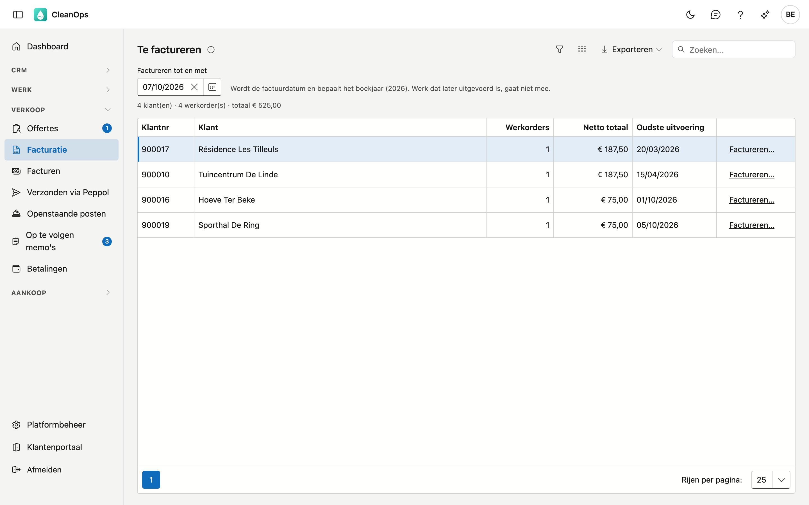
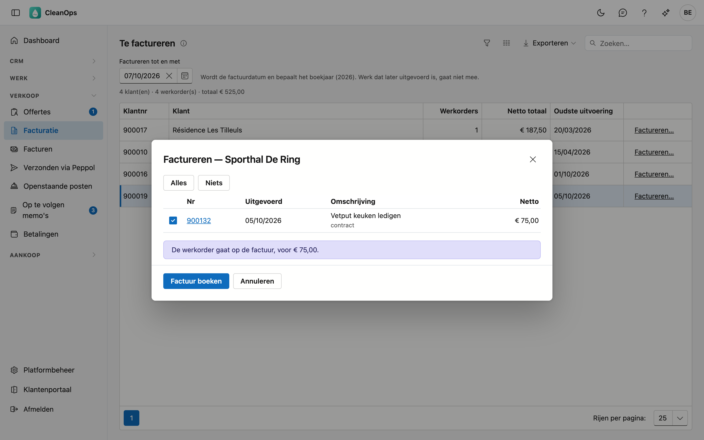

# Facturatie

Op Facturatie maakt u facturen van het uitgevoerde werk. U ziet per klant welke werkorders te factureren zijn, kiest wat er op
de factuur komt en boekt ze. De factuur krijgt meteen haar nummer, vervaldag en gestructureerde mededeling.

## Het scherm openen

Klik links in het menu, onder **Verkoop**, op **Facturatie**. U ziet het met de rol **Financieel** of als beheerder. Facturen boeken vraagt daarnaast het recht
*Facturen opmaken*; dat heeft standaard enkel de beheerder.

## Wat er te factureren is

De lijst toont per klant de werkorders met de status **Te factureren**: werk met een uitvoeringsdatum dat nog niet op een factuur
staat. Contant betaald werk staat er niet in, want dat is al betaald.

| Kolom | Wat erin staat |
|---|---|
| Klantnr, Klant | Voor wie. Dubbelklik om de klantfiche te openen. |
| Werkorders | Hoeveel werkorders er voor die klant te factureren zijn. |
| Netto totaal | Hun bedrag zonder btw. |
| Oudste uitvoering | Het werk dat het langst wacht. |

### Factureren tot en met

Bovenaan staat de datum **Factureren tot en met**, standaard vandaag. Ze doet drie dingen:

- ze wordt de **factuurdatum**;
- ze bepaalt het **boekjaar**;
- werk dat **later** uitgevoerd is, gaat niet mee.

Een datum meer dan 50 dagen vooruit wordt geweigerd. Meer dan 51 dagen terug mag, maar CleanOps waarschuwt.

## Een factuur boeken

Klik bij de klant op **Factureren…**. Het venster toont zijn te factureren werkorders, allemaal aangevinkt.

- Vink uit wat (nog) niet op de factuur mag; met **Alles** en **Niets** kiest u in één keer. Wat u uitvinkt, blijft te factureren.
- Onder de omschrijving staat in het rood wat ontbreekt: **attest ontbreekt**, **geen bedrag**, **geen btw-code**. Een werkorder
  zonder bedrag of btw-code kan niet geboekt worden.
- Klik op **attest ontbreekt**, of op het groene **attest** als er al een is, om de [attesten](attesten.md) van die werkorder in
  een nieuw tabblad te openen. Uw keuze in het venster blijft staan.
- **cameraverslag vereist** is een vermelding; **contract** opent het contract in een nieuw tabblad.
- Klik op het nummer om de werkorder in een nieuw tabblad te openen en recht te zetten.
- Per werkorder ziet u ook de **btw-code**, het **aantal** en de **eenheidsprijs** (leeg als ze 0 zijn). Let op 6 %: dan hoort er
  een attest bij.

Klik op **Factuur boeken** en bevestig. De factuur krijgt het volgende nummer; rechtzetten kan daarna enkel met een creditnota. De
factuur opent meteen met het afdrukvoorbeeld (zie [Facturen](facturen.md#afdrukken)).

### Wat er bij het boeken gebeurt

- Elke werkorder wordt een lijn, met het tarief, het aantal en de prijs van de werkorder.
- De **btw** wordt per btw-code opgeteld.
- De **vervaldag** volgt uit de betalingstermijn van de klant.
- De factuur krijgt een **gestructureerde mededeling** en een openstaande post.
- Draagt een lijn **6 % btw**, dan komt de attestzin op de factuur, in de taal van de klant. Is er in die taal geen
  attestzin, dan wordt er niet geboekt (zie [Factuurteksten](beheer/factuurteksten.md)). Bij **0 %** komt de
  verleggingsvermelding op de afdruk.
- De werkorders gaan op **Gefactureerd**, met het factuurnummer erbij.

Is het nettototaal negatief, dan wordt het document een **creditnota**.

## Voorschotten

Een voorschotfactuur maakt u op de [klantfiche](klanten.md#de-knoppen-onderaan) met **Voorschotfactuur**. Factureert u daarna het
werk van die klant, dan toont het keuzevenster het openstaande voorschot met een vinkje **… aftrekken**. Staat het aan, dan trekt
CleanOps het voorschot af en wordt de factuur een **saldofactuur**. Het vinkje staat vanzelf aan als het gekozen werk het voorschot
dekt, en uit bij een kleiner werk. Zet u het toch aan terwijl het voorschot groter is, dan zegt het venster dat de saldofactuur een
creditnota wordt en het voorschot opgebruikt is. Ook de bevestiging noemt de aftrek.

## Veelgestelde vragen

**Een werkorder staat niet in de lijst.**
Ze heeft niet de status Te factureren, ze is contant betaald, of ze werd ná de datum Factureren tot en met uitgevoerd.

**De boeking wordt geweigerd.**
CleanOps zegt waarom: een werkorder zonder bedrag of btw-code, een onbekende betalingstermijn op de klantfiche, of een werkorder die
intussen al op een factuur staat. Zet het recht en boek opnieuw.

**Ik zie de knop Factureren… niet.**
Daarvoor is het recht *Facturen opmaken* nodig. Vraag het aan uw beheerder.

## Zie ook

- [Facturen](facturen.md)
- [Werkorders](werkorders.md)
- [Klanten](klanten.md)
