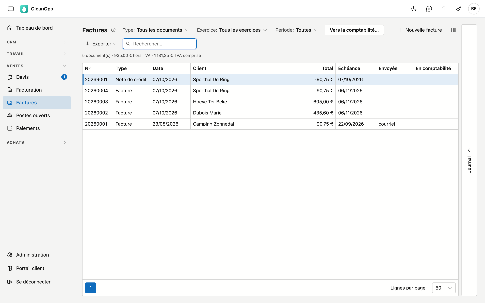
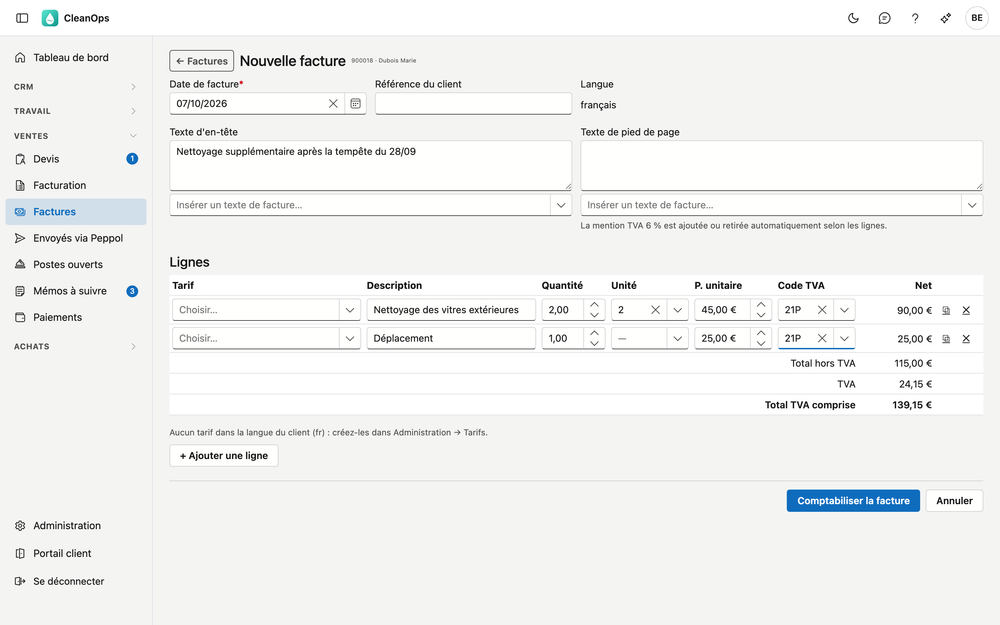
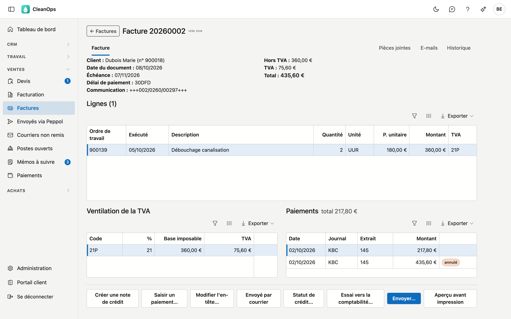
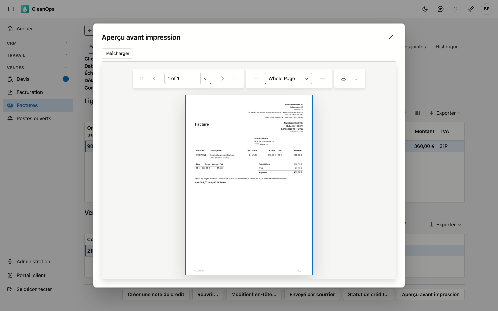
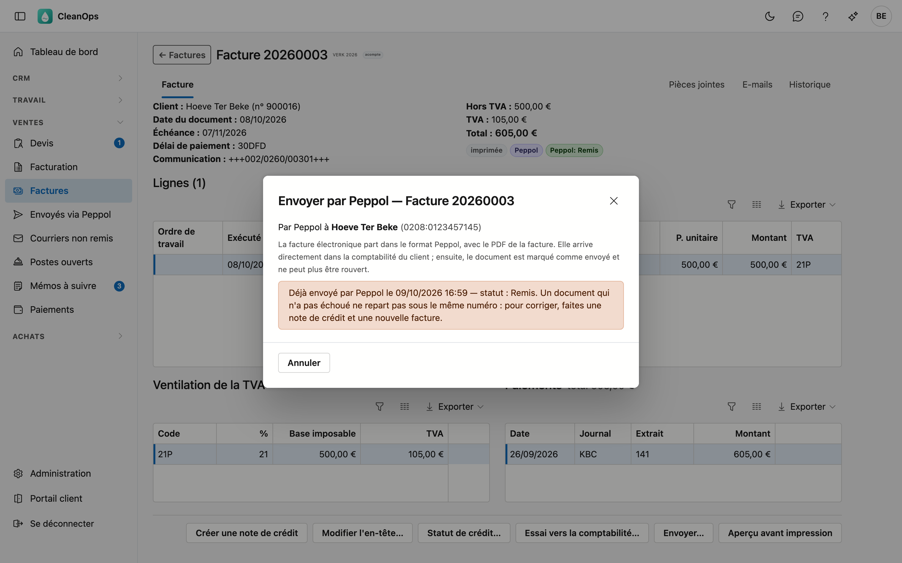
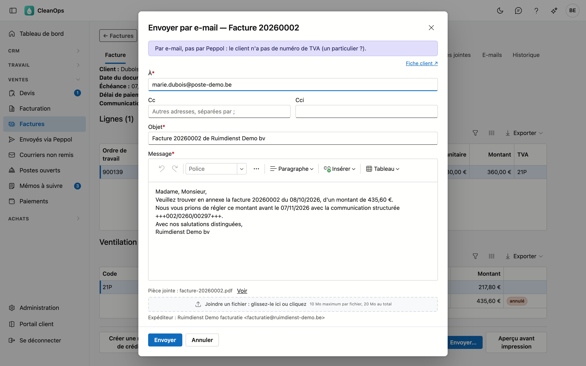
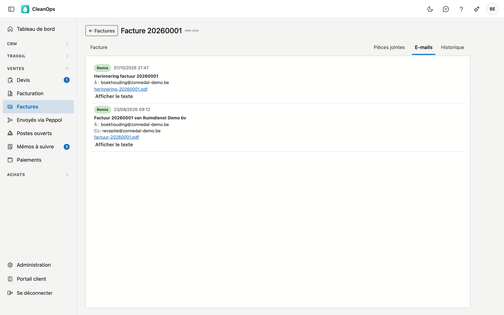
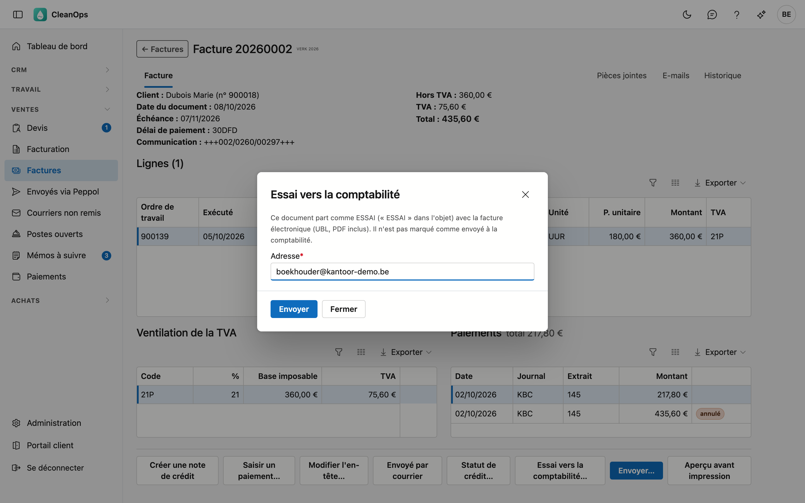
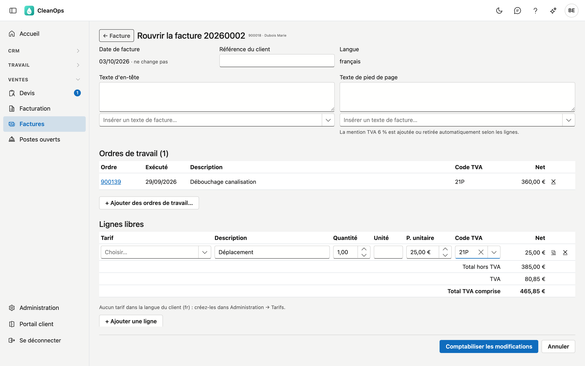

# Factures

Factures affiche tous vos documents de vente : les factures et notes de crédit de votre application précédente et celles que
vous avez comptabilisées dans CleanOps. Ici, vous établissez une facture avec des lignes libres, vous imprimez une facture, vous
modifiez une facture qui n'a pas encore été envoyée et vous la créditez. Les ordres de travail se facturent dans
[Facturation](facturatie.fr.md).

## Ouvrir l'écran

Dans le menu de gauche, sous **Ventes**, cliquez sur **Factures**. Vous le voyez avec le rôle **Financieel** ou en tant
qu'administrateur. Comptabiliser, modifier et créditer des factures demande en plus le droit *Établir des factures* ; par défaut,
seul l'administrateur l'a.

## La liste

| Colonne | Contenu |
|---|---|
| N°, Type | Le numéro du document et s'il s'agit d'une facture ou d'une note de crédit. |
| Date, Client, Total | La date du document, pour qui, et le montant TVA comprise. |
| Échéance | Quand la facture doit être payée. |
| Envoyée | Comment le document a été envoyé : *courrier*, *courriel* ou *Peppol*. Vide : pas encore envoyé. |
| En comptabilité | *oui* si le document est déjà parti chez votre bureau comptable. |
| Communication | La communication structurée. |
| Créditée par | Le numéro de la note de crédit qui crédite cette facture. |

Communication et Créditée par sont masquées par défaut, pour que la liste tienne aussi sur un écran plus petit : le sélecteur
de colonnes les affiche.

En haut, choisissez un **Type**, un **Exercice** ou une **Période**, ou cherchez par numéro, client ou communication.
Sélectionnez un document et ouvrez à droite le volet **Journal** pour ses pièces jointes et son historique. Double-cliquez pour
l'ouvrir.

Sous les filtres figure le nombre de documents de la sélection, avec leur total hors TVA et TVA comprise. Une note de crédit
compte en négatif : avec la **Période** sur **Ce mois-ci**, le montant hors TVA est le chiffre d'affaires du mois, le chiffre
de la tuile *facturé ce mois-ci* du [tableau de bord](dashboard.md).

### Vers la comptabilité

Chaque matin, les factures et notes de crédit jusqu'à la veille partent d'elles-mêmes chez votre bureau comptable, si c'est activé
sur la [fiche d'entreprise](beheer/bedrijfsfiche.fr.md#comptabilite). Avec **Vers la comptabilité…**, vous le faites tout de suite :
la fenêtre indique d'abord combien de documents attendent et vers quelle adresse ils partent, et n'envoie que lorsque vous cliquez
sur **Envoyer**. Si un document échoue, vous voyez pourquoi ; il repart le lendemain matin.

Si l'envoi est désactivé, ou si votre application précédente établit encore les factures, la fenêtre le dit et n'envoie rien.

## Une nouvelle facture

Avec **Nouvelle facture**, vous établissez une facture pour quelque chose qui n'a pas d'ordre de travail, par exemple un
déplacement ou une livraison de matériel.

1. En haut de la liste, cliquez sur **Nouvelle facture**, cherchez le client par nom ou par numéro et cliquez sur **choisir**.
2. Indiquez la **Date de facture** (aujourd'hui par défaut) et, si besoin, la **Référence du client**, le **Texte d'en-tête** et le
   **Texte de pied de page**. **Insérer un texte de facture** ajoute un texte des [textes de facture](beheer/factuurteksten.fr.md)
   à la fin du champ, dans la langue du client.
3. Remplissez les **lignes**. Choisir un **Tarif** remplit la description, l'unité, le prix et le code TVA ; vous pouvez ensuite
   les adapter. Une description de plus de 35 caractères figure en entier sous la ligne. Les boutons à droite dupliquent ou
   suppriment une ligne ; **+ Ajouter une ligne** en ajoute une.
4. En bas figurent le total hors TVA, la TVA et le total TVA comprise, tels qu'ils seront comptabilisés.
5. Cliquez sur **Comptabiliser la facture**. CleanOps vous le demande encore une fois, avec le montant. La facture reçoit le numéro
   suivant, une échéance selon le délai de paiement du client et une communication structurée, et figure dans les
   [Postes ouverts](openstaande-posten.fr.md). Elle s'ouvre aussitôt.

Si quelque chose ne va pas, par exemple une ligne sans code TVA, l'écran indique ce qui manque et rien n'est comptabilisé. Si une
ligne porte une TVA de 6 %, la phrase d'attestation s'ajoute d'elle-même sous le texte de pied de page.

## La facture

En haut figurent le client, les dates, le délai de paiement, la communication, la référence du client et les montants. En
dessous, le **Texte d'en-tête** s'il y en a un, les **Lignes**, la **Ventilation de la TVA** et à côté les **Paiements** reçus (voir [Paiements](betalingen.fr.md)) : chaque
grille défile séparément.
En bas figure le **Texte de pied de page**, par exemple la phrase d'attestation à 6 %. En haut à droite se trouvent les **Pièces
jointes**, les **E-mails** et l'**Historique**. Une ligne provenant d'un ordre de travail en porte le numéro ; une ligne libre n'en a pas.

Une note de crédit indique quelle facture elle contre-passe, et une facture créditée par quelle note de crédit ; les deux sont
un lien.

Si le document est encore ouvert, **Saisir un paiement…** y saisit directement un paiement, avec le montant ouvert déjà rempli
(voir [Paiements](betalingen.fr.md)).

### Imprimer

**Aperçu avant impression** affiche la facture en PDF, dans la langue de la facture. **Télécharger** l'enregistre ; l'icône
d'imprimante de la visionneuse l'imprime. Si la facture a déjà été envoyée, CleanOps vous demande d'abord si vous voulez quand
même l'ouvrir.

Sur la facture figurent :

- l'**en-tête** de la [fiche entreprise](beheer/bedrijfsfiche.fr.md) : logo, nom, adresse, numéro de TVA, IBAN et BIC ;
- le type : facture, facture d'acompte, facture de solde ou note de crédit ;
- le numéro, la date, l'échéance, le numéro de client et la référence du client ;
- le client avec son adresse et son numéro de TVA ;
- le texte d'en-tête, les lignes, la TVA par pourcentage et les totaux ;
- sur une facture, la demande de paiement avec la communication structurée — pas sur une note de crédit ;
- le texte de pied de page et les mentions légales : à 6 %, la phrase d'attestation ; à 0 %, l'autoliquidation par le
  cocontractant.

### Envoyer

**Envoyer…** choisit lui-même comment la facture part :

- Si le client est sur le **réseau Peppol**, elle part en facture électronique via Peppol, directement dans sa comptabilité.
- Sinon, elle part **par e-mail**, avec le PDF en pièce jointe. La fenêtre d'e-mail indique en haut pourquoi ce n'est pas
  Peppol : le client n'a pas de numéro de TVA, il n'est pas sur le réseau, ou le réseau n'a pas pu être vérifié.

CleanOps recherche le client sur le réseau avec son numéro GLN, sinon avec son numéro d'entreprise belge (voir [Clients](klanten.fr.md)).

!!! warning "Tant que votre application précédente gère les factures"
    Pendant cette période, CleanOps n'envoie rien via Peppol : c'est votre application précédente qui le fait. Pour un client
    Peppol, la fenêtre l'indique, et elle n'ouvre pas d'e-mail à la place.

#### Via Peppol

La fenêtre montre à qui part la facture électronique, avec l'identifiant Peppol du client. Il n'y a rien à remplir : la facture
électronique est la facture elle-même, avec le PDF. Votre entreprise y figure comme sur la [fiche entreprise](beheer/bedrijfsfiche.fr.md)
sous **Peppol**.

Cliquez sur **Envoyer**. La facture électronique part réellement. La facture est ensuite marquée comme envoyée, avec *Peppol*,
et ne peut plus être rouverte. À droite de *Peppol* figure si elle est arrivée :

| Statut | Signification |
|---|---|
| Accepté | Le réseau Peppol a accepté la facture électronique — pas encore qu'elle est arrivée. |
| En file d'attente | Un incident temporaire ; ADM One l'envoie lui-même dès que possible. Ne la renvoyez pas. |
| Remis | Elle est arrivée chez le client, généralement en moins d'une minute. |
| Échoué ou Refusé | Elle n'est pas arrivée ; la raison figure à côté du statut. |

Une facture électronique qui n'a pas échoué ne repart pas sous le même numéro : la fenêtre le dit. Pour corriger, faites une
note de crédit et une nouvelle facture. Toutes les factures électroniques et leur statut figurent dans
[Envoyés via Peppol](verzonden-via-peppol.fr.md).

#### Par e-mail

- **À** — l'adresse e-mail de facturation du client, sinon son adresse e-mail habituelle (voir [Clients](klanten.fr.md)).
- **Cc** — les autres adresses du client figurent comme case à cocher. En dessous, vous ajoutez d'autres adresses, séparées par
  un point-virgule ; la copie fixe du texte d'e-mail y figure déjà.
- **Cci** — une copie invisible, par exemple pour votre propre archive.
- **Objet** et **Message** — le texte d'e-mail pour une facture ou une note de crédit, dans la langue de la facture, avec le
  numéro, le montant, l'échéance et la communication structurée remplis. Vous réglez ce texte dans
  [Textes d'e-mail](beheer/mailteksten.fr.md) ; ici, vous l'adaptez pour cet e-mail seulement.
- En bas figurent la **Pièce jointe** (la facture en PDF) et l'**Expéditeur** (voir [Expéditeurs](beheer/mailafzenders.fr.md)).
- **Attestations** — si la facture porte des ordres de travail avec une [attestation](attesten.fr.md), ces attestations
  figurent en dessous, à cocher. Aucune n'est cochée d'avance. Celles que vous cochez partent en PDF et sont ensuite
  **envoyées**. Une note de crédit ne propose pas d'attestations.
- **Joindre un fichier** — glissez votre propre fichier dans la zone ou cliquez dessus, par exemple un bon de commande ou une
  photo. 10 Mo maximum par fichier et 20 Mo pour toutes les pièces jointes ensemble ; un fichier trop grand est refusé tout
  de suite, avec la raison. La croix retire un fichier.

Cliquez sur **Envoyer**. L'e-mail part réellement chez le client. La facture est ensuite marquée comme envoyée, avec *courriel*,
et ne peut plus être rouverte.

Si le client n'a pas d'adresse e-mail, la fenêtre l'indique : saisissez vous-même une adresse. Si une donnée reste vide pour
cette facture, par exemple l'échéance d'une ancienne facture, la fenêtre la nomme. Vérifiez alors cette phrase avant d'envoyer.

Une facture déjà envoyée peut être renvoyée ; CleanOps vous demande d'abord si vous le souhaitez. Dans l'**Aperçu avant
impression**, **Envoyer par courriel** envoie la même facture via la même fenêtre.

!!! tip "Le bouton bleu"
    Si la facture n'a pas encore été envoyée et que le client est sur Peppol ou a coché **Factures par e-mail**, **Envoyer…** est
    le bouton bleu.

### L'onglet E-mails

En haut à droite, **E-mails** montre ce qui a été envoyé par e-mail pour cette facture, rappels compris (voir
[Postes ouverts](openstaande-posten.fr.md)) : quand, à qui, si l'e-mail a été délivré (et sinon, pourquoi), le texte tel qu'il est parti
(**Afficher le texte**) et le PDF joint.

Un e-mail qui n'a pas atteint le client porte le statut **Rejeté** ou **Indésirable**. Vérifiez alors l'adresse du client et renvoyez
l'e-mail.

### Envoyé par courrier

Si vous avez imprimé la facture et l'avez envoyée par la poste, cliquez sur **Envoyé par courrier**. Dans la liste, elle figure
alors comme envoyée, le bouton disparaît, et la facture ne peut plus être rouverte.

### Essai vers la comptabilité

Avec **Essai vers la comptabilité…**, ce seul document part comme ESSAI vers l'adresse de votre choix, avec la facture électronique
(UBL) et le PDF inclus. Vous vérifiez ainsi avec votre comptable que son logiciel lit bien les factures, avant d'activer l'envoi
quotidien. Un essai ne marque pas le document comme *en comptabilité*.

### Modifier l'en-tête

**Modifier l'en-tête…** adapte le texte d'en-tête, le texte de pied de page et la référence du client, même sur une facture déjà
envoyée. La communication structurée ne change jamais : le client paie avec elle.

### Rouvrir

Tant qu'une facture n'a pas été envoyée, vous pouvez encore la modifier avec **Rouvrir…**. La même fenêtre que pour une nouvelle
facture s'ouvre, avec la facture :

- les **Ordres de travail** de la facture. La croix en retire un ; cet ordre figure ensuite à nouveau dans
  [Facturation](facturatie.fr.md). **+ Ajouter des ordres de travail…** choisit des ordres à facturer du même client, exécutés au
  plus tard à la date de la facture ;
- les **Lignes libres**, que vous adaptez, ajoutez ou supprimez comme pour une nouvelle facture ;
- la référence du client, le texte d'en-tête et le texte de pied de page.

Cliquez sur **Comptabiliser les modifications**. CleanOps vous demande si le client n'a pas encore reçu la facture. Le numéro, la
date, l'échéance et la communication structurée ne changent pas ; les lignes, la TVA, la phrase d'attestation et le montant dans
les [Postes ouverts](openstaande-posten.fr.md) suivent le nouveau contenu.

Le prix d'une ligne d'ordre de travail se modifie sur l'ordre lui-même : retirez-le de la facture, corrigez l'ordre (le numéro est
un lien vers l'ordre) et ajoutez-le à nouveau.

**Rouvrir…** n'apparaît pas pour une facture envoyée, créditée, (partiellement) payée, ayant fait l'objet d'un rappel ou déjà
transmise au bureau comptable, pour une facture d'acompte ou de solde, pour une note de crédit ni pour une facture de votre
application précédente. Créditez-la alors et établissez-en une nouvelle.

Si la facture date de plus de 51 jours, un avertissement s'affiche en haut : la déclaration TVA de cette période peut déjà avoir
été déposée. Ne modifiez alors que les textes, pas les montants — ou créditez la facture et établissez-en une nouvelle.

### Statut de crédit

**Statut de crédit…** marque à la main le poste ouvert d'un document comme crédité, ou retire cette marque. Un poste crédité ne
figure pas dans les listes de rappel. Le bouton n'apparaît que si le document a un poste ouvert.

## Créditer

Supprimer une facture n'est pas possible : la numérotation des factures ne comporte pas de trous. Pour annuler une facture,
établissez une note de crédit.

Cliquez sur **Créer une note de crédit**. La fenêtre explique ce qui va se passer. Cochez **Remettre les ordres de travail « à
facturer »** si vous voulez refacturer le même travail, par exemple après une erreur sur la facture : les ordres de travail
figurent alors à nouveau dans [Facturation](facturatie.fr.md). Cliquez sur **Créditer**. La note de crédit reçoit le numéro
suivant de la série des notes de crédit et s'ouvre aussitôt.

Une facture déjà créditée ne peut pas l'être une seconde fois.

## Questions fréquentes

**Pourquoi une facture part-elle par e-mail et pas via Peppol ?**
La fenêtre d'e-mail l'indique en haut : le client n'a pas de numéro de TVA, il n'est pas sur le réseau Peppol, ou le réseau n'a
pas pu être vérifié. Dans ce dernier cas, réessayez un peu plus tard.

**Pour un client Peppol, CleanOps dit qu'il n'envoie pas.**
Tant que votre application précédente gère les factures, c'est elle qui envoie les factures électroniques. CleanOps prend le
relais le jour du passage.

**Je veux renvoyer une facture électronique.**
Ce n'est possible que si l'envoi précédent est **Échoué** ou **Refusé**. Une facture électronique arrivée ne repart pas sous le
même numéro — le client la comptabiliserait deux fois. Faites une note de crédit et une nouvelle facture.

**L'e-mail est parti d'une adresse d'ADM One et non de notre propre adresse.**
L'adresse d'expéditeur n'est pas approuvée par ADM One, ou aucun expéditeur n'a été choisi. Voir
[Expéditeurs](beheer/mailafzenders.fr.md).

**Je ne vois pas Rouvrir… sur une facture.**
La facture a été envoyée, créditée, payée, a fait l'objet d'un rappel ou a déjà été transmise au bureau comptable, ou il s'agit
d'une facture d'acompte, de solde ou d'une note de crédit. Créditez la facture et établissez-en une nouvelle.

**Pourquoi les lignes d'ordre de travail sont-elles figées quand je rouvre une facture ?**
Leur prix vient de l'ordre de travail. Retirez l'ordre de la facture, corrigez-le et ajoutez-le à nouveau.

**Une facture d'acompte ne peut pas être créditée.**
L'acompte a déjà été déduit sur une facture de solde. Créditez d'abord cette facture de solde ; l'acompte est alors à nouveau
ouvert.

**Pourquoi une note de crédit a-t-elle un numéro comme 20269001 ?**
Les factures et les notes de crédit ont chacune leur série par exercice : une facture reçoit l'année suivie de 0001 (20260001),
une note de crédit l'année suivie de 9001 (20269001).

## Voir aussi

- [Facturation](facturatie.fr.md)
- [Postes ouverts](openstaande-posten.fr.md)
- [Clients](klanten.fr.md)
- [Textes d'e-mail](beheer/mailteksten.fr.md)
- [Envoyés via Peppol](verzonden-via-peppol.fr.md)
- [Textes de facture](beheer/factuurteksten.fr.md)
- [Fiche entreprise](beheer/bedrijfsfiche.fr.md)
