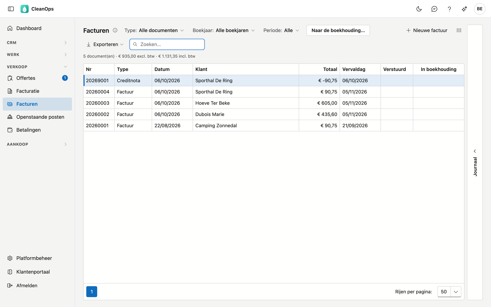
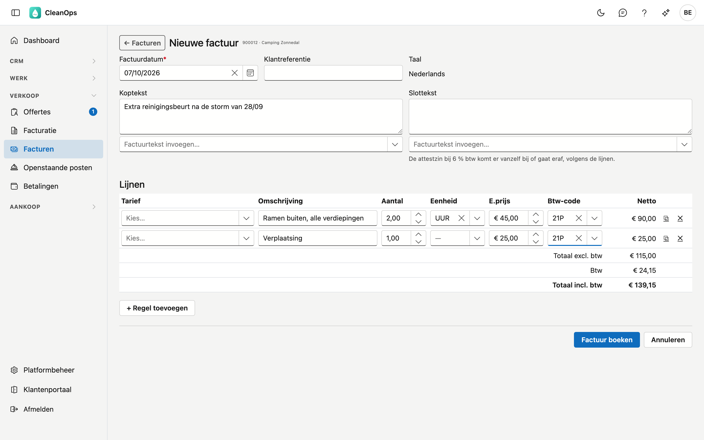
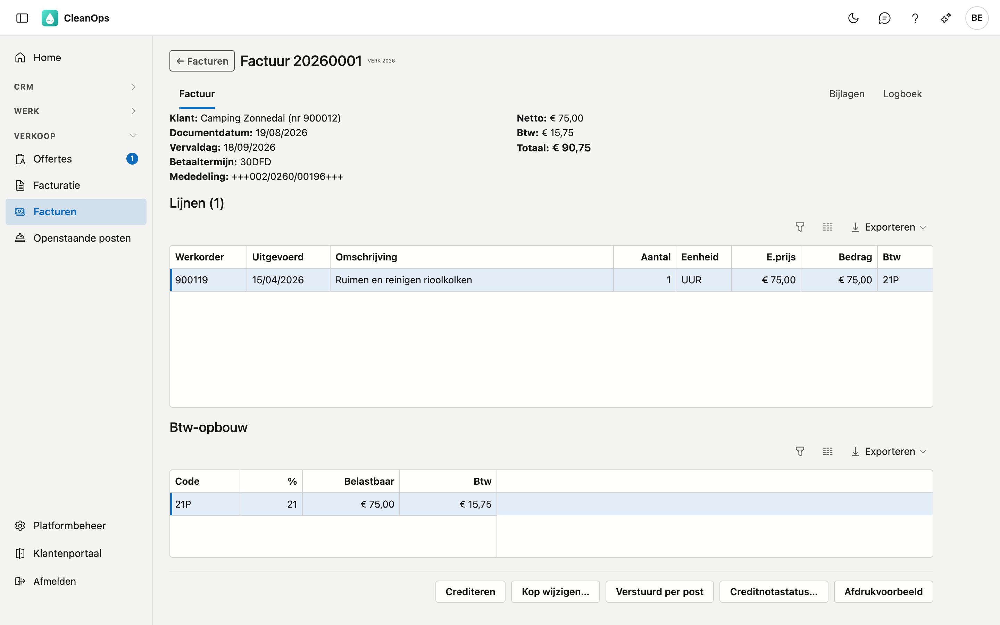
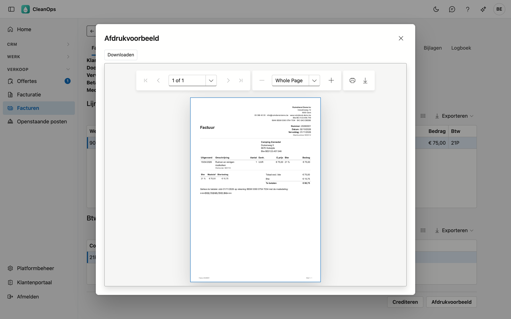
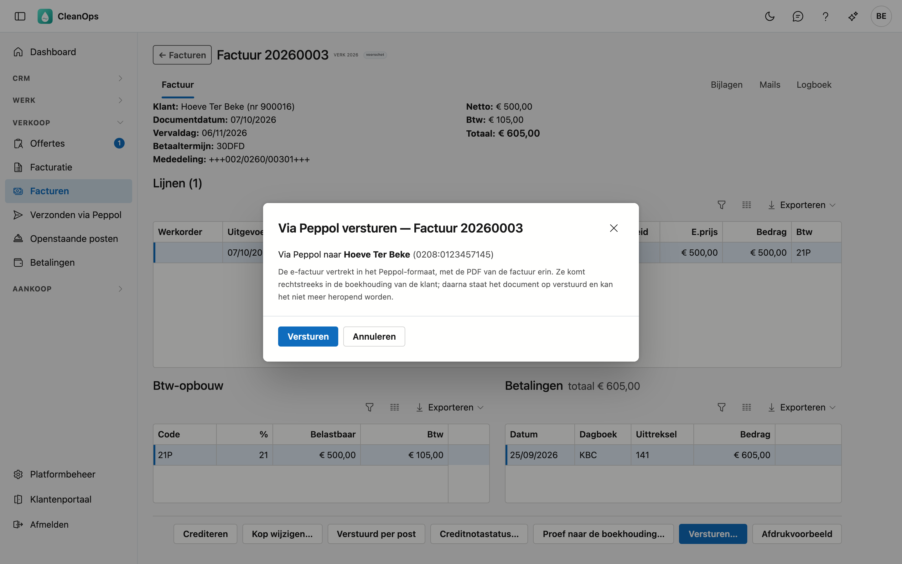
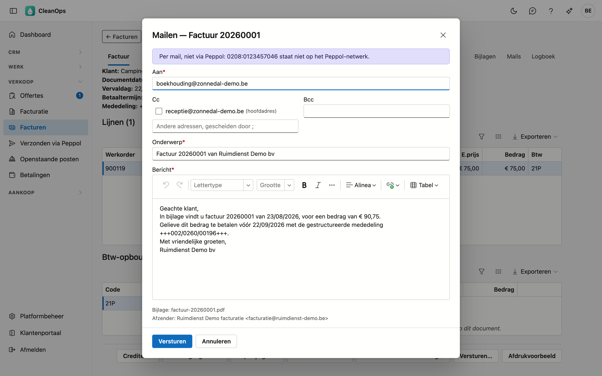
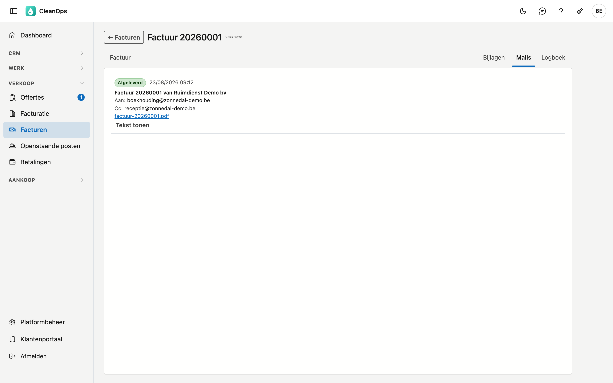
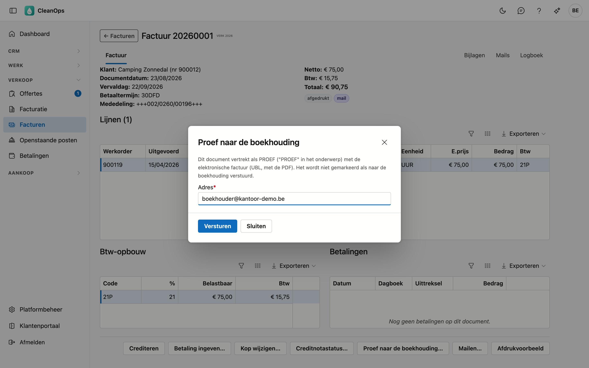
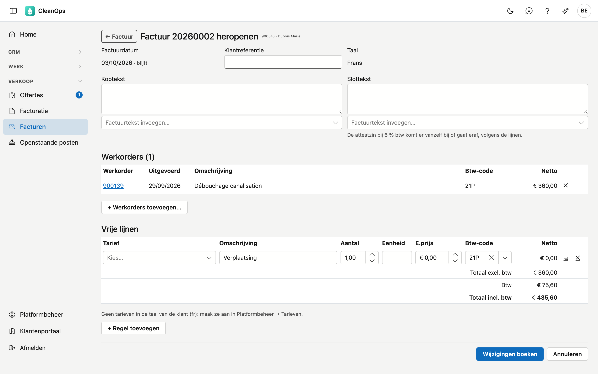

# Facturen

Facturen toont al uw verkoopdocumenten: de facturen en creditnota's uit uw vorige toepassing en die u in CleanOps boekte. Hier
maakt u een factuur met vrije lijnen, drukt u een factuur af, wijzigt u een factuur die nog niet verstuurd is en crediteert u ze.
Werkorders factureert u in [Facturatie](facturatie.md).

## Het scherm openen

Klik links in het menu, onder **Verkoop**, op **Facturen**. U ziet het met de rol **Financieel** of als beheerder. Facturen boeken,
wijzigen en crediteren vraagt daarnaast het recht *Facturen opmaken*; dat heeft standaard enkel de beheerder.

## De lijst

| Kolom | Wat erin staat |
|---|---|
| Nr, Type | Het documentnummer en of het een factuur of een creditnota is. |
| Datum, Klant, Totaal | De documentdatum, voor wie, en het bedrag met btw. |
| Vervaldag | Wanneer de factuur betaald moet zijn. |
| Verstuurd | Hoe het document verstuurd is: *post*, *mail* of *Peppol*. Leeg: nog niet verstuurd. |
| In boekhouding | *ja* als het document al naar uw boekhoudkantoor ging. |
| Mededeling | De gestructureerde mededeling. |
| Gecrediteerd door | Het nummer van de creditnota die deze factuur crediteert. |

Mededeling en Gecrediteerd door staan standaard verborgen, zodat de lijst ook op een kleiner scherm past: met de kolomkiezer
zet u ze erbij.

Kies bovenaan een **Type**, een **Boekjaar** of een **Periode**, of zoek op nummer, klant of mededeling. Klik een document aan en
open rechts de strook **Journaal** voor zijn bijlagen en logboek. Dubbelklik om het te openen.

Onder de filters staat hoeveel documenten de selectie telt, met hun totaal zonder en met btw. Een creditnota telt negatief:
met de **Periode** op **Deze maand** is het bedrag zonder btw de omzet van de maand, het getal van de tegel *gefactureerd
deze maand* op het [dashboard](dashboard.md).

### Naar de boekhouding

Elke ochtend gaan de facturen en creditnota's tot en met gisteren vanzelf naar uw boekhoudkantoor, als dat op de
[bedrijfsfiche](beheer/bedrijfsfiche.md#boekhouding) aan staat. Met **Naar de boekhouding…** doet u het meteen: het venster zegt
eerst hoeveel documenten wachten en naar welk adres ze gaan, en verstuurt pas als u op **Versturen** klikt. Lukt een document niet,
dan ziet u waarom; het gaat de volgende ochtend opnieuw mee.

Staat de export uit, of maakt uw vorige toepassing de facturen nog, dan zegt het venster dat en verstuurt het niets.

## Een nieuwe factuur

Met **Nieuwe factuur** maakt u een factuur voor iets dat geen werkorder heeft, bijvoorbeeld een verplaatsing of een
materiaallevering.

1. Klik bovenaan de lijst op **Nieuwe factuur**, zoek de klant op naam of nummer en klik op **kies**.
2. Vul de **Factuurdatum** in (standaard vandaag), en eventueel de **Klantreferentie**, de **Koptekst** en de **Slottekst**. Met
   **Factuurtekst invoegen** zet u een tekst uit de [factuurteksten](beheer/factuurteksten.md) achteraan in het veld, in de taal
   van de klant.
3. Vul de **lijnen** in. Een **Tarief** kiezen vult de omschrijving, de eenheid, de prijs en de btw-code in; u kunt ze daarna
   aanpassen. Een omschrijving langer dan 35 tekens komt volledig onder de lijn. Met de knoppen rechts dupliceert of verwijdert u
   een lijn, met **+ Regel toevoegen** komt er een bij.
4. Onderaan ziet u het totaal zonder btw, de btw en het totaal met btw, zoals ze geboekt worden.
5. Klik op **Factuur boeken**. CleanOps vraagt het nog eens, met het bedrag. De factuur krijgt het volgende nummer, een vervaldag
   volgens de betalingstermijn van de klant en een gestructureerde mededeling, en komt in [Openstaande posten](openstaande-posten.md).
   Ze opent meteen.

Staat er iets niet goed, bijvoorbeeld een lijn zonder btw-code, dan zegt het scherm wat er ontbreekt en wordt er niets geboekt.
Draagt een lijn 6 % btw, dan komt de attestzin vanzelf onder de slottekst.

## De factuur

Bovenaan staan de klant, de datums, de betalingstermijn, de mededeling, de klantreferentie en de bedragen. Daaronder de
**koptekst** als die er is, de **lijnen**, de **btw-opbouw** en ernaast de **betalingen** die erop kwamen (zie [Betalingen](betalingen.md)): elk raster
scrolt apart. Onderaan staat de **slottekst**,
bijvoorbeeld de 6 %-attestzin. Rechts bovenaan vindt u **Bijlagen**, **Mails** en **Logboek**. Bij een lijn uit een werkorder staat het
werkordernummer; een vrije lijn heeft er geen.

Een creditnota zegt welke factuur ze tegenboekt, en een gecrediteerde factuur door welke creditnota; beide zijn een link.

Staat het document nog open, dan geeft **Betaling ingeven…** er meteen een betaling op in, met het openstaande bedrag al ingevuld
(zie [Betalingen](betalingen.md)).

### Afdrukken

**Afdrukvoorbeeld** toont de factuur als PDF, in de taal van de factuur. **Downloaden** bewaart ze; met het printerteken in de kijker
drukt u ze af. Is de factuur al verstuurd, dan vraagt CleanOps eerst of u ze toch wilt openen.

Op de factuur staan:

- het **briefhoofd** uit de [bedrijfsfiche](beheer/bedrijfsfiche.md): logo, naam, adres, btw-nummer, IBAN en BIC;
- de soort: factuur, voorschotfactuur, saldofactuur of creditnota;
- het nummer, de datum, de vervaldag, het klantnummer en de referentie van de klant;
- de klant met zijn adres en btw-nummer;
- de koptekst, de lijnen, de btw per percentage en de totalen;
- op een factuur de vraag om te betalen met de gestructureerde mededeling — niet op een creditnota;
- de slottekst en de wettelijke vermeldingen: bij 6 % de attestzin, bij 0 % de verlegging naar de medecontractant.

### Versturen

**Versturen…** kiest zelf hoe de factuur vertrekt:

- Staat de klant op het **Peppol-netwerk**, dan gaat ze als e-factuur via Peppol, rechtstreeks naar zijn boekhouding.
- Anders gaat ze **per mail**, met de PDF als bijlage. Het mailvenster zegt bovenaan waarom het geen Peppol is: de klant heeft
  geen btw-nummer, hij staat niet op het netwerk, of het netwerk kon niet nagekeken worden.

CleanOps zoekt de klant op het netwerk op met zijn GLN-nummer, anders met zijn Belgisch ondernemingsnummer (zie [Klanten](klanten.md)).

!!! warning "Zolang uw vorige toepassing de facturen beheert"
    In die periode verstuurt CleanOps niets via Peppol: dat doet uw vorige toepassing. Bij een Peppol-klant zegt het venster dat,
    en het opent geen mail in de plaats.

#### Via Peppol

Het venster toont naar wie de e-factuur gaat, met het Peppol-ID van de klant. Er valt niets in te vullen: de e-factuur is de
factuur zelf, met de PDF erin. Uw bedrijf staat erin zoals op de [bedrijfsfiche](beheer/bedrijfsfiche.md) onder **Peppol**.

Klik op **Versturen**. De e-factuur vertrekt echt. Daarna staat de factuur op verstuurd, met *Peppol*, en kan ze niet meer
heropend worden. Rechts van *Peppol* staat of ze aankwam:

| Status | Wat het betekent |
|---|---|
| Aangeboden | Het Peppol-netwerk nam de e-factuur aan — nog niet dat ze aankwam. |
| In de wachtrij | Een tijdelijke storing; ADM One verstuurt ze zelf zodra het kan. Niet opnieuw versturen. |
| Afgeleverd | Ze kwam aan bij de klant, doorgaans binnen de minuut. |
| Mislukt of Geweigerd | Ze kwam niet aan; de reden staat bij de status. |

Een e-factuur die niet mislukte, vertrekt niet nog eens met hetzelfde nummer: het venster zegt dat. Om te corrigeren maakt u
een creditnota en een nieuwe factuur. Alle e-facturen en hun status staan in [Verzonden via Peppol](verzonden-via-peppol.md).

#### Per mail

- **Aan** — het e-mailadres voor facturen van de klant, anders zijn gewone e-mailadres (zie [Klanten](klanten.md)).
- **Cc** — de andere adressen van de klant staan er als vinkje. Daaronder vult u nog andere adressen in, gescheiden door een
  puntkomma; de vaste kopie uit de mailtekst staat er al.
- **Bcc** — een onzichtbare kopie, bijvoorbeeld voor uw eigen archief.
- **Onderwerp** en **Bericht** — de mailtekst voor een factuur of creditnota, in de taal van de factuur, met het nummer, het
  bedrag, de vervaldag en de gestructureerde mededeling ingevuld. U stelt die tekst in bij [Mailteksten](beheer/mailteksten.md);
  hier past u ze aan voor deze ene mail.
- Onderaan staan de **Bijlage** (de factuur als PDF) en de **Afzender** (zie [Mailafzenders](beheer/mailafzenders.md)).

Klik op **Versturen**. De mail vertrekt echt naar de klant. Daarna staat de factuur op verstuurd, met *mail*, en kan ze niet
meer heropend worden.

Heeft de klant geen e-mailadres, dan zegt het venster dat: vul zelf een adres in. Blijft een gegeven leeg voor deze factuur,
bijvoorbeeld de vervaldag van een oude factuur, dan noemt het venster welk. Kijk die zin dan na vóór u verstuurt.

Een factuur die al verstuurd is, kunt u opnieuw mailen; CleanOps vraagt eerst of u dat wilt. In het **Afdrukvoorbeeld** stuurt
**Doorsturen per mail** dezelfde factuur door via hetzelfde venster.

!!! tip "De blauwe knop"
    Is de factuur nog niet verstuurd en staat de klant op Peppol of heeft hij **Facturen per e-mail** aangevinkt, dan is
    **Versturen…** de blauwe knop.

### Het tabblad Mails

Rechts bovenaan toont **Mails** wat er over deze factuur gemaild werd, ook de rappels (zie
[Openstaande posten](openstaande-posten.md)): wanneer, aan wie, of de mail afgeleverd is, de tekst zoals ze vertrok
(**Tekst tonen**) en de PDF die meeging.

Een mail die de klant niet bereikte, staat op **Geweigerd** of **Spam**. Kijk dan het adres van de klant na en mail opnieuw.

### Verstuurd per post

Hebt u de factuur afgedrukt en met de post verstuurd, klik dan op **Verstuurd per post**. In de lijst staat ze dan als verstuurd,
de knop verdwijnt, en de factuur kan niet meer heropend worden.

### Proef naar de boekhouding

Met **Proef naar de boekhouding…** gaat dit ene document als PROEF naar een adres naar keuze, met de elektronische factuur (UBL)
en de PDF erin. Zo gaat u met uw boekhouder na of zijn boekhoudpakket de facturen goed inleest, vóór u de dagelijkse export
aanzet. Een proef zet het document niet op *in boekhouding*.

### Kop wijzigen

**Kop wijzigen…** past de koptekst, de slottekst en de klantreferentie aan, ook op een factuur die al verstuurd is. De
gestructureerde mededeling wijzigt nooit: de klant betaalt ermee.

### Heropenen

Zolang een factuur niet verstuurd is, kunt u ze nog wijzigen met **Heropenen…**. Hetzelfde venster als bij een nieuwe factuur
opent, met de factuur erin:

- de **werkorders** op de factuur. Met het kruisje haalt u er een af; die werkorder staat daarna weer in
  [Facturatie](facturatie.md). Met **+ Werkorders toevoegen…** kiest u te factureren werkorders van dezelfde klant, uitgevoerd tot
  de factuurdatum;
- de **vrije lijnen**, die u aanpast, toevoegt of verwijdert zoals bij een nieuwe factuur;
- de klantreferentie, de koptekst en de slottekst.

Klik op **Wijzigingen boeken**. CleanOps vraagt of de klant de factuur nog niet ontvangen heeft. Het nummer, de datum, de vervaldag
en de gestructureerde mededeling blijven; de lijnen, de btw, de attestzin en het bedrag in [Openstaande posten](openstaande-posten.md)
volgen de nieuwe inhoud.

De prijs van een werkorderlijn wijzigt u op de werkorder zelf: haal ze van de factuur, zet de werkorder recht (het nummer is een
link naar de werkorder) en voeg ze opnieuw toe.

**Heropenen…** staat er niet bij een factuur die verstuurd, gecrediteerd, (deels) betaald of gerappelleerd is, bij een voorschot-
of saldofactuur, bij een creditnota en bij een factuur uit uw vorige toepassing. Crediteer ze dan en maak een nieuwe.

### Creditnotastatus

Met **Creditnotastatus…** markeert u de openstaande post van een document met de hand als gecrediteerd, of haalt u die markering
weg. Een gecrediteerde post staat niet in de rappellijsten. De knop staat er enkel als het document een openstaande post heeft.

## Crediteren

Een factuur verwijderen kan niet: een factuurnummer loopt zonder gaten door. Wilt u een factuur ongedaan maken, maak dan een
creditnota.

Klik op **Crediteren**. Het venster zegt wat er gebeurt. Vink **Werkorders opnieuw te factureren** aan als u hetzelfde werk opnieuw
wilt factureren, bijvoorbeeld na een fout op de factuur: de werkorders staan dan weer in [Facturatie](facturatie.md). Klik op
**Crediteren**. De creditnota krijgt het volgende nummer uit de reeks van de creditnota's en opent meteen.

Een factuur die al gecrediteerd is, kan niet nog eens gecrediteerd worden.

## Veelgestelde vragen

**Waarom gaat een factuur per mail en niet via Peppol?**
Het mailvenster zegt het bovenaan: de klant heeft geen btw-nummer, hij staat niet op het Peppol-netwerk, of het netwerk kon niet
nagekeken worden. In dat laatste geval: probeer het wat later opnieuw.

**Bij een Peppol-klant zegt CleanOps dat het niet verstuurt.**
Zolang uw vorige toepassing de facturen beheert, verstuurt die de e-facturen. CleanOps neemt het over op de dag van de overstap.

**Ik wil een e-factuur opnieuw versturen.**
Dat kan enkel als de vorige keer **Mislukt** of **Geweigerd** was. Een e-factuur die aankwam, vertrekt niet nog eens met
hetzelfde nummer — de klant zou ze twee keer boeken. Maak een creditnota en een nieuwe factuur.

**De mail vertrok van een adres van ADM One en niet van ons eigen adres.**
Het afzenderadres is niet aanvaard bij ADM One, of er is geen afzender gekozen. Zie [Mailafzenders](beheer/mailafzenders.md).

**Ik zie Heropenen… niet bij een factuur.**
De factuur is verstuurd, gecrediteerd, betaald of gerappelleerd, of het is een voorschot-, saldo- of creditnota. Crediteer de
factuur en maak een nieuwe.

**Waarom staan de werkorderlijnen vast bij het heropenen?**
Hun prijs komt van de werkorder. Haal de werkorder van de factuur, zet ze recht en voeg ze opnieuw toe.

**Een voorschotfactuur laat zich niet crediteren.**
Het voorschot is al afgetrokken op een saldofactuur. Crediteer eerst die saldofactuur; daarna is het voorschot weer open.

**Waarom heeft een creditnota een nummer als 20269001?**
Facturen en creditnota's hebben elk hun reeks per boekjaar: een factuur krijgt het jaar met 0001 erachter (20260001), een
creditnota het jaar met 9001 (20269001).

## Zie ook

- [Facturatie](facturatie.md)
- [Openstaande posten](openstaande-posten.md)
- [Klanten](klanten.md)
- [Mailteksten](beheer/mailteksten.md)
- [Verzonden via Peppol](verzonden-via-peppol.md)
- [Factuurteksten](beheer/factuurteksten.md)
- [Bedrijfsfiche](beheer/bedrijfsfiche.md)
