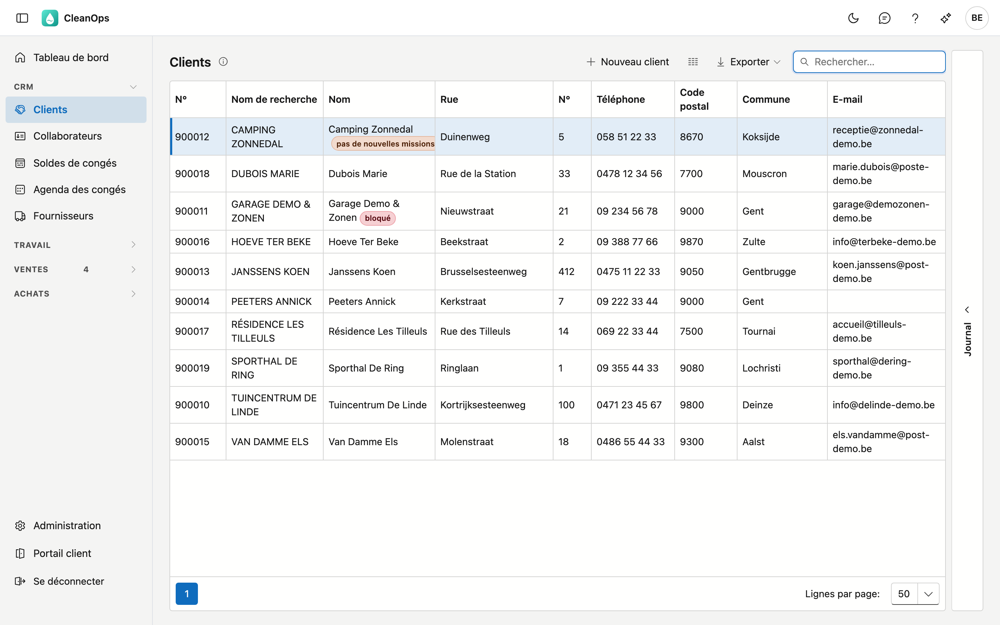
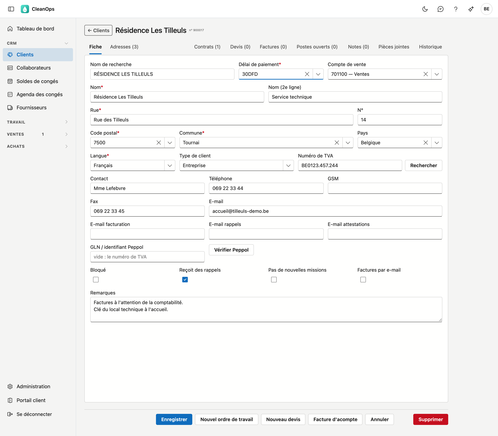
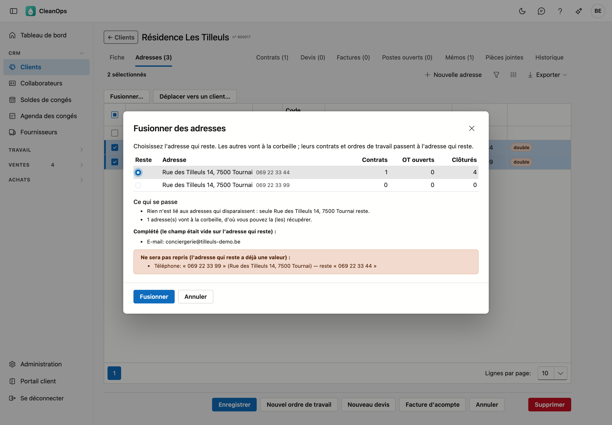
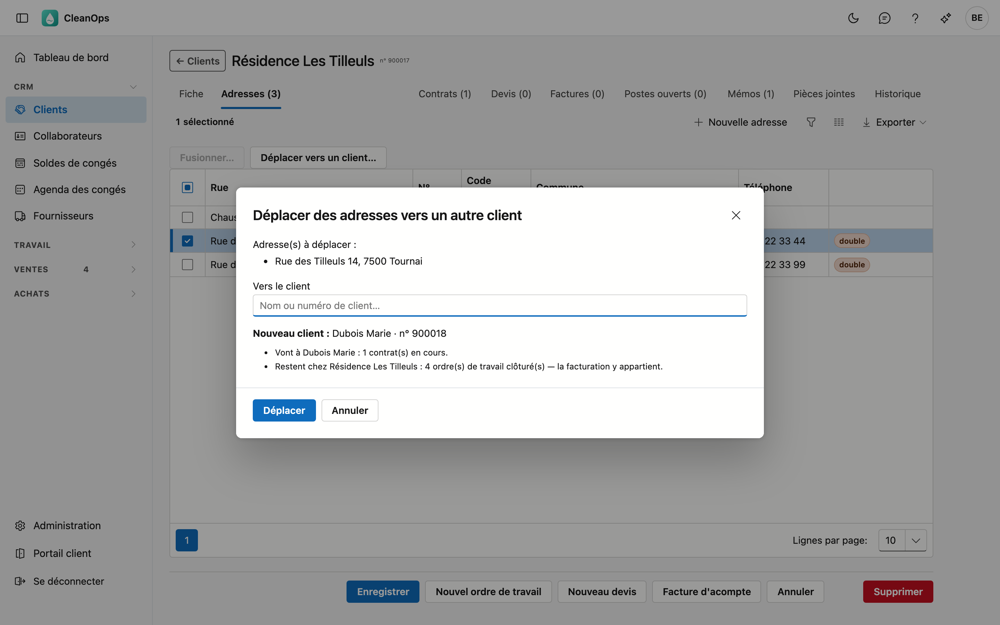
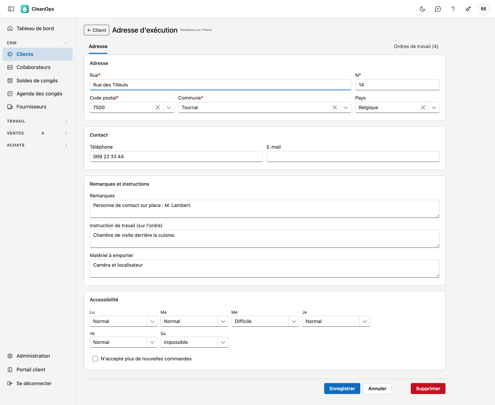
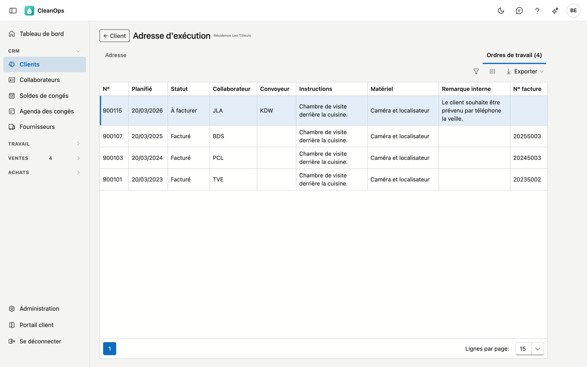
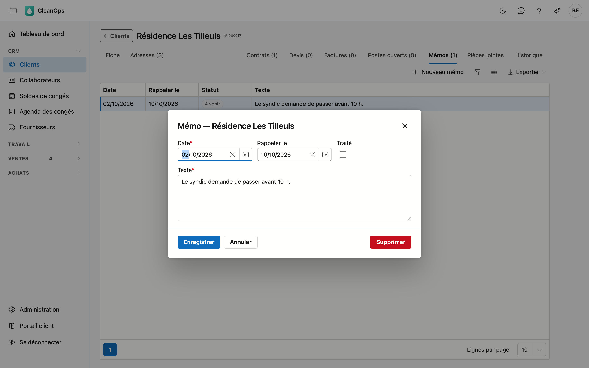

# Clients

Le fichier clients de CleanOps : tous les clients de votre entreprise, avec leurs coordonnées, les adresses où
le travail est exécuté, et tout ce qui leur est rattaché — contrats, devis, factures et postes ouverts.

## Ouvrir l'écran

Dans le menu de gauche, sous **CRM**, cliquez sur **Clients**.

## La liste

Pour chaque client, vous voyez le numéro, le nom de recherche, le nom, un numéro de téléphone (le GSM, sinon le
fixe), le code postal, la commune, le délai de paiement et l'adresse e-mail. Si **bloqué** ou **pas de nouvelles
missions** figure à côté du nom, le client porte cette mention sur sa fiche.

- **Rechercher** — le curseur est déjà dans le champ de recherche. Vous pouvez taper plusieurs mots ; chaque mot
  doit figurer quelque part chez le client. *janssens gent* trouve donc les clients qui s'appellent Janssens et
  habitent à Gand. La recherche porte sur le numéro, le nom de recherche, le nom (les deux lignes), la rue, le
  code postal, la commune, le numéro de TVA, l'adresse e-mail et les numéros de téléphone. Un numéro de téléphone
  se trouve avec ou sans espaces. Si vous tapez un numéro de compte complet (*701100*), vous trouvez aussi les
  clients qui ont ce compte de vente.
- **Trier** — cliquez sur un titre de colonne ; un second clic inverse l'ordre.
- **Exporter** — le bouton en haut à droite vous donne la liste, telle qu'elle est filtrée, sous forme de fichier.
- **Ouvrir** — double-cliquez sur une ligne pour ouvrir la fiche de ce client.
- **Journal** — le volet à droite montre les pièces jointes et l'historique du client que vous sélectionnez dans
  la liste, sans ouvrir la fiche.

## Un nouveau client

Cliquez sur **Nouveau client**. Vous obtenez une fiche vide ; les champs marqués d'un astérisque sont
obligatoires. Après **Enregistrer**, la fiche du nouveau client s'ouvre, avec ses onglets.

## La fiche client

En haut figurent le nom et le numéro du client, puis une rangée d'onglets. À gauche **Fiche** et
**Adresses** — le client lui-même. À droite, ce qui est rattaché au client : **Contrats**, **Devis**,
**Factures**, **Postes ouverts** et **Mémos**, et en fin de rangée **Pièces jointes** et **Historique**.

Chaque onglet reste visible, même vide ; le nombre figure entre parenthèses dans son titre. « Devis (0) »
signifie donc qu'il n'y a pas de devis. Seul l'onglet **Mémos** n'est visible qu'avec le droit de voir les postes ouverts.

### L'onglet Fiche

| Champ | Explication |
|---|---|
| Nom de recherche | Le nom en majuscules. CleanOps le forme lui-même à partir du nom ; il détermine l'ordre dans la liste. |
| Délai de paiement * | Le délai qui sert à calculer l'échéance d'une facture. Vous choisissez parmi les délais de paiement de l'Administration. |
| Compte de vente | Le compte général pour votre bureau comptable, choisi dans le [plan comptable](beheer/rekeningplan.fr.md). Peut rester vide. |
| Nom *, Nom (2e ligne) | Le nom tel qu'il figure sur les documents, 30 caractères au plus chacun. |
| Rue *, N°, Code postal *, Commune *, Pays | L'adresse du client. Après le code postal, Commune propose les localités de ce code (9800 : Deinze, Astene, Vinkt…) ; vous pouvez aussi taper vous-même. |
| Langue * | La langue des documents pour ce client. |
| Type de client | **Entreprise** ou **Particulier**. Une entreprise a besoin d'un numéro de TVA. |
| Numéro de TVA | Un numéro belge est vérifié sur son chiffre de contrôle. **Rechercher** remplit le nom et l'adresse depuis la BCE ; ce que la BCE ne connaît pas reste tel quel. |
| Contact | La personne de contact chez le client. |
| Téléphone, GSM, Fax, E-mail | Un numéro de téléphone, de GSM ou une adresse e-mail doit être valide ; le fax non. |
| E-mail facturation, E-mail rappels, E-mail attestations | Une adresse distincte pour les factures, les rappels et les attestations, si elle diffère de l'adresse e-mail ci-dessus. Chaque champ contient une seule adresse valide. |
| GLN / identifiant Peppol | L'adresse du client sur le réseau Peppol : un numéro GLN de 13 chiffres, ou un identifiant Peppol complet comme `0208:0123456749`. Vide : CleanOps recherche le client avec son numéro de TVA. S'il contient autre chose, la fiche indique qu'il n'est pas utilisable. Avec **Vérifier Peppol**, vous voyez si le client est sur le réseau et s'il reçoit des factures et des notes de crédit — vous savez ainsi si **Envoyer…** sur une facture passe par Peppol ou par e-mail (voir [Factures](facturen.fr.md#envoyer)). |
| Bloqué | Le client reste utilisable, mais figure avec une étiquette dans la liste et se remarque dans la planification. CleanOps le signale lors d'un nouvel ordre de travail. |
| Reçoit des rappels | Désactivez ceci pour un client que vous ne souhaitez pas relancer. |
| Pas de nouvelles missions | Lors d'un nouvel ordre de travail pour ce client, CleanOps demande d'abord une confirmation. |
| Factures par e-mail | Le client préfère recevoir ses factures par e-mail plutôt que par courrier. |
| Remarques | Du texte libre sur le client, comme les coordonnées de personnes ou des accords. |

Cliquez sur **Enregistrer** pour sauvegarder. S'il manque un champ obligatoire, CleanOps indique lequel. Une
adresse e-mail, un numéro de téléphone ou un numéro de TVA incorrect est refusé — même si vous ne l'avez pas
modifié vous-même ; corrigez-le d'abord. **Annuler** vous ramène à la liste sans sauvegarder.

### L'onglet Adresses

Les adresses d'exécution : les lieux où le travail est effectué. Un client possédant plusieurs bâtiments a une
adresse sur sa fiche et plusieurs adresses d'exécution. Si une autre adresse du même client a la même rue, le même
numéro et le même code postal, **double** figure à côté.

**Nouvelle adresse** en ajoute une ; ouvrir une ligne vous mène à l'adresse même.

#### Fusionner des adresses

Si deux adresses ou plus désignent le même bâtiment — **double** figure souvent à côté —, cochez-les et cliquez sur
**Fusionner…**. La fenêtre montre pour chaque adresse le nombre de contrats, d'ordres de travail ouverts et d'ordres
clôturés qui y sont liés. Choisissez sous **Reste** l'adresse que vous gardez ; celle à laquelle le plus est lié est
proposée.

En dessous figure ce qui se passe, avant que vous confirmiez :

- Les contrats et ordres de travail des autres adresses passent à l'adresse qui reste. Les ordres encore à exécuter
  reçoivent aussi son adresse ; un ordre clôturé garde l'adresse de l'époque.
- **Complété** — un champ vide sur l'adresse qui reste reçoit la valeur d'une autre adresse : téléphone, e-mail,
  remarques, instruction de travail, matériel ou accessibilité.
- **Ne sera pas repris** — si l'adresse qui reste a déjà une valeur, celle-ci est gardée. La valeur de l'autre adresse
  est indiquée, pour que vous puissiez la reprendre vous-même.
- Si une autre adresse est sur **N'accepte plus de nouvelles commandes**, la fenêtre le signale. L'adresse qui reste ne
  le reprend pas ; activez-le vous-même si nécessaire.

**Fusionner** place les autres adresses dans la [corbeille](beheer/prullenbak.fr.md). La modification figure dans
l'historique de chaque contrat et de chaque ordre de travail qui a reçu une autre adresse.

#### Déplacer des adresses vers un autre client

Si une adresse appartient à un autre client — le bâtiment a été vendu, ou elle figure chez le mauvais client —,
cochez-la et cliquez sur **Déplacer vers un client…**. Cherchez le nouveau client par son nom ou son numéro et cliquez
sur **choisir**. La fenêtre indique alors ce qui part et ce qui reste :

- Les **contrats en cours** (aussi ceux en attente) et les **ordres de travail encore à exécuter** partent chez le
  nouveau client. Ces ordres reçoivent la langue du nouveau client ; un numéro de téléphone repris du client actuel
  devient celui du nouveau.
- Les **ordres de travail clôturés** et les **contrats terminés ou archivés** restent chez le client actuel : la
  facturation y appartient.
- Si un ordre qui part porte un numéro de commande du client actuel, celui-ci reste en place. La fenêtre le signale,
  pour que vous puissiez le vérifier.

Sur une adresse d'exécution, la rue, le code postal et la commune sont obligatoires. Par ailleurs :

- **Remarques**, **Instruction de travail (sur l'ordre)** et **Matériel à emporter** — qui choisit cette adresse
  sur un ordre de travail y retrouve ces textes : les remarques comme remarque interne, l'instruction et le
  matériel dans leur propre champ. Ce qui figurait déjà sur l'ordre de travail reste en place.
- **Accessibilité** — par jour *Normal*, *Difficile* ou *Impossible*. Qui choisit cette adresse sur un nouvel
  ordre de travail voit les jours où elle est difficile ou impossible d'accès.
- **N'accepte plus de nouvelles commandes** — lors d'un nouvel ordre de travail à cette adresse, CleanOps demande
  d'abord une confirmation.

**Supprimer** place l'adresse dans la [corbeille](beheer/prullenbak.fr.md). **← Client** vous ramène à l'onglet
Adresses.

#### L'onglet Ordres de travail d'une adresse

Sur une adresse existante, l'onglet **Ordres de travail** figure à côté d'**Adresse** : tous les ordres de travail à
cette adresse, du plus récent au plus ancien, avec la planification, le statut, le collaborateur et le convoyeur, les
instructions, le matériel, la remarque interne et le numéro de facture. Vous voyez ainsi ce qui était nécessaire les
fois précédentes. Si du travail d'un autre client est lié à cette adresse — après un déplacement, le travail clôturé
reste chez le client précédent —, une colonne **Client** s'ajoute.

Double-cliquez sur un ordre pour l'ouvrir ; **← Adresse** vous ramène à cet onglet. L'onglet est visible pour qui peut
ouvrir les ordres de travail.

### Ce qui est rattaché au client

**Contrats** — les contrats périodiques de ce client, avec le numéro, la description, la fréquence et la date de
début. Ce sont ces contrats qui donnent naissance aux ordres de travail.

**Devis** — avec le numéro, la date, la description, le total et le statut.

**Factures** — les factures et notes de crédit, avec le numéro, le type, la date, le total, l'échéance et la
communication. La communication est la référence structurée que le client mentionne lors de son paiement.

**Postes ouverts** — ce qui reste dû par ce client. En haut figure le solde ouvert, en rouge s'il dépasse zéro.
Pour chaque poste, vous voyez le document, la date, l'échéance, le solde ouvert et le nombre de rappels. En
dessous figure l'**historique des rappels** : les rappels envoyés, avec la date, le document et le niveau.

**Mémos** — ce qui a été convenu avec ce client, avec la date et éventuellement une date de rappel. Voir
[Mémos](#memos) ci-dessous.

**Pièces jointes** — les documents de ce client. **Pièce jointe** ajoute un fichier, jusqu'à 25 Mo ; pour chacune,
vous adaptez la description ou vous la supprimez.

**Historique** — qui a modifié quel champ de ce client, quand, et de quelle valeur vers quelle autre. Le plus
récent figure en haut.

Chaque onglet dispose de son propre bouton d'exportation, ce qui vous permet d'exporter un élément séparément.

### Mémos

Dans l'onglet **Mémos**, vous notez ce qui a été convenu avec le client, par exemple sur un paiement. Cliquez sur **Nouveau mémo**,
ou double-cliquez sur un mémo pour le modifier.

| Champ | Ce qu'il contient |
|---|---|
| Date | Le jour du mémo, aujourd'hui par défaut. Au plus 10 jours après aujourd'hui. |
| Rappeler le | Le jour où vous voulez revoir le mémo. Ce jour-là, il figure dans [Mémos à suivre](op-te-volgen-memos.fr.md). Pas avant la date. |
| Traité | Uniquement pour un mémo avec une date de rappel : ce qui devait être fait l'a-t-il été ? |
| Texte | Ce qui a été convenu. Obligatoire. |

La colonne **Statut** indique pour chaque mémo **À suivre**, **À venir** ou **Traité**. La suppression est définitive. Vous créez
et modifiez des mémos avec le droit de gérer les rappels.

### Les boutons en bas

À côté d'**Enregistrer** et d'**Annuler**, la fiche peut porter trois boutons : **Nouvel ordre de travail**,
**Nouveau devis** et **Facture d'acompte**. Vous n'en voyez un que si vous avez le droit de créer ce qu'il crée,
et que la partie vers laquelle il mène est ouverte pour vous. Ce que vous créez ainsi apparaît dans l'onglet
correspondant.

!!! info "Tous les boutons ne sont pas visibles par tout le monde"
    Les boutons que vous voyez et les lignes que vous pouvez ouvrir dépendent de vos droits. Une partie qui n'est
    pas encore disponible n'apparaît pas dans votre menu — et les boutons qui y mènent ne vous sont donc pas
    montrés non plus. Si votre collègue voit un bouton que vous n'avez pas, c'est une différence de droits et non
    un problème.

## Supprimer un client

**Supprimer**, en bas de la fiche, place le client dans la [corbeille](beheer/prullenbak.fr.md), d'où vous le
restaurez. Si le client a des contrats en cours, la question indique combien : ils ne génèrent plus d'ordres de
travail tant que le client est dans la corbeille.

## Questions fréquentes

**Je ne peux pas enregistrer un client : « Adresse e-mail invalide » (ou numéro de téléphone).**
Le champ contient une valeur incorrecte, par exemple une espace au milieu d'une adresse e-mail. Corrigez le champ
et enregistrez à nouveau.

**Je ne retrouve pas un client.**
Cherchez sur une partie du nom, la rue, le code postal ou le numéro de téléphone. Si le client n'y est vraiment
plus, consultez la [corbeille](beheer/prullenbak.fr.md).
