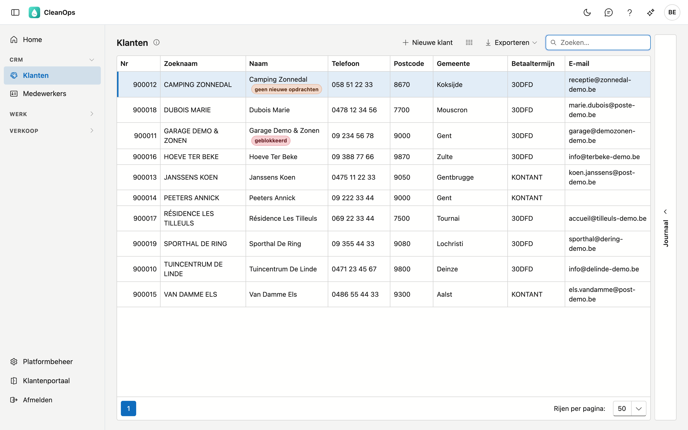
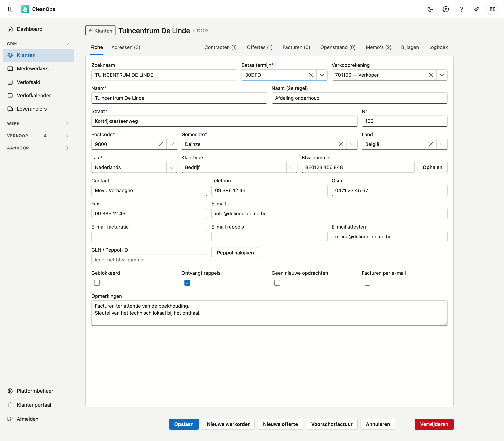
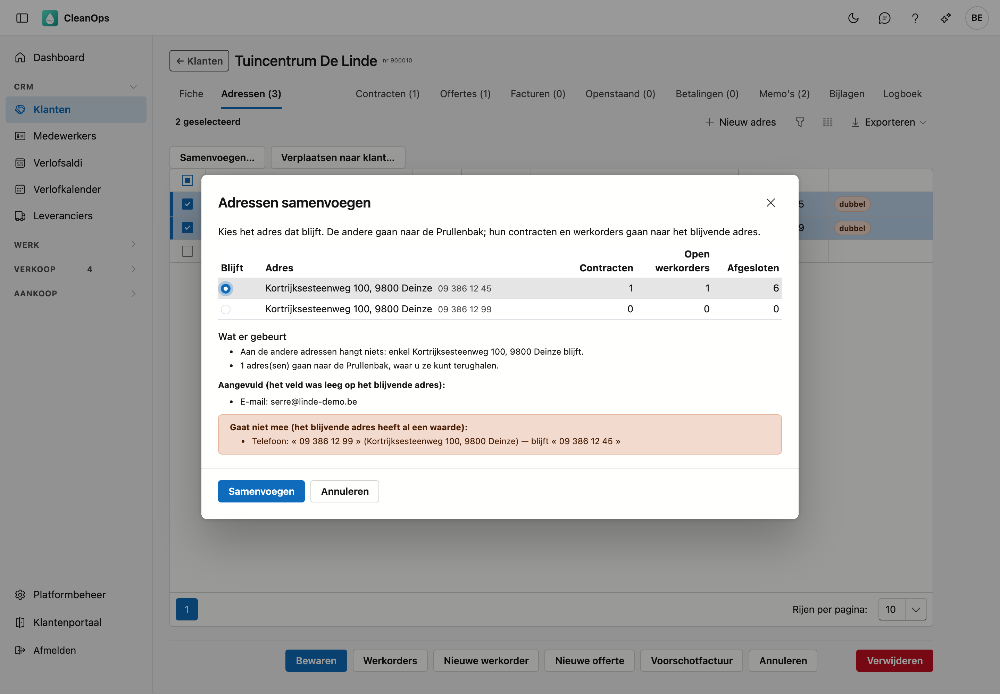
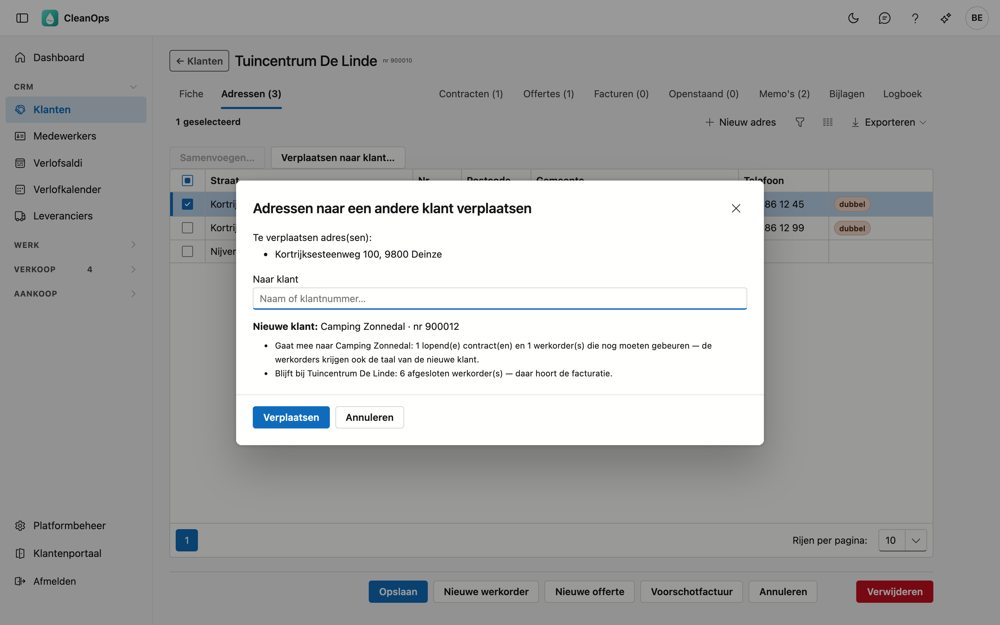
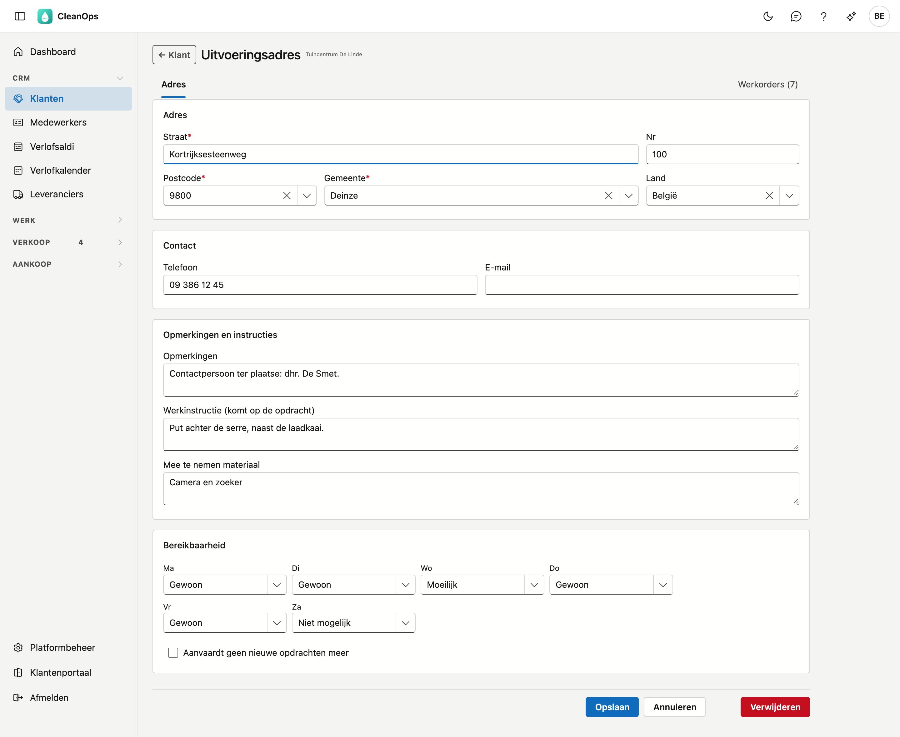
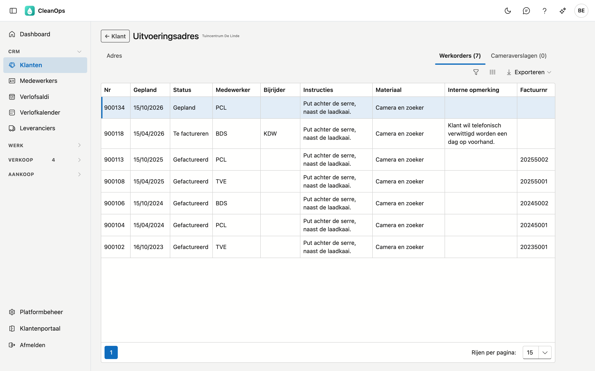
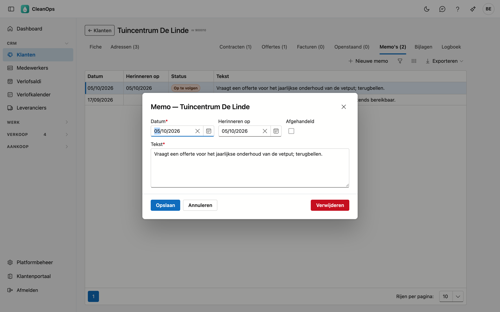

# Klanten

Het klantenbestand van CleanOps: alle klanten van uw bedrijf, met hun gegevens, de adressen waar gewerkt wordt,
en alles wat aan hen hangt — contracten, offertes, facturen en openstaande posten.

## Het scherm openen

Klik links in het menu, onder **CRM**, op **Klanten**.

## De lijst

Per klant ziet u het nummer, de zoeknaam, de naam, de straat en het huisnummer, een telefoonnummer (de gsm, en
anders het vaste nummer), de postcode, de gemeente en het e-mailadres. Zo houdt u klanten met dezelfde naam uit
elkaar. Het **btw-nummer** en de **betaaltermijn** staan standaard verborgen: met de kolomkiezer zet u ze erbij.
Staat er naast de naam **geblokkeerd** of **geen nieuwe opdrachten**, dan draagt de klant die aanduiding op zijn
fiche.

- **Zoeken** — de cursor staat meteen in het zoekveld. U mag meerdere woorden typen; elk woord moet ergens bij
  de klant voorkomen. *janssens gent* vindt dus de klanten die Janssens heten en in Gent wonen. Er wordt gezocht
  in het nummer, de zoeknaam, de naam (beide regels), de straat, de postcode, de gemeente, het btw-nummer, het
  e-mailadres en de telefoonnummers. Een telefoonnummer vindt u met of zonder spaties. Typt u een volledig
  rekeningnummer (*701100*), dan vindt u ook de klanten met die verkooprekening.
- **Sorteren** — klik op een kolomtitel; nog eens klikken keert de volgorde om.
- **Exporteren** — via de knop rechtsboven krijgt u de lijst zoals ze nu gefilterd is als bestand.
- **Openen** — dubbelklik op een rij om de fiche van die klant te openen.
- **Journaal** — de strook rechts toont de bijlagen en het logboek van de klant die u in de lijst aanklikt,
  zonder de fiche te openen.

## Een nieuwe klant

Klik op **Nieuwe klant**. U krijgt een lege fiche; de velden met een sterretje zijn verplicht. Na **Bewaren**
opent de fiche van de nieuwe klant, met de tabbladen erbij. CleanOps maakt meteen ook een eerste uitvoeringsadres uit
het adres en de telefoon van de klant, en zegt dat bovenaan; u vindt het onder **Adressen**.

## De klantfiche

Bovenaan staan de naam en het klantnummer, daaronder een rij tabbladen. Links **Fiche** en **Adressen** —
dat is de klant zelf. Rechts daarvan staat wat aan de klant hangt: **Contracten**, **Offertes**, **Facturen**,
**Openstaand** en **Memo's**, en achteraan **Bijlagen** en **Logboek**.

Elk tabblad blijft staan, ook als er niets in zit; het aantal staat tussen haakjes in de titel. "Offertes (0)"
betekent dus dat er geen offertes zijn. Enkel **Memo's** ziet u alleen met het recht om de openstaande posten te bekijken.

### Het tabblad Fiche

| Veld | Toelichting |
|---|---|
| Zoeknaam | De naam in hoofdletters. CleanOps maakt ze zelf uit de naam; ze bepaalt de volgorde in de lijst. |
| Betaaltermijn * | De termijn waarmee de vervaldag van een factuur berekend wordt. U kiest uit de betalingstermijnen van Platformbeheer. |
| Verkooprekening | De algemene rekening voor uw boekhoudkantoor, gekozen uit het [rekeningplan](beheer/rekeningplan.md). Mag leeg blijven. |
| Naam *, Naam (2e regel) | De naam zoals hij op documenten komt, elk hoogstens 30 tekens. |
| Straat *, Nr, Postcode *, Gemeente *, Land | Het adres van de klant. Na de postcode biedt Gemeente de plaatsen van die postcode aan (9800: Deinze, Astene, Vinkt…); u mag ook zelf typen. |
| Taal * | De taal van de documenten voor deze klant. |
| Klanttype | **Bedrijf** of **Particulier**. Een bedrijf heeft een btw-nummer nodig. |
| Btw-nummer | Een Belgisch nummer wordt op zijn controlecijfer getoetst. Met **Ophalen** toont CleanOps eerst wat de KBO weet — naam, type, oprichting, juridische situatie, rechtsvorm en adres, en in het rood **stopgezet** als de onderneming niet meer actief is. Met **Overnemen** komen naam en adres (met toevoeging en bus bij het huisnummer) op de fiche; wat de KBO niet kent, blijft staan. Bewaren doet u daarna zelf. ⚠️ De KBO geeft de maatschappelijke zetel, niet altijd het adres waar u factureert. |
| Contact | De contactpersoon bij de klant. |
| Telefoon, Gsm, Fax, E-mail | Een telefoonnummer, gsm-nummer of e-mailadres moet geldig zijn; de fax niet. |
| E-mail facturatie, E-mail rappels, E-mail attesten | Een apart adres voor facturen, rappels en attesten, als dat een ander is dan het e-mailadres hierboven. Elk veld bevat één geldig adres. |
| GLN / Peppol-ID | Het adres van de klant op het Peppol-netwerk: een GLN-nummer van 13 cijfers, of een volledig Peppol-ID zoals `0208:0123456749`. Leeg: CleanOps zoekt de klant op met zijn btw-nummer. Staat er iets anders, dan zegt de fiche dat het niet bruikbaar is. Met **Peppol nakijken** ziet u of de klant op het netwerk staat en of hij facturen en creditnota's ontvangt — zo weet u of **Versturen…** op een factuur via Peppol of per mail gaat (zie [Facturen](facturen.md#versturen)). |
| Geblokkeerd | De klant blijft gewoon bruikbaar, maar staat met een label in de lijst en valt op in de planning. Bij een nieuwe werkorder meldt CleanOps het. |
| Ontvangt rappels | Zet dit af voor een klant die u niet wilt aanmanen. |
| Geen nieuwe opdrachten | Bij een nieuwe werkorder voor deze klant vraagt CleanOps eerst een bevestiging. |
| Facturen per e-mail | De klant ontvangt zijn facturen liever per e-mail dan per post. |
| Opmerkingen | Vrije tekst bij de klant, zoals contactgegevens van personen of afspraken. |

Klik op **Bewaren** om te bewaren. Ontbreekt er een verplicht veld, dan zegt CleanOps welk. Een e-mailadres,
telefoonnummer of btw-nummer dat niet klopt, wordt geweigerd — ook als u het zelf niet gewijzigd hebt; verbeter
het dan eerst. **Annuleren** brengt u terug naar de lijst zonder te bewaren.

### Het tabblad Adressen

De uitvoeringsadressen: de plaatsen waar het werk gebeurt. Een klant met meerdere panden heeft één adres op zijn
fiche en meerdere uitvoeringsadressen. Heeft een ander adres van dezelfde klant dezelfde straat, hetzelfde
nummer en dezelfde postcode, dan staat er **dubbel** bij.

Met **Nieuw adres** voegt u er één toe; een rij openen brengt u naar het adres zelf.

#### Adressen samenvoegen

Zijn twee of meer adressen hetzelfde pand — vaak staat er **dubbel** bij —, vink ze aan en klik **Samenvoegen…**. Het
venster toont per adres hoeveel contracten, open werkorders en afgesloten werkorders eraan hangen. Kies bij **Blijft** het
adres dat u houdt; voorgekozen is het adres waar het meeste aan hangt.

Daaronder staat wat er gebeurt, vóór u bevestigt:

- De contracten en werkorders van de andere adressen gaan naar het blijvende adres. Werkorders die nog moeten gebeuren,
  krijgen ook zijn adres; een afgesloten werkorder houdt het adres van toen.
- **Aangevuld** — een veld dat leeg is op het blijvende adres, krijgt de waarde van een ander adres: telefoon, e-mail,
  opmerkingen, werkinstructie, materiaal of bereikbaarheid.
- **Gaat niet mee** — heeft het blijvende adres zelf een waarde, dan blijft die. De waarde van het andere adres staat
  erbij, zodat u ze zelf kunt overnemen.
- Staat een ander adres op **Aanvaardt geen nieuwe opdrachten meer**, dan zegt het venster dat. Het blijvende adres
  neemt dat niet over; zet het zelf aan als het moet.

Met **Samenvoegen** gaan de andere adressen naar de [prullenbak](beheer/prullenbak.md). De wijziging staat in het
logboek van elk contract en elke werkorder die een ander adres kreeg.

#### Adressen naar een andere klant verplaatsen

Hoort een adres bij een andere klant — het pand werd verkocht, of het staat bij de verkeerde klant —, vink het aan en
klik **Verplaatsen naar klant…**. Zoek de nieuwe klant op naam of nummer en klik **kies**. Het venster zegt dan wat er
meegaat en wat blijft:

- De **lopende contracten** (ook die on hold) en de **werkorders die nog moeten gebeuren** gaan mee naar de nieuwe
  klant. Die werkorders krijgen de taal van de nieuwe klant; een telefoonnummer dat van de huidige klant kwam, wordt dat
  van de nieuwe.
- **Afgesloten werkorders** en **beëindigde of gearchiveerde contracten** blijven bij de huidige klant: daar hoort de
  facturatie.
- Draagt een meegaande werkorder een bestelnummer van de huidige klant, dan blijft dat staan. Het venster waarschuwt
  ervoor, zodat u het kunt nakijken.

Op een uitvoeringsadres zijn straat, postcode en gemeente verplicht. Verder:

- **Opmerkingen**, **Werkinstructie (komt op de opdracht)** en **Mee te nemen materiaal** — wie dit adres kiest
  op een werkorder, krijgt deze teksten daar aangevuld: de opmerkingen als interne opmerking, de werkinstructie
  en het materiaal in hun eigen veld. Wat al op de werkorder stond, blijft staan.
- **Bereikbaarheid** — per dag *Gewoon*, *Moeilijk* of *Niet mogelijk*. Wie dit adres kiest op een nieuwe
  werkorder, ziet op welke dagen het moeilijk of niet bereikbaar is.
- **Aanvaardt geen nieuwe opdrachten meer** — bij een nieuwe werkorder op dit adres vraagt CleanOps eerst een
  bevestiging.

**Verwijderen** legt het adres in de [prullenbak](beheer/prullenbak.md). Hangen er lopende contracten of open werkorders aan,
dan zegt de vraag dat eerst: een lopend contract blijft er werkorders naartoe maken, ook als het adres niet meer op de klantfiche
staat. Is het een dubbel adres, gebruik dan liever **Samenvoegen…**. Met **← Klant** keert u terug naar het tabblad Adressen.

#### Het tabblad Werkorders van een adres

Op een bestaand adres staat naast **Adres** het tabblad **Werkorders**: alle werkorders op dat adres, de nieuwste eerst,
met de planning, de status, de medewerker en de bijrijder, de instructies, het materiaal, de interne opmerking en het
factuurnummer. Zo ziet u wat er de vorige keren nodig was. Hangt er werk van een andere klant aan dit adres — na een
verplaatsing blijft afgesloten werk bij de vorige klant —, dan staat er een kolom **Klant** bij.

Dubbelklik op een werkorder om ze te openen; **← Adres** brengt u terug naar dit tabblad. Klik op het factuurnummer om de
factuur te openen. Het tabblad staat er voor wie
de werkorders mag openen.

### Wat aan de klant hangt

**Contracten** — de periodieke contracten van deze klant, met nummer, omschrijving, frequentie en startdatum.
Uit deze contracten ontstaan de werkorders.

**Offertes** — met nummer, datum, omschrijving, totaal en status.

**Facturen** — de facturen en creditnota's, met nummer, type, datum, totaal, vervaldag, wat er nog **openstaat** (leeg als
alles betaald is) en mededeling. De mededeling is de gestructureerde referentie die de klant bij zijn betaling vermeldt.

**Openstaand** — wat er van deze klant nog openstaat. Bovenaan staat het openstaande saldo, in het rood als het
groter is dan nul. Per post ziet u het document, de datum, de vervaldag, het oorspronkelijke en het openstaande bedrag en
het aantal rappels. Daaronder staat de **rappelhistoriek**: de verstuurde rappels, met datum, document, niveau en wie ze verstuurde.
Is ze leeg terwijl een post al rappels telt, dan komen die rappels van vóór het logboek van uw vorige toepassing: die
staan enkel als aantal bij de post.

**Memo's** — wat er met deze klant afgesproken is, met de datum en eventueel een herinneringsdatum. Zie
[Memo's](#memos) hieronder.

**Bijlagen** — de documenten bij deze klant. Met **Bijlage** voegt u een bestand toe, tot 25 MB; per bijlage
past u de omschrijving aan of haalt u ze weg.

**Logboek** — wie welk veld van deze klant gewijzigd heeft, wanneer, en van welke waarde naar welke. Het nieuwste
staat bovenaan.

Elk tabblad heeft een eigen exportknop, zodat u één onderdeel apart kunt uitvoeren.

### Memo's

Op het tabblad **Memo's** noteert u wat er met de klant afgesproken is, bijvoorbeeld over een betaling. Klik op **Nieuwe memo**,
of dubbelklik op een memo om ze te wijzigen.

| Veld | Wat erin hoort |
|---|---|
| Datum | De dag van de memo, standaard vandaag. Hoogstens 10 dagen na vandaag. |
| Herinneren op | De dag waarop u de memo terug wilt zien. Die dag staat ze in [Op te volgen memo's](op-te-volgen-memos.md). Niet vóór de datum. |
| Afgehandeld | Enkel bij een memo met een herinneringsdatum: is er gedaan wat er moest gebeuren? |
| Tekst | Wat er afgesproken is. Verplicht. |

De kolom **Status** zegt per memo **Op te volgen**, **Komend** of **Afgehandeld**. Verwijderen is definitief. Memo's maken en
wijzigen doet u met het recht om de rappels te beheren.

### De knoppen onderaan

Naast **Bewaren** en **Annuleren** kan de fiche vier knoppen dragen.

- **Werkorders** opent de [werkorderlijst](werkorders.md) met enkel de werkorders van deze klant, over alle statussen.
  U ziet hem wanneer u de werkorders mag openen.
- **Nieuwe werkorder**, **Nieuwe offerte** en **Voorschotfactuur** ziet u enkel wanneer u het recht hebt om te maken
  wat ze maken, én het onderdeel waar ze naartoe leiden voor u vrijgegeven is. Wat u zo aanmaakt, verschijnt in het
  bijbehorende tabblad.

!!! info "Niet elke knop is voor iedereen zichtbaar"
    Welke knoppen u ziet en welke rijen u kunt openen, hangt af van wat u mag. Een onderdeel dat nog niet
    vrijgegeven is, verschijnt niet in uw menu — en de knoppen die ernaartoe leiden, toont CleanOps u dan ook
    niet. Ziet uw collega een knop die u niet heeft, dan is dat het verschil in rechten en geen storing.

## Een klant verwijderen

**Verwijderen** onderaan de fiche legt de klant in de [prullenbak](beheer/prullenbak.md); van daaruit haalt u hem
terug. Heeft de klant lopende contracten, dan zegt de vraag hoeveel: die maken geen werkorders meer zolang de
klant in de prullenbak ligt.

## Veelgestelde vragen

**Ik kan een klant niet bewaren: "Ongeldig e-mailadres" (of telefoonnummer).**
Het veld bevat een waarde die niet klopt, bijvoorbeeld een spatie midden in een e-mailadres. Verbeter het veld
en sla opnieuw op.

**Ik vind een klant niet terug.**
Zoek op een deel van de naam, de straat, de postcode of het telefoonnummer. Staat de klant er echt niet meer,
kijk dan in de [prullenbak](beheer/prullenbak.md).
