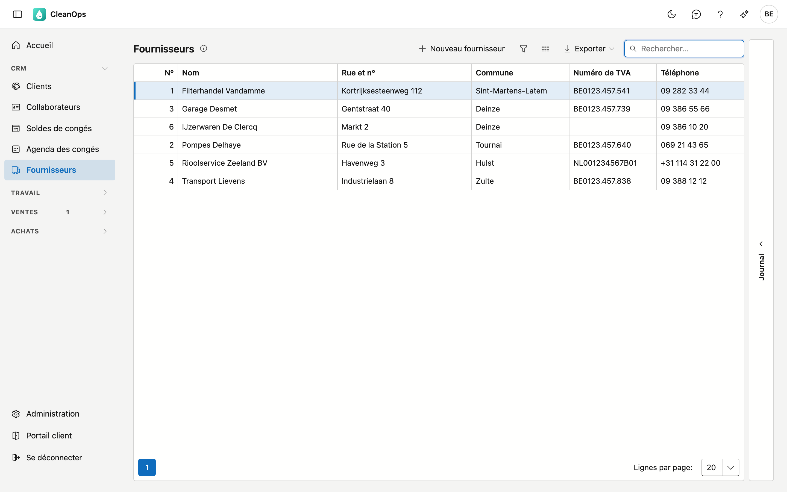
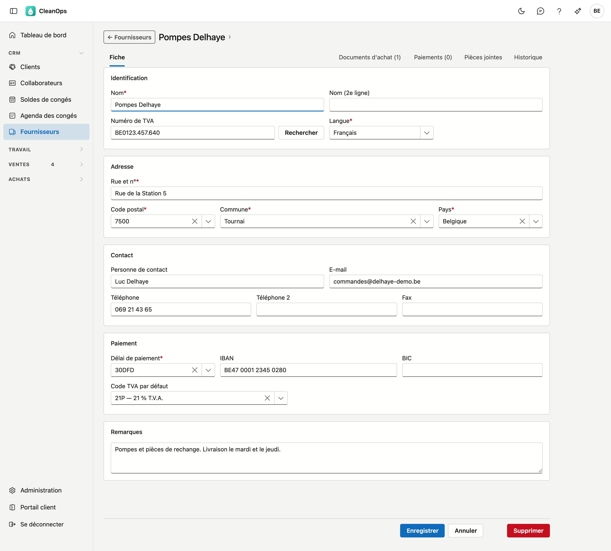
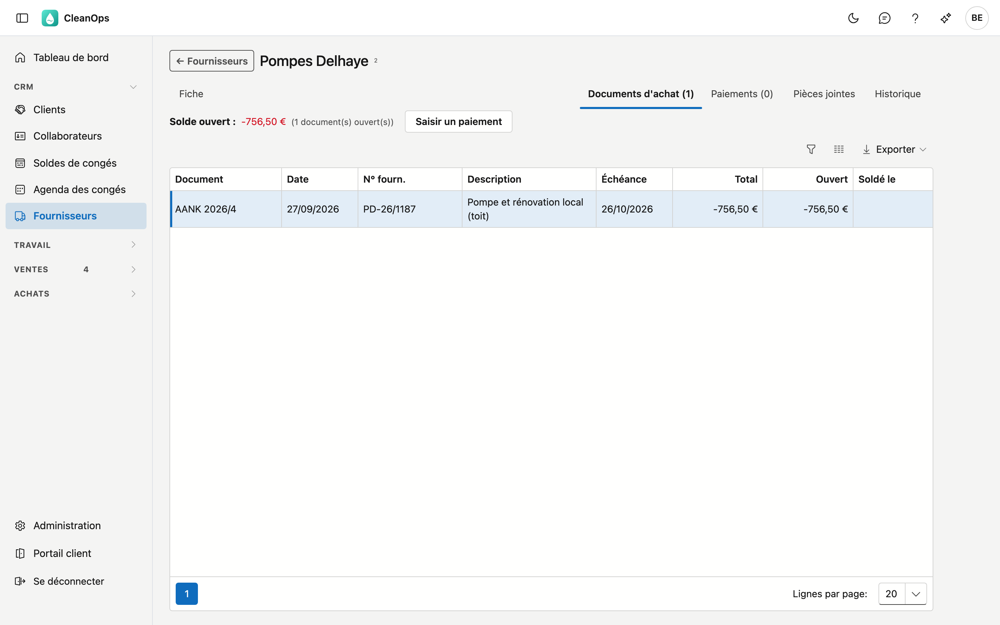
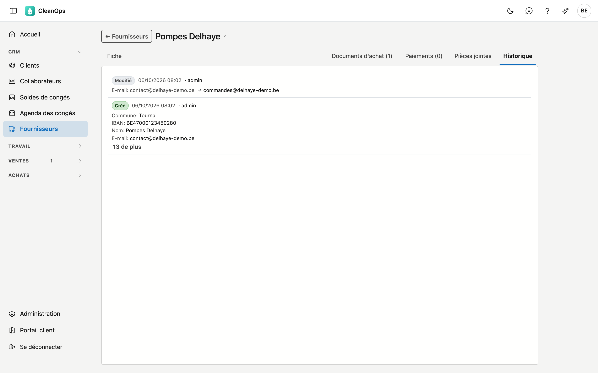

# Fournisseurs

Les entreprises chez qui vous achetez et que vous payez. Par fournisseur, CleanOps garde les données, la manière de
le joindre, et comment et quand vous le payez.

## Ouvrir l'écran

Cliquez à gauche dans le menu, sous **CRM**, sur **Fournisseurs**.

## La liste

Par fournisseur, vous voyez le numéro, le nom, la rue, la commune, le numéro de TVA et le téléphone, triés par nom.

- **Rechercher** — le curseur se trouve directement dans le champ de recherche. La recherche porte sur chaque
  colonne, donc aussi sur une partie du numéro de TVA ou de la rue.
- **Trier** — cliquez sur un titre de colonne ; un second clic inverse l'ordre.
- **Exporter** — le bouton en haut à droite vous donne la liste telle qu'elle est filtrée, sous forme de fichier.
- **Ouvrir** — double-cliquez sur une ligne pour ouvrir la fiche de ce fournisseur.
- **Journal** — le volet à droite montre les pièces jointes et l'historique du fournisseur sélectionné dans la
  liste, sans ouvrir la fiche.

## Un nouveau fournisseur

Cliquez sur **Nouveau fournisseur**. Vous obtenez une fiche vide ; les champs marqués d'un astérisque sont
obligatoires. CleanOps attribue lui-même le numéro. Après **Enregistrer**, la fiche du nouveau fournisseur s'ouvre,
avec ses onglets.

Si une facture arrive par Peppol d'un fournisseur que CleanOps ne connaît pas encore, vous le créez depuis cette
facture : la fiche est alors préremplie avec les données du document, et après **Enregistrer** vous revenez à la
facture. Voir [Documents reçus](binnengekomen-documenten.md).

## La fiche fournisseur

En haut figurent le nom et le numéro, en dessous les onglets **Fiche**, **Documents d'achat**, **Paiements**, **Pièces jointes**
et **Historique**. Documents d'achat et Paiements s'affichent avec le droit *Voir les achats*.

### L'onglet Fiche

**Identification**

| Champ | Explication |
|---|---|
| Nom * | 30 caractères maximum. La liste est triée sur ce nom. |
| Nom (2e ligne) | Une deuxième ligne, par exemple un service. |
| Numéro de TVA | Un numéro belge est vérifié sur son chiffre de contrôle ; un numéro étranger non. **Rechercher** à côté montre d'abord ce que sait la BCE (avec **arrêtée** en rouge si l'entreprise n'est plus active) ; **Reprendre** place le nom et l'adresse sur la fiche. Si rien ne revient, CleanOps dit pourquoi : la BCE ne connaît pas le numéro, ou la recherche est momentanément indisponible (réessayez plus tard). |
| Langue * | Néerlandais ou français. |

!!! note "Un numéro de TVA ne figure que chez un seul fournisseur"
    CleanOps refuse un numéro de TVA qui figure déjà chez un autre fournisseur, même écrit autrement
    (« BE0123.457.640 » et « 0123457640 » sont le même numéro), et même si cet autre fournisseur se trouve dans la
    corbeille. Le message indique chez quel fournisseur il figure.

**Adresse** — rue et numéro (dans un seul champ), code postal, commune et pays ; les quatre sont obligatoires.
Après le code postal, Commune propose les localités de ce code ; vous pouvez aussi taper vous-même. En dessous, **Carte** et
**Itinéraire** ouvrent l'adresse dans Google Maps, dans un nouvel onglet.

**Contact** — personne de contact, e-mail, deux numéros de téléphone et fax. Une adresse e-mail ou un numéro de
téléphone rempli doit être valide ; le laisser vide est permis.

**Paiement**

| Champ | Explication |
|---|---|
| Délai de paiement * | Dans la liste des [délais de paiement](beheer/betalingstermijnen.md). Fixe l'échéance des factures d'achat de ce fournisseur. |
| IBAN | Le compte sur lequel vous payez le fournisseur. Il est vérifié sur son chiffre de contrôle et affiché par groupes de quatre. Sans IBAN, le fournisseur ne figure pas dans le fichier SEPA de la [proposition de paiement](betalingsvoorstel.md). |
| BIC | Le code de sa banque, 8 ou 11 caractères. Dans la zone euro, vous pouvez le laisser vide. |
| Code TVA par défaut | Dans les [codes TVA](beheer/btw-codes.md). Préremplit une nouvelle facture d'achat de ce fournisseur ; le laisser vide est permis. |

**Remarques** — texte libre, par exemple des accords sur les livraisons.

Cliquez sur **Enregistrer** pour sauvegarder. S'il manque un champ obligatoire ou qu'une valeur est incorrecte,
CleanOps indique lequel. **Annuler** vous ramène à la liste sans enregistrer.

### L'onglet Documents d'achat

Toutes les [factures d'achat](aankoopfacturen.md) et notes de crédit de ce fournisseur, la plus récente en haut. Au-dessus de la
liste figure son **solde ouvert** : ce que vous lui devez encore, comme sur l'extrait (négatif), et le nombre de documents encore
ouverts. Avec **Saisir un paiement**, vous les payez en une fois : la fenêtre de [Paiements](betalingen.md) s'ouvre avec leur solde
rempli. La colonne **Soldé le** montre le jour où un document a été entièrement payé — le jour du dernier paiement, ou la date de
comptabilisation s'il était déjà payé avant d'être comptabilisé. Double-cliquez sur un document pour l'ouvrir.

### L'onglet Paiements

Les paiements à ce fournisseur, le plus récent en haut, avec la date et le numéro de l'extrait et le montant. Un paiement annulé
porte l'étiquette **annulé**. Ce qu'un paiement a soldé se voit dans [Paiements](betalingen.md).

### L'onglet Pièces jointes

Les documents de ce fournisseur, comme un contrat ou une liste de prix. Avec **Pièce jointe**, vous ajoutez un
fichier, jusqu'à 25 Mo ; par pièce jointe, vous adaptez la description ou vous la retirez.

### L'onglet Historique

Qui a modifié quel champ de ce fournisseur, quand, et de quelle valeur vers quelle valeur. Le plus récent figure en
haut.

## Supprimer un fournisseur

**Supprimer** au bas de la fiche place le fournisseur dans la [corbeille](beheer/prullenbak.md) ; vous l'y
récupérez.

## Questions fréquentes

**Un fournisseur ne figure pas dans la liste.**
Regardez dans la [corbeille](beheer/prullenbak.md).

**Le numéro de TVA est refusé alors qu'il est correct.**
Lisez le message : si le numéro figure déjà chez un autre fournisseur, il le nomme. Une entreprise ne doit figurer
qu'une seule fois dans la liste.

**Où se trouve l'ancien numéro de compte de mon logiciel précédent ?**
Dans le champ IBAN. Un numéro de compte belge de 12 chiffres a été converti lors de la reprise en son IBAN : c'est
le même numéro, précédé de BE et de deux chiffres de contrôle.
