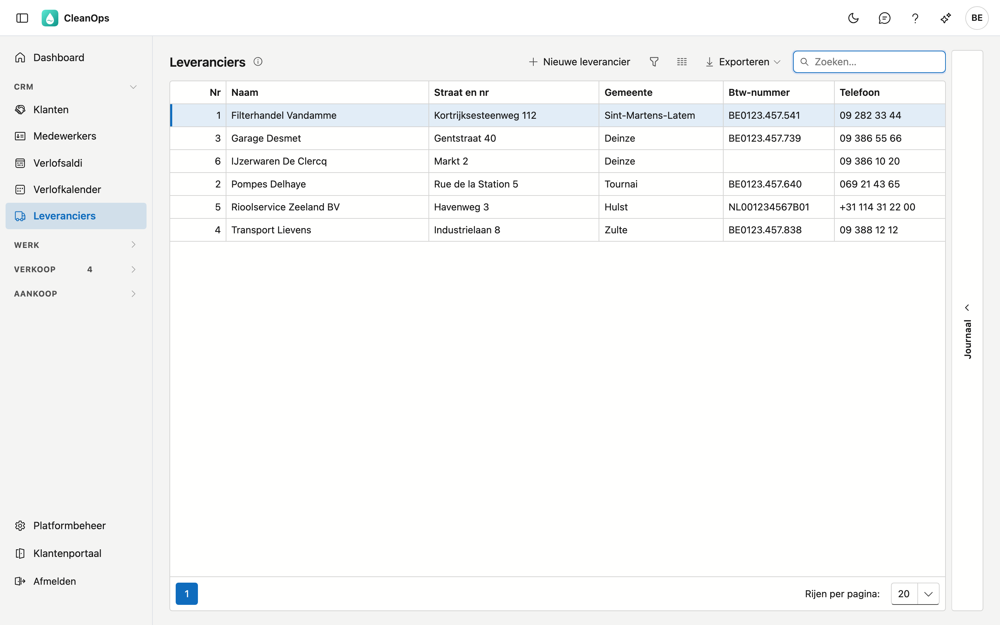
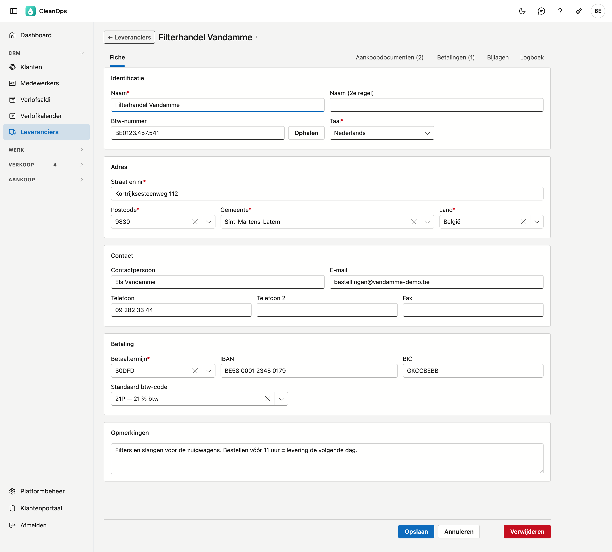
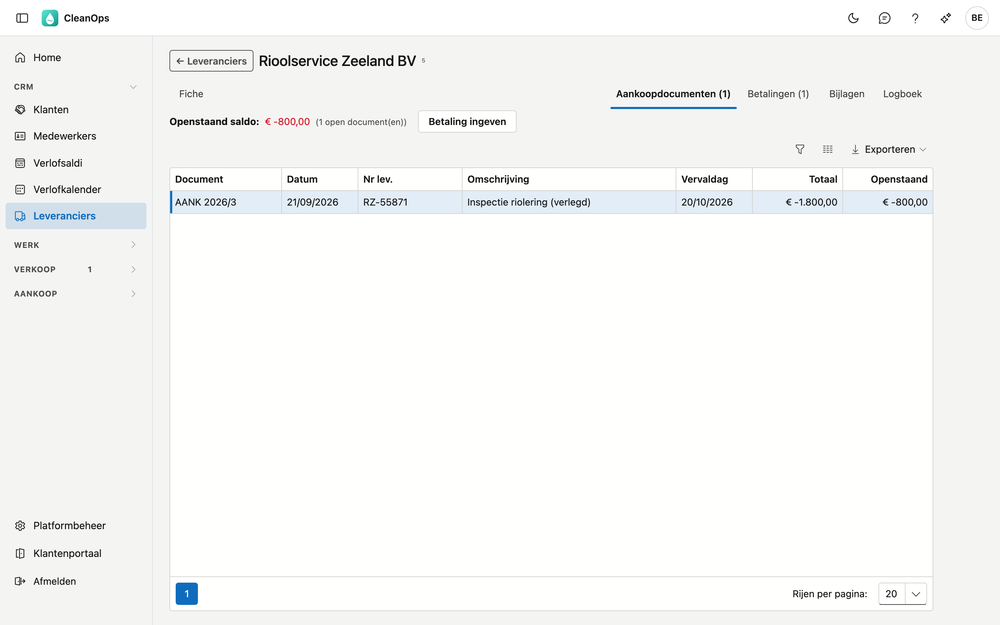
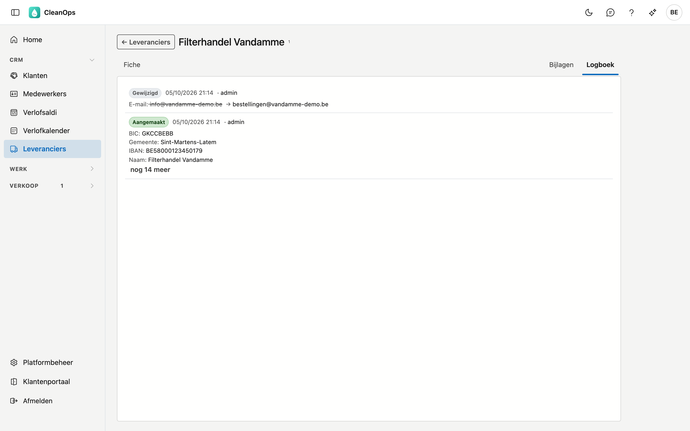

# Leveranciers

De bedrijven waar u aankoopt en die u betaalt. Per leverancier houdt CleanOps de gegevens bij, hoe u hem bereikt,
en hoe en wanneer u hem betaalt.

## Het scherm openen

Klik links in het menu, onder **CRM**, op **Leveranciers**.

## De lijst

Per leverancier ziet u het nummer, de naam, de straat, de gemeente, het btw-nummer en het telefoonnummer, op naam
gesorteerd.

- **Zoeken** — de cursor staat meteen in het zoekveld. Er wordt gezocht in elke kolom, dus ook op een stuk van het
  btw-nummer of de straat.
- **Sorteren** — klik op een kolomtitel; nog eens klikken keert de volgorde om.
- **Exporteren** — via de knop rechtsboven krijgt u de lijst zoals ze nu gefilterd is als bestand.
- **Openen** — dubbelklik op een rij om de fiche van die leverancier te openen.
- **Journaal** — de strook rechts toont de bijlagen en het logboek van de leverancier die u in de lijst aanklikt,
  zonder de fiche te openen.

## Een nieuwe leverancier

Klik op **Nieuwe leverancier**. U krijgt een lege fiche; de velden met een sterretje zijn verplicht. Het nummer
kent CleanOps zelf toe. Na **Bewaren** opent de fiche van de nieuwe leverancier, met de tabbladen erbij.

Kwam er een factuur via Peppol binnen van een leverancier die CleanOps nog niet kent, dan maakt u hem aan vanuit die
factuur: de fiche is dan voorgevuld met de gegevens van het document, en na **Bewaren** gaat u terug naar de factuur.
Zie [Binnengekomen documenten](binnengekomen-documenten.md).

## De leveranciersfiche

Bovenaan staan de naam en het nummer, daaronder de tabbladen **Fiche**, **Aankoopdocumenten**, **Betalingen**, **Bijlagen** en
**Logboek**. Aankoopdocumenten en Betalingen ziet u met het recht *Aankoop bekijken*.

### Het tabblad Fiche

**Identificatie**

| Veld | Toelichting |
|---|---|
| Naam * | Hoogstens 30 tekens. De lijst sorteert op deze naam. |
| Naam (2e regel) | Een tweede regel, bijvoorbeeld een afdeling. |
| Btw-nummer | Een Belgisch nummer wordt op zijn controlecijfer nagekeken; een buitenlands nummer niet. **Ophalen** ernaast toont eerst wat de KBO weet (met **stopgezet** in het rood als de onderneming niet meer actief is); **Overnemen** zet naam en adres op de fiche. |
| Taal * | Nederlands of Frans. |

!!! note "Een btw-nummer staat maar bij één leverancier"
    CleanOps weigert een btw-nummer dat al bij een andere leverancier staat, ook als het anders geschreven is
    ("BE0123.457.541" en "0123457541" zijn hetzelfde nummer), en ook als die andere leverancier in de prullenbak
    ligt. De melding zegt bij welke leverancier het al staat.

**Adres** — straat en nummer (in één veld), postcode, gemeente en land; alle vier zijn verplicht. Na de postcode
biedt Gemeente de plaatsen van die postcode aan; u mag ook zelf typen. Daaronder openen **Kaart** en **Route** het adres in
Google Maps, in een nieuw tabblad.

**Contact** — contactpersoon, e-mail, twee telefoonnummers en fax. Een ingevuld e-mailadres of telefoonnummer
moet geldig zijn; leeg laten mag.

**Betaling**

| Veld | Toelichting |
|---|---|
| Betaaltermijn * | Uit de lijst van de [betalingstermijnen](beheer/betalingstermijnen.md). Bepaalt de vervaldag van de aankoopfacturen van deze leverancier. |
| IBAN | Het rekeningnummer waarop u de leverancier betaalt. Het wordt op zijn controlecijfer nagekeken en in groepjes van vier getoond. Zonder IBAN staat de leverancier niet in het SEPA-bestand van het [betalingsvoorstel](betalingsvoorstel.md). |
| BIC | De code van zijn bank, 8 of 11 tekens. Binnen de eurozone mag u ze leeg laten. |
| Standaard btw-code | Uit de [btw-codes](beheer/btw-codes.md). Vult een nieuwe aankoopfactuur van deze leverancier voor; leeg laten mag. |

**Opmerkingen** — vrije tekst, bijvoorbeeld afspraken over leveringen.

Klik op **Bewaren** om te bewaren. Ontbreekt er een verplicht veld of klopt een waarde niet, dan zegt CleanOps
welk. **Annuleren** brengt u terug naar de lijst zonder te bewaren.

### Het tabblad Aankoopdocumenten

Alle [aankoopfacturen](aankoopfacturen.md) en creditnota's van deze leverancier, de recentste bovenaan. Boven de lijst staat zijn
**openstaand saldo**: wat u hem nog moet betalen, zoals op het uittreksel (negatief), en hoeveel documenten nog openstaan. Met
**Betaling ingeven** betaalt u ze in één keer: het venster van [Betalingen](betalingen.md) opent met hun saldo ingevuld.
De kolom **Vereffend op** toont de dag waarop een document volledig betaald raakte — de dag van de laatste betaling, of de
boekingsdatum als het al betaald was vóór het geboekt werd. Dubbelklik op een document om het te openen.

### Het tabblad Betalingen

De betalingen aan deze leverancier, de recentste bovenaan, met de datum en het nummer van het uittreksel en het bedrag. Een
teruggedraaide betaling draagt het label **teruggedraaid**. Wat een betaling vereffende, ziet u in [Betalingen](betalingen.md).

### Het tabblad Bijlagen

De documenten bij deze leverancier, zoals een contract of een prijslijst. Met **Bijlage** voegt u een bestand toe,
tot 25 MB; per bijlage past u de omschrijving aan of haalt u ze weg.

### Het tabblad Logboek

Wie welk veld van deze leverancier gewijzigd heeft, wanneer, en van welke waarde naar welke. Het nieuwste staat
bovenaan.

## Een leverancier verwijderen

**Verwijderen** onderaan de fiche legt de leverancier in de [prullenbak](beheer/prullenbak.md); van daaruit haalt
u hem terug.

## Veelgestelde vragen

**Een leverancier staat niet in de lijst.**
Kijk in de [prullenbak](beheer/prullenbak.md).

**Het btw-nummer wordt geweigerd terwijl het klopt.**
Lees de melding: staat het nummer al bij een andere leverancier, dan noemt ze die. Een partij hoort maar één keer
in de lijst te staan.

**Waar staat het oude rekeningnummer uit mijn vorige pakket?**
In het veld IBAN. Een Belgisch rekeningnummer van 12 cijfers is bij de overname omgerekend naar zijn IBAN: dat is
hetzelfde nummer, met BE en twee controlecijfers ervoor.
