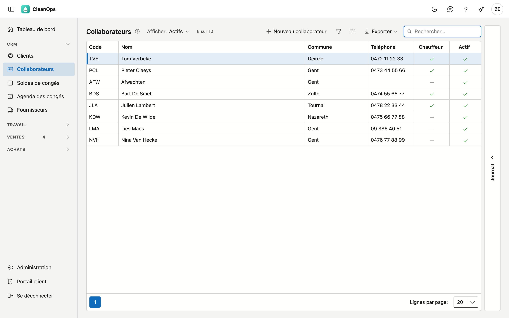
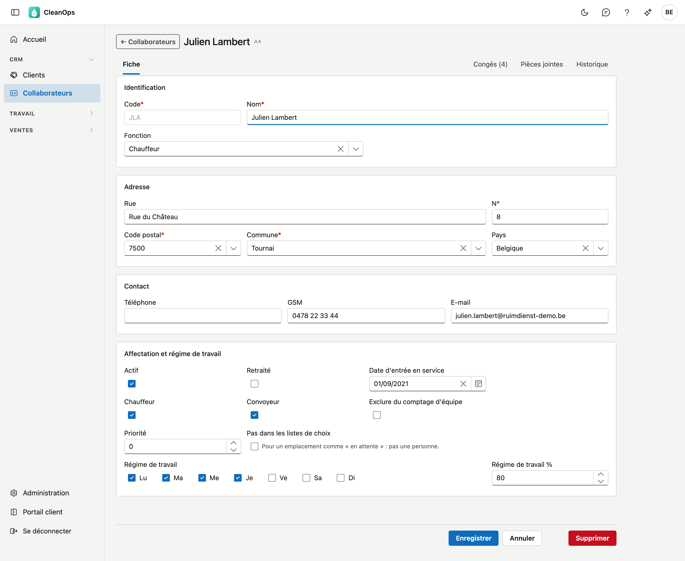
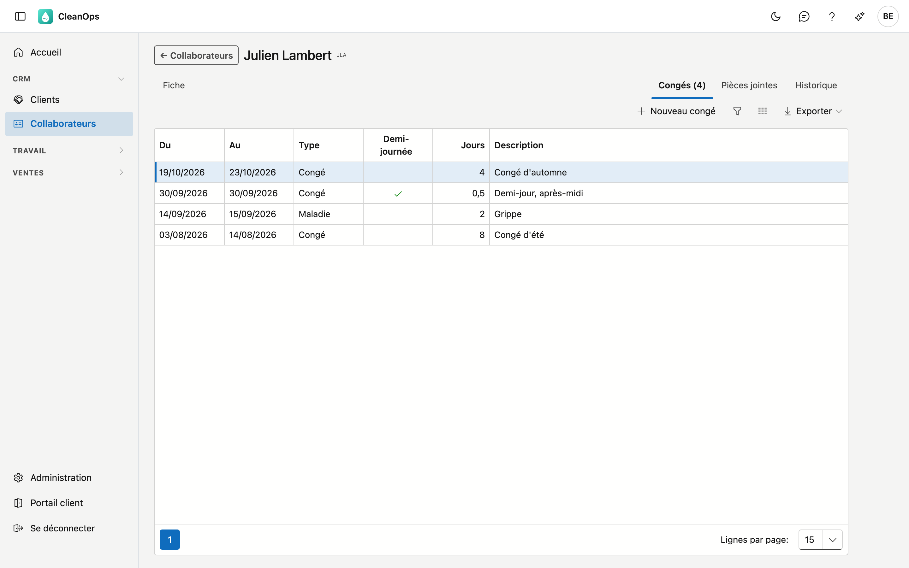
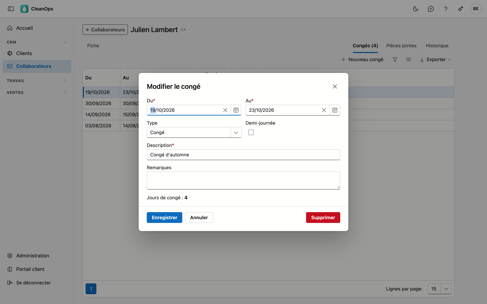

# Collaborateurs

Les personnes que vous planifiez en équipes et sur les ordres de travail. Pour chaque collaborateur, CleanOps
conserve les coordonnées, indique qui est chauffeur ou convoyeur, quels jours la personne travaille, et ses
congés.

## Ouvrir l'écran

Dans le menu de gauche, sous **CRM**, cliquez sur **Collaborateurs**.

## La liste

Pour chaque collaborateur, vous voyez le code, le nom, la commune, un numéro de téléphone (le GSM, sinon le fixe),
et si la personne est chauffeur et active. En tête figurent les collaborateurs avec la **priorité** la plus élevée,
puis les autres par nom.

- **Rechercher** — le curseur est déjà dans le champ de recherche. La recherche porte sur le code, le nom, la
  commune et le numéro de téléphone.
- **Afficher** — est réglé sur **Actifs**. Choisissez **Pensionnés** pour les retraités, ou **Tous** pour
  retrouver aussi ceux qui ne sont plus actifs. Le compteur à côté indique combien de collaborateurs sont affichés
  sur le total.
- **Trier** — cliquez sur un titre de colonne ; un second clic inverse l'ordre.
- **Exporter** — le bouton en haut à droite vous donne la liste, telle qu'elle est filtrée, sous forme de fichier.
- **Ouvrir** — double-cliquez sur une ligne pour ouvrir la fiche de ce collaborateur.
- **Journal** — le volet à droite montre les pièces jointes et l'historique du collaborateur que vous sélectionnez
  dans la liste, sans ouvrir la fiche.

## Un nouveau collaborateur

Cliquez sur **Nouveau collaborateur**. Vous obtenez une fiche vide ; les champs marqués d'un astérisque sont
obligatoires. Après **Enregistrer**, la fiche du nouveau collaborateur s'ouvre, avec ses onglets.

## La fiche collaborateur

En haut figurent le nom et le code, puis les onglets **Fiche**, **Congés**, **Pièces jointes** et **Historique**.
Le nombre de périodes de congé figure entre parenthèses dans le titre : « Congés (4) ».

### L'onglet Fiche

La fiche se compose de quatre blocs.

**Identification**

| Champ | Explication |
|---|---|
| Code * | La clé courte par laquelle le collaborateur est reconnu partout : sur un ordre de travail, dans une équipe, sur un bon de travail. 5 caractères au maximum. |
| Nom * | 30 caractères au maximum. |
| Fonction | Dans la liste « Fonctions collaborateur » des [tables de base](beheer/basistabellen.fr.md). |

!!! note "Le code est figé après la création"
    Sur un collaborateur existant, le champ du code est grisé. Tous les ordres de travail, équipes et bons de
    travail de la personne sont rattachés à ce code ; le modifier ensuite détacherait ces références. Si un code
    est erroné, créez un nouveau collaborateur et mettez l'ancien sur inactif.

**Adresse** — rue, numéro, code postal, commune et pays ; le code postal et la commune sont obligatoires. Après le
code postal, Commune propose les localités de ce code (9800 : Deinze, Astene, Vinkt…) ; vous pouvez aussi taper
vous-même.

**Contact** — téléphone, GSM et e-mail. Un numéro ou une adresse e-mail saisi doit être valide ; les laisser vides
est permis.

**Affectation et régime de travail**

| Champ | Explication |
|---|---|
| Actif | Si la personne fait partie de l'effectif. Celui qui ne travaille plus est mis sur inactif ; la fiche et tout l'historique subsistent. |
| Retraité | Une mention distincte d'Actif, pour afficher les retraités séparément. |
| Date d'entrée en service | Le premier jour de travail. Avant ce jour, le collaborateur n'est pas compté lors de la composition des équipes. |
| Chauffeur, Convoyeur | Le rôle lors d'une mission. Une personne peut être les deux. |
| Exclure du comptage d'équipe | Le collaborateur n'est pas compté dans les totaux des [Équipes](ploegen.fr.md#lapercu) (Planifiés, Disponibles, Libre (régime)). Il peut quand même faire partie d'une équipe. |
| Priorité | Détermine l'ordre : plus elle est élevée, plus la personne figure haut, dans cette liste et partout où vous choisissez un collaborateur. Vos chauffeurs habituels se retrouvent ainsi en tête. |
| Pas dans les listes de choix | Pour un emplacement comme *En attente* : une ligne du planning qui n'est pas une personne. |
| Régime de travail | Les jours où la personne travaille, avec à côté le pourcentage d'une semaine à temps plein. Les congés ne comptent que ces jours-là. |
| Couleur dans le planning | La couleur avec laquelle le planning affiche ce collaborateur : sa ligne sur le [tableau de planning](planning.fr.md#le-tableau-de-planning) et son code dans la [liste du planning](planning.fr.md#la-liste-du-planning). Choisissez une couleur dans la palette, ou **Aucune couleur**. L'**Aperçu** à côté montre le nom tel que le planning l'affiche. |

Cliquez sur **Enregistrer** pour sauvegarder. S'il manque un champ obligatoire, CleanOps indique lequel.
**Annuler** vous ramène à la liste sans enregistrer.

### L'onglet Congés

Les congés, maladies et autres absences du collaborateur, les plus récents en tête : du, au, type, demi-journée,
le nombre de jours et la description.

**Nouveau congé** encode une période ; double-cliquez sur une ligne pour la modifier.

| Champ | Explication |
|---|---|
| Du *, Au * | Le premier et le dernier jour. Au ne peut pas précéder Du. |
| Type | **Congé**, **Maladie** ou **Autre**. |
| Demi-journée | La période compte une demi-journée de moins. |
| Description * | 50 caractères au maximum, par exemple *Congé d'été*. |
| Remarques | Texte libre. |

Sous les champs figure le nombre de **jours de congé** de la période. CleanOps les calcule lui-même : les jours où
le collaborateur travaille selon son régime de travail, sans les [jours fériés et jours de fermeture](beheer/feestdagen.fr.md). Une personne qui travaille du lundi
au jeudi compte donc 4 jours pour une semaine complète.

Si le collaborateur figure déjà sur des ordres de travail ouverts ou dans une équipe durant cette période, la
fenêtre le signale. Le congé peut être encodé normalement ; le message vous indique où vérifier le planning.

**Supprimer** dans la fenêtre retire la période définitivement, après confirmation. Le
[journal des actions](beheer/actielogboek.fr.md) garde la trace de qui l'a encodée, modifiée ou supprimée.

### L'onglet Pièces jointes

Les documents de ce collaborateur, comme une attestation ou un certificat médical. **Pièce jointe** ajoute un
fichier, jusqu'à 25 Mo ; pour chacune, vous modifiez la description ou la retirez. Pour un certificat médical,
indiquez la période dans la description : vous le retrouverez ainsi avec le bon congé.

### L'onglet Historique

Qui a modifié quel champ de ce collaborateur, quand, et de quelle valeur vers quelle autre. Le plus récent figure
en tête.

## Supprimer un collaborateur

**Supprimer**, en bas de la fiche, place le collaborateur dans la [corbeille](beheer/prullenbak.fr.md), d'où vous le
restaurez.

Mieux vaut ne pas supprimer une personne qui a figuré sur un ordre de travail : mettez-la sur inactif. Tout ce qui
s'y rattache reste alors lisible.

## Questions fréquentes

**Un collaborateur ne figure pas dans la liste.**
Regardez **Afficher** en haut : ce champ est réglé sur les collaborateurs actifs. Choisissez **Tous**. Si la
personne n'y figure toujours pas, consultez la [corbeille](beheer/prullenbak.fr.md).

**Un collaborateur actif n'apparaît pas lors de la composition d'une équipe.**
Vérifiez sur sa fiche **Exclure du comptage d'équipe** et la **Date d'entrée en service**.

**Une semaine de congé compte moins de 5 jours.**
CleanOps ne compte que les jours du régime de travail, et pas les jours fériés. Consultez le régime de travail sur
la fiche du collaborateur.
