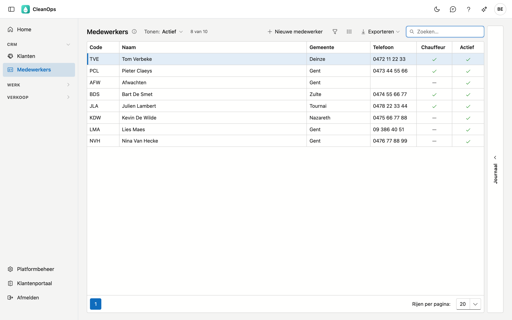
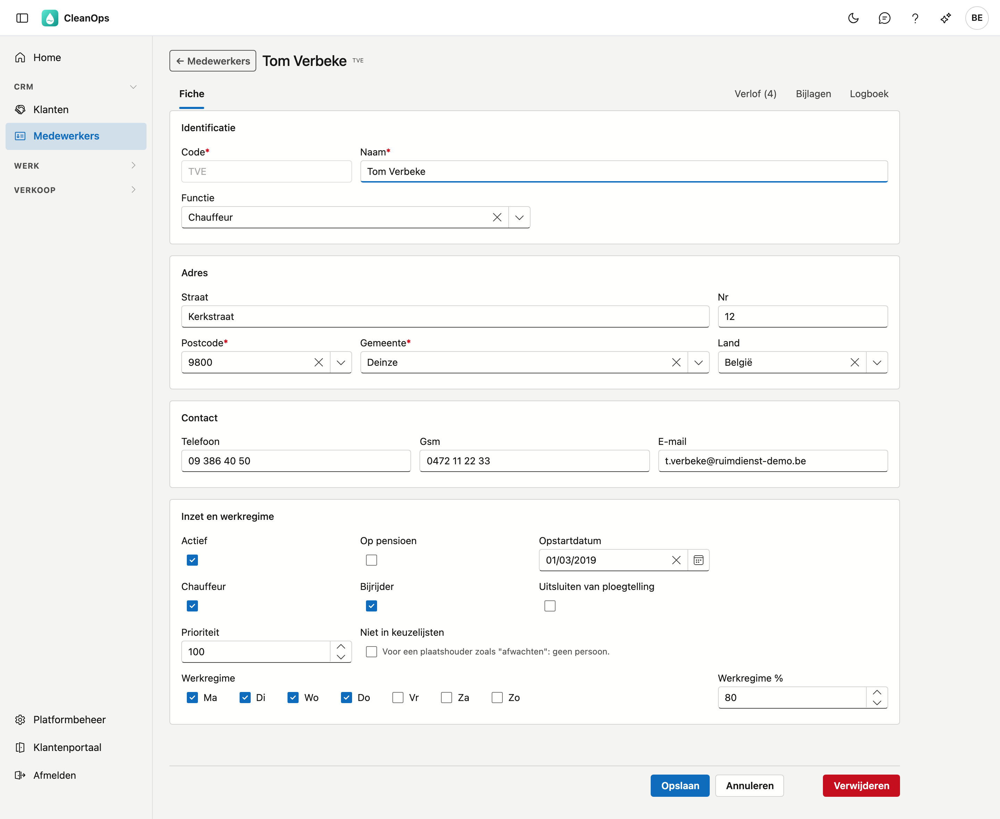
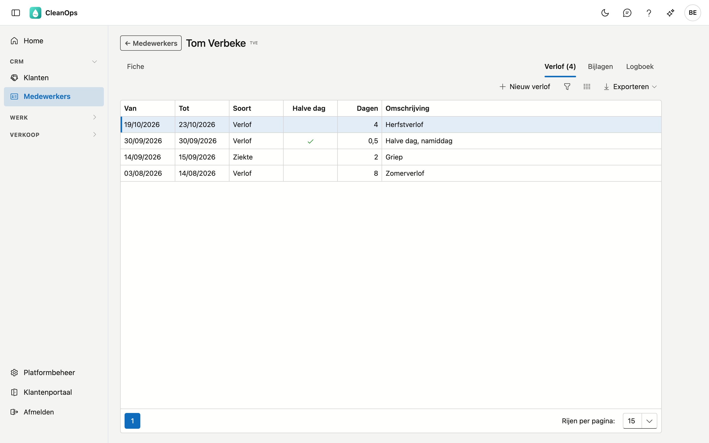
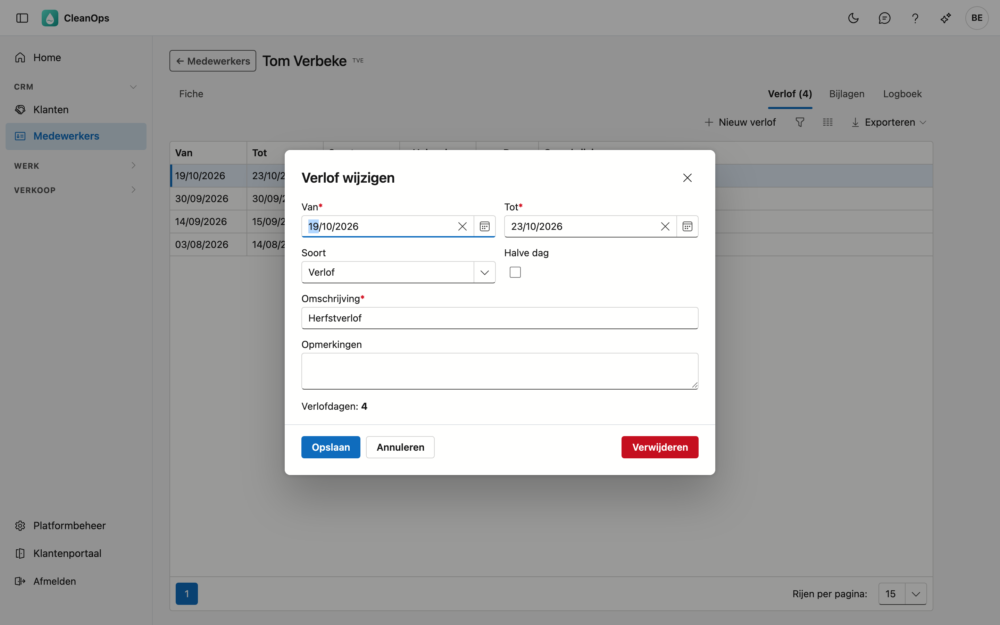

# Medewerkers

De mensen die u in ploegen en op werkorders inplant. Per medewerker houdt CleanOps de gegevens bij, wie chauffeur
of bijrijder is, op welke dagen iemand werkt, en het verlof.

## Het scherm openen

Klik links in het menu, onder **CRM**, op **Medewerkers**.

## De lijst

Per medewerker ziet u de code, de naam, de gemeente, een telefoonnummer (de gsm, en anders het vaste nummer), en
of de persoon chauffeur is en actief. Bovenaan staan de medewerkers met de hoogste **prioriteit**, daarna de
anderen op naam.

- **Zoeken** — de cursor staat meteen in het zoekveld. Er wordt gezocht in de code, de naam, de gemeente en het
  telefoonnummer.
- **Tonen** — staat op **Actief**. Kies **Op pensioen** voor wie gepensioneerd is, of **Alles** om ook wie niet
  meer actief is terug te vinden. De teller ernaast zegt hoeveel medewerkers er getoond worden van het totaal.
- **Sorteren** — klik op een kolomtitel; nog eens klikken keert de volgorde om.
- **Exporteren** — via de knop rechtsboven krijgt u de lijst zoals ze nu gefilterd is als bestand.
- **Openen** — dubbelklik op een rij om de fiche van die medewerker te openen.
- **Journaal** — de strook rechts toont de bijlagen en het logboek van de medewerker die u in de lijst aanklikt,
  zonder de fiche te openen.

## Een nieuwe medewerker

Klik op **Nieuwe medewerker**. U krijgt een lege fiche; de velden met een sterretje zijn verplicht. Na
**Opslaan** opent de fiche van de nieuwe medewerker, met de tabbladen erbij.

## De medewerkerfiche

Bovenaan staan de naam en de code, daaronder de tabbladen **Fiche**, **Verlof**, **Bijlagen** en **Logboek**. Het
aantal verlofperiodes staat tussen haakjes in de titel: "Verlof (4)".

### Het tabblad Fiche

De fiche bestaat uit vier blokken.

**Identificatie**

| Veld | Toelichting |
|---|---|
| Code * | De korte sleutel waarmee de medewerker overal herkend wordt: op een werkorder, in een ploeg, op een werkbon. Hoogstens 5 tekens. |
| Naam * | Hoogstens 30 tekens. |
| Functie | Uit de lijst "Functies medewerker" van de [basistabellen](beheer/basistabellen.md). |

!!! note "De code ligt vast na het aanmaken"
    Bij een bestaande medewerker staat het codeveld grijs. Aan die code hangen alle werkorders, ploegen en
    werkbonnen van de persoon; ze achteraf wijzigen zou die verwijzingen losmaken. Klopt een code niet, maak dan
    een nieuwe medewerker aan en zet de oude op niet-actief.

**Adres** — straat, nummer, postcode, gemeente en land; postcode en gemeente zijn verplicht. Na de postcode biedt
Gemeente de plaatsen van die postcode aan (9800: Deinze, Astene, Vinkt…); u mag ook zelf typen.

**Contact** — telefoon, gsm en e-mail. Een ingevuld nummer of e-mailadres moet geldig zijn; leeg laten mag.

**Inzet en werkregime**

| Veld | Toelichting |
|---|---|
| Actief | Of de persoon meedraait. Wie niet meer werkt, zet u op niet-actief; de fiche en alle historiek blijven bestaan. |
| Op pensioen | Een aparte aanduiding naast Actief, zodat u wie gepensioneerd is apart kunt tonen. |
| Opstartdatum | De eerste werkdag. Vóór die dag telt de medewerker niet mee bij het samenstellen van ploegen. |
| Chauffeur, Bijrijder | De rol bij een opdracht. Iemand kan beide zijn. |
| Uitsluiten van ploegtelling | De medewerker telt niet mee bij het samenstellen van ploegen. |
| Prioriteit | Bepaalt de volgorde: hoger komt bovenaan, in deze lijst en overal waar u een medewerker kiest. Zo staan uw vaste chauffeurs vooraan. |
| Niet in keuzelijsten | Voor een plaatshouder zoals *Afwachten*: een regel in de planning die geen persoon is. |
| Werkregime | De dagen waarop de persoon werkt, met daarnaast het percentage van een voltijdse week. Het verlof telt enkel deze dagen. |

Klik op **Opslaan** om te bewaren. Ontbreekt er een verplicht veld, dan zegt CleanOps welk. **Annuleren** brengt u
terug naar de lijst zonder te bewaren.

### Het tabblad Verlof

De verlofperiodes, ziektes en andere afwezigheden van de medewerker, de jongste bovenaan: van, tot, soort, halve
dag, het aantal dagen en de omschrijving.

Met **Nieuw verlof** boekt u een periode; dubbelklik op een rij om ze te wijzigen.

| Veld | Toelichting |
|---|---|
| Van *, Tot * | De eerste en de laatste dag. Tot mag niet vóór Van liggen. |
| Soort | **Verlof**, **Ziekte** of **Ander**. |
| Halve dag | De periode telt een halve dag minder. |
| Omschrijving * | Hoogstens 50 tekens, bijvoorbeeld *Zomerverlof*. |
| Opmerkingen | Vrije tekst. |

Onder de velden staat hoeveel **verlofdagen** de periode telt. CleanOps rekent ze zelf: de dagen waarop de
medewerker volgens het werkregime werkt, zonder de feestdagen. Wie van maandag tot donderdag werkt, krijgt voor een
volledige week dus 4 dagen.

Staat de medewerker in die periode al op open werkorders of in een ploeg, dan meldt het venster dat. Het verlof
boeken kan gewoon; de melding zegt u waar u de planning moet nakijken.

**Verwijderen** in het venster haalt de periode definitief weg, na een bevestiging. Het
[actielogboek](beheer/actielogboek.md) houdt bij wie ze geboekt, gewijzigd of verwijderd heeft.

### Het tabblad Bijlagen

De documenten bij deze medewerker, zoals een attest of een doktersbriefje. Met **Bijlage** voegt u een bestand
toe, tot 25 MB; per bijlage past u de omschrijving aan of haalt u ze weg. Zet bij een doktersbriefje de periode in
de omschrijving, dan vindt u het terug bij het juiste verlof.

### Het tabblad Logboek

Wie welk veld van deze medewerker gewijzigd heeft, wanneer, en van welke waarde naar welke. Het nieuwste staat
bovenaan.

## Een medewerker verwijderen

**Verwijderen** onderaan de fiche legt de medewerker in de [prullenbak](beheer/prullenbak.md); van daaruit haalt
u hem terug.

Wie ooit op een werkorder gestaan heeft, verwijdert u beter niet: zet de medewerker op niet-actief. Dan blijft
alles wat aan die persoon hangt leesbaar.

## Veelgestelde vragen

**Een medewerker staat niet in de lijst.**
Kijk bovenaan bij **Tonen**: die staat op de actieve medewerkers. Kies **Alles**. Staat de persoon er dan nog
niet bij, kijk dan in de [prullenbak](beheer/prullenbak.md).

**Een actieve medewerker verschijnt niet bij het samenstellen van een ploeg.**
Kijk op de fiche naar **Uitsluiten van ploegtelling** en naar de **Opstartdatum**.

**Een week verlof telt minder dan 5 dagen.**
CleanOps telt enkel de dagen van het werkregime, en geen feestdagen. Kijk op de fiche naar het werkregime van de
medewerker.
