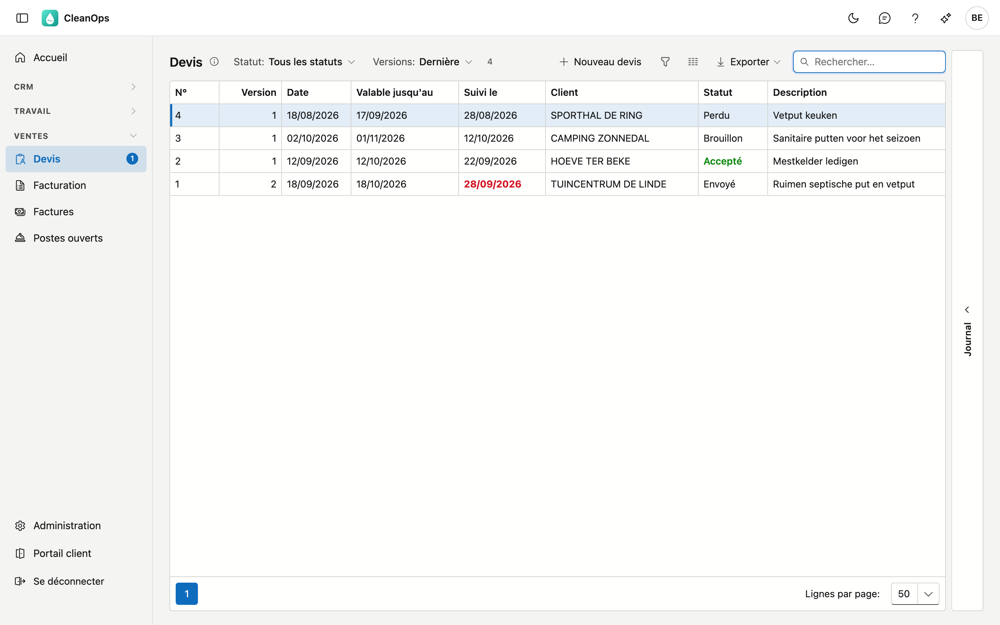
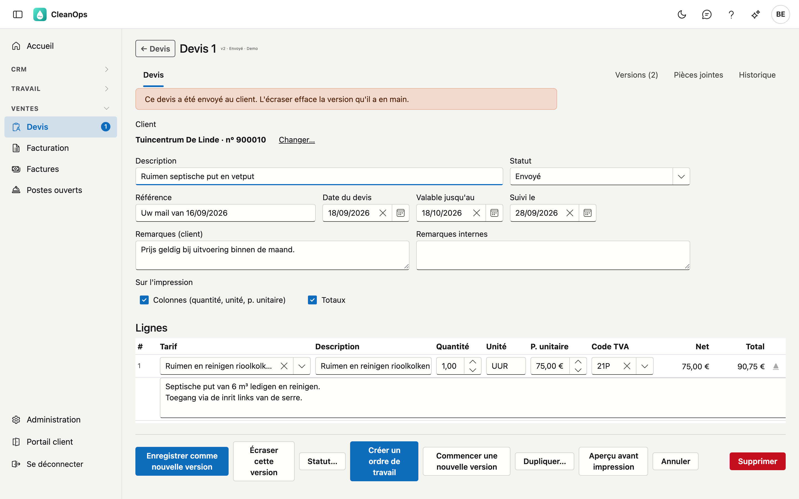
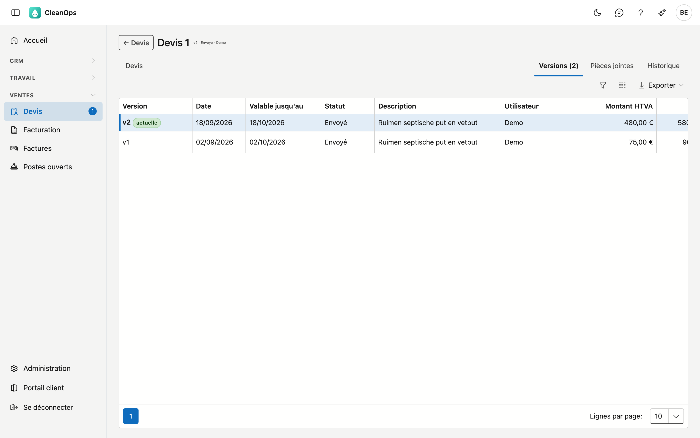

# Devis

Sur Devis, vous établissez des devis pour vos clients, vous les suivez jusqu'à ce qu'ils soient acceptés ou perdus, et
vous transformez un devis accepté directement en ordre de travail.

## Ouvrir l'écran

Dans le menu de gauche, sous **Ventes**, cliquez sur **Devis**. La liste affiche par défaut la dernière version de chaque
devis.

## La liste

| Colonne | Contenu |
|---|---|
| N° | Le numéro du devis. La numérotation recommence à 1 chaque année. |
| Version | La version du devis. |
| Date, Valable jusqu'au | La date du devis et jusqu'à quand il est valable. |
| Client, Description | Pour qui, et à quel sujet. |
| Montant HTVA, Total | Le montant hors TVA et TVA comprise. |
| Utilisateur | Qui a établi le devis. |
| Statut | Brouillon, Envoyé, Accepté, Perdu ou Expiré. Accepté figure en vert. |
| Suivi le | Quand vous relancez le client. **En rouge et en gras** pour un devis envoyé dès que cette date est aujourd'hui ou passée. |

En haut, choisissez un **Statut** et, sous **Versions**, la **Dernière** ou **Toutes** les versions. Sélectionnez un devis
et ouvrez à droite le volet **Journal** pour ses pièces jointes et son historique. Double-cliquez pour ouvrir le devis.

Le nombre à côté de **Devis** dans le menu compte les devis envoyés que vous deviez relancer aujourd'hui ou avant.

## Un nouveau devis

Cliquez sur **Nouveau devis**, cherchez le client par nom ou numéro de client et cliquez sur **choisir**. Le même bouton
figure sur la [fiche client](klanten.fr.md#les-boutons-en-bas).

Un nouveau devis reçoit la date du jour, **Valable jusqu'au** dans 30 jours et **Suivi le** dans 10 jours. Il commence
comme **Brouillon**. Il reçoit son numéro à l'enregistrement : le numéro suivant de l'année de la date du devis.

## Le devis

| Champ | Ce que vous indiquez |
|---|---|
| Client | Pour qui est le devis. Avec **Changer…**, vous choisissez un autre client ; il vaut pour toutes les versions du devis. |
| Description | Le sujet du devis, en quelques mots. 200 caractères au maximum. |
| Statut | Où en est le devis. Voir aussi [Le statut](#le-statut). |
| Référence | Par exemple la référence du client. 50 caractères au maximum. |
| Date du devis, Valable jusqu'au, Suivi le | Les trois dates du devis. |
| Remarques (client) | Figurent sur le devis pour le client. |
| Remarques internes | Pour vous seul ; elles ne figurent pas sur le devis. |
| Sur l'impression | Si les **Colonnes** (quantité, unité, prix unitaire) et les **Totaux** figurent sur le devis. Sans colonnes, le client ne voit que les descriptions et les montants par ligne. |

### Les lignes

Chaque ligne est une partie de l'offre.

- Choisissez d'abord un **Tarif** : il remplit en une fois la description, la description détaillée, l'unité, le prix
  unitaire et le code TVA. Vous ne voyez que les tarifs dans la langue du client.
- Adaptez la **Description**, la **Quantité**, l'**Unité** et le **P. unitaire** si nécessaire. Une ligne sans tarif est
  possible.
- Choisissez un **Code TVA**. Il est obligatoire ; le pourcentage vient du code TVA.
- **▲** et **▼** déplacent la ligne, **⧉** en fait une copie en dessous, **✕** la supprime.
- **✎** ouvre la **description détaillée** de la ligne : un texte plus long qui figure sur le devis et sur l'ordre de
  travail. Le crayon est en gras si la ligne a une description détaillée.

**+ Ajouter une ligne** ajoute une ligne vide en dessous. En bas figurent le total hors TVA et TVA comprise.

### Enregistrer

Un devis en brouillon s'enregistre avec **Enregistrer**. S'il est déjà envoyé, accepté ou perdu, CleanOps vous demande ce
que vous voulez :

- **Enregistrer comme nouvelle version** : le client garde la version qu'il a reçue, et vos modifications deviennent une
  nouvelle version avec le même numéro.
- **Écraser cette version** : les modifications remplacent la version actuelle.

S'il manque quelque chose, comme un code TVA sur une ligne, CleanOps l'indique.

## Les versions

L'onglet **Versions** affiche toutes les versions du devis, la plus récente en haut. **Ouvrir** affiche une version plus
ancienne, **Activer** en refait la version actuelle.

**Commencer une nouvelle version** copie le devis enregistré vers une nouvelle version en brouillon. Les modifications non
encore enregistrées ne sont pas reprises ; utilisez pour cela **Enregistrer comme nouvelle version**.

## Les autres boutons

| Bouton | Ce qu'il fait |
|---|---|
| Statut… | Change le statut, par exemple en **Accepté** ou **Perdu**, sans ouvrir le devis pour le modifier. |
| Créer un ordre de travail | Crée un ordre de travail à l'adresse du client, avec la description et les lignes du devis comme travail et le montant hors TVA. Les pièces jointes du devis sont reprises. Le devis passe à **Accepté**. Si un ordre de travail a déjà été créé à partir de ce devis, le nouveau ne reçoit pas de montant et CleanOps l'indique. |
| Dupliquer… | Crée un nouveau devis avec son propre numéro à partir de celui-ci, pour le même client ou un autre. Les lignes, la description et les remarques pour le client sont reprises ; la référence et la remarque interne non. |
| Aperçu avant impression | Affiche le devis en PDF, dans la langue du client. **Télécharger** l'enregistre. L'aperçu montre le devis enregistré. |
| Supprimer | Déplace le devis vers la [corbeille](beheer/prullenbak.fr.md), après confirmation. |

### Le statut

| Statut | Signification |
|---|---|
| Brouillon | En préparation, pas encore chez le client. |
| Envoyé | Chez le client. La date de suivi compte. |
| Accepté | Le client est d'accord. **Créer un ordre de travail** met lui-même le devis sur Accepté. |
| Perdu | Le client ne donne pas suite au devis. |
| Expiré | Le devis n'est plus valable. |

## Pièces jointes et Historique

En haut à droite figurent les **Pièces jointes** — les documents du devis, comme un plan ou une photo — et
l'**Historique** : qui a modifié quoi et quand.

## Questions fréquentes

**Puis-je envoyer un devis par e-mail depuis CleanOps ?**
Pas encore. Téléchargez le PDF dans l'**Aperçu avant impression** et joignez-le à votre e-mail. Mettez ensuite le statut
sur **Envoyé**.

**Un tarif ne figure pas dans la liste.**
Vous ne voyez que les tarifs non archivés dans la langue du client. S'il n'y a aucun tarif dans cette langue, l'écran
l'indique. Les tarifs se gèrent dans [Tarifs](beheer/tarieven.fr.md).

**Pourquoi un nouveau devis porte-t-il le numéro 1 ?**
La numérotation recommence chaque année, comme dans l'application précédente. L'année vient de la date du devis.

**Je ne vois pas de bouton Créer un ordre de travail.**
Il faut pour cela le droit de modifier les ordres de travail.

## Voir aussi

- [Clients](klanten.fr.md)
- [Ordres de travail](werkorders.fr.md)
- [Tarifs](beheer/tarieven.fr.md)
