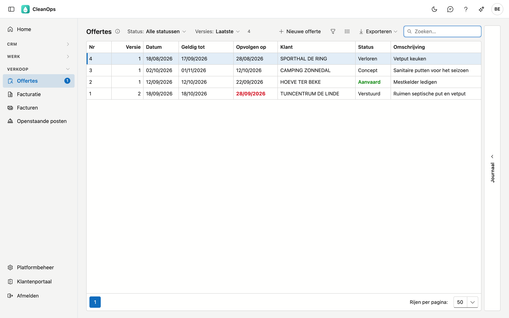
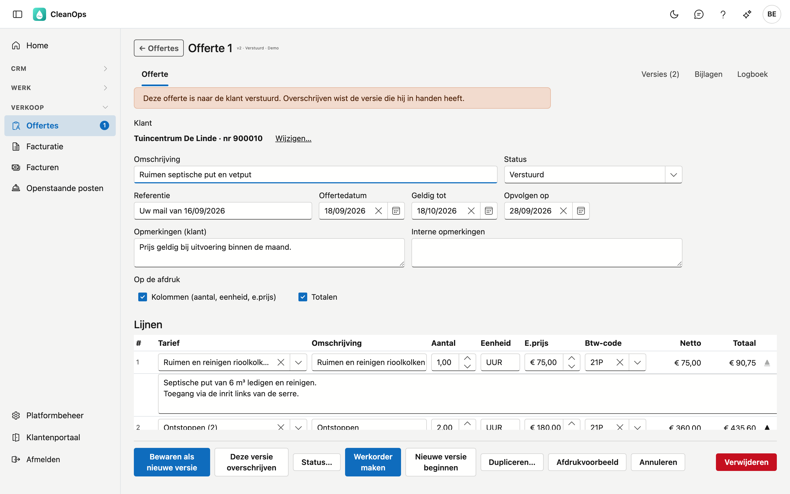
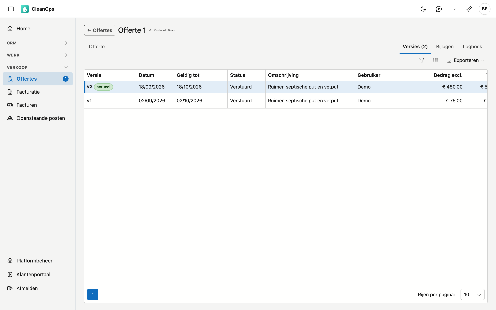

# Offertes

Op Offertes maakt u prijsoffertes voor uw klanten, volgt u ze op tot ze aanvaard of verloren zijn, en maakt u van een
aanvaarde offerte meteen een werkorder.

## Het scherm openen

Klik links in het menu, onder **Verkoop**, op **Offertes**. De lijst toont standaard de laatste versie van elke offerte.

## De lijst

| Kolom | Wat erin staat |
|---|---|
| Nr | Het offertenummer. De nummering begint elk jaar opnieuw bij 1. |
| Versie | Welke versie van de offerte dit is. |
| Datum, Geldig tot | De offertedatum en tot wanneer de offerte geldt. |
| Klant, Omschrijving | Voor wie, en waarover. |
| Bedrag excl., Totaal | Het bedrag zonder en met btw. |
| Gebruiker | Wie de offerte opgesteld heeft. |
| Status | Concept, Verstuurd, Aanvaard, Verloren of Vervallen. Aanvaard staat in het groen. |
| Opvolgen op | Wanneer u de klant opvolgt. **Rood en vet** bij een verstuurde offerte zodra die datum vandaag is of voorbij. |

Bovenaan kiest u een **Status** en bij **Versies** de **Laatste** of **Alle** versies. Klik een offerte aan en open rechts
de strook **Journaal** voor haar bijlagen en logboek. Dubbelklik om de offerte te openen.

Het getal naast **Offertes** in het menu telt de verstuurde offertes die u vandaag of eerder moest opvolgen.

## Een nieuwe offerte

Klik op **Nieuwe offerte**, zoek de klant op naam of klantnummer en klik op **kies**. Op de
[klantfiche](klanten.md#de-knoppen-onderaan) staat dezelfde knop.

Een nieuwe offerte krijgt de datum van vandaag, **Geldig tot** over 30 dagen en **Opvolgen op** over 10 dagen. Ze begint
als **Concept**. Het nummer krijgt ze bij het opslaan: het volgende nummer van het jaar van de offertedatum.

## De offerte

| Veld | Wat u invult |
|---|---|
| Klant | Voor wie de offerte is. Met **Wijzigen…** kiest u een andere klant; die geldt voor alle versies van de offerte. |
| Omschrijving | Waarover de offerte gaat, in een paar woorden. Hoogstens 200 tekens. |
| Status | Waar de offerte staat. Zie ook [De status](#de-status). |
| Referentie | Bijvoorbeeld de referentie van de klant. Hoogstens 50 tekens. |
| Offertedatum, Geldig tot, Opvolgen op | De drie datums van de offerte. |
| Opmerkingen (klant) | Komen op de offerte voor de klant. |
| Interne opmerkingen | Enkel voor uzelf; ze komen niet op de offerte. |
| Op de afdruk | Of de **Kolommen** (aantal, eenheid, eenheidsprijs) en de **Totalen** op de offerte komen. Zonder kolommen ziet de klant enkel de omschrijvingen en de bedragen per lijn. |

### De lijnen

Elke lijn is een onderdeel van het aanbod.

- Kies eerst een **Tarief**: dat vult de omschrijving, de beschrijving, de eenheid, de eenheidsprijs en de btw-code in één
  keer. U ziet enkel de tarieven in de taal van de klant.
- Pas de **Omschrijving**, het **Aantal**, de **Eenheid** en de **E.prijs** aan waar nodig. Een lijn zonder tarief kan
  ook.
- Kies een **Btw-code**. Die is verplicht; het percentage komt uit de btw-code.
- **▲** en **▼** verschuiven de lijn, **⧉** maakt er een kopie van eronder, **✕** haalt ze weg.
- **✎** opent de **beschrijving** van de lijn: een langere tekst die op de offerte en op de werkorder komt. Het potlood
  staat vet als de lijn een beschrijving heeft.

**+ Regel toevoegen** zet er een lege lijn onder. Onderaan staan het totaal zonder en met btw.

### Opslaan

Een offerte in concept bewaart u met **Opslaan**. Is ze al verstuurd, aanvaard of verloren, dan vraagt CleanOps wat u wilt:

- **Bewaren als nieuwe versie**: de klant houdt de versie die hij kreeg, en uw wijzigingen worden een nieuwe versie met
  hetzelfde nummer.
- **Deze versie overschrijven**: de wijzigingen vervangen de huidige versie.

Ontbreekt er iets, zoals een btw-code op een lijn, dan zegt CleanOps wat.

## De versies

Het tabblad **Versies** toont alle versies van de offerte, de nieuwste bovenaan. **Openen** toont een oudere versie,
**Activeren** maakt ze weer de actuele.

**Nieuwe versie beginnen** kopieert de bewaarde offerte naar een nieuwe versie in concept. Wijzigingen die nog niet
bewaard zijn, gaan daarbij niet mee; gebruik daarvoor **Bewaren als nieuwe versie**.

## De andere knoppen

| Knop | Wat hij doet |
|---|---|
| Status… | Zet de status, bijvoorbeeld op **Aanvaard** of **Verloren**, zonder de offerte te openen voor wijzigingen. |
| Werkorder maken | Maakt een werkorder op het adres van de klant, met de omschrijving en de lijnen van de offerte als werk en het bedrag zonder btw. De bijlagen van de offerte gaan mee. De offerte komt op **Aanvaard**. Is er al een werkorder uit deze offerte gemaakt, dan krijgt de nieuwe geen bedrag en zegt CleanOps dat. |
| Dupliceren… | Maakt een nieuwe offerte met een eigen nummer op basis van deze, voor dezelfde of een andere klant. De lijnen, de omschrijving en de opmerkingen voor de klant gaan mee; de referentie en de interne opmerking niet. |
| Afdrukvoorbeeld | Toont de offerte als PDF, in de taal van de klant. **Downloaden** bewaart ze. Het voorbeeld toont de bewaarde offerte. |
| Verwijderen | Verplaatst de offerte naar de [prullenbak](beheer/prullenbak.md), na een bevestiging. |

### De status

| Status | Betekenis |
|---|---|
| Concept | Nog in opmaak, niet naar de klant. |
| Verstuurd | Bij de klant. De opvolgdatum telt. |
| Aanvaard | De klant gaat akkoord. **Werkorder maken** zet de offerte zelf op Aanvaard. |
| Verloren | De klant gaat niet in op de offerte. |
| Vervallen | De offerte is niet meer geldig. |

## Bijlagen en Logboek

Rechts bovenaan staan **Bijlagen** — documenten bij de offerte, zoals een plan of een foto — en **Logboek**: wie wat
wijzigde en wanneer.

## Veelgestelde vragen

**Kan ik een offerte vanuit CleanOps mailen?**
Nog niet. Download de PDF in het **Afdrukvoorbeeld** en voeg ze bij uw mail. Zet daarna de status op **Verstuurd**.

**Een tarief staat niet in de keuzelijst.**
U ziet enkel de tarieven in de taal van de klant die niet gearchiveerd zijn. Staat er geen enkel tarief in die taal, dan
zegt het scherm dat. Tarieven beheert u in [Tarieven](beheer/tarieven.md).

**Waarom heeft een nieuwe offerte nummer 1?**
De nummering begint elk jaar opnieuw, zoals in de vorige toepassing. Het jaar komt van de offertedatum.

**Ik zie geen knop Werkorder maken.**
Daarvoor is het recht om werkorders te bewerken nodig.

## Zie ook

- [Klanten](klanten.md)
- [Werkorders](werkorders.md)
- [Tarieven](beheer/tarieven.md)
