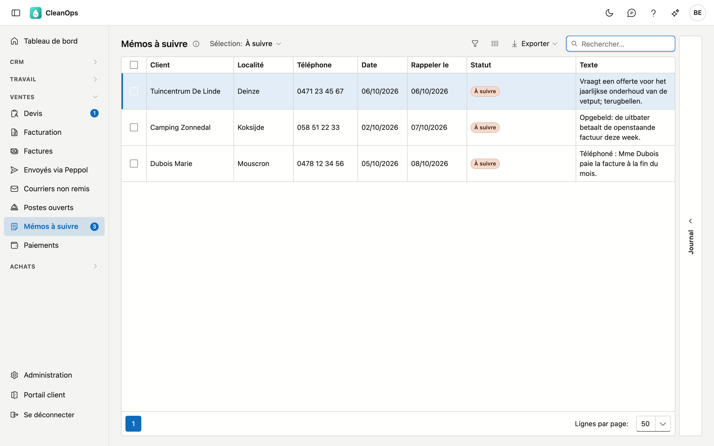

# Mémos à suivre

Un mémo est une courte note sur un client : ce que vous avez convenu au téléphone, ce que le client a promis, ce que vous devez
encore vérifier. Si vous donnez à un mémo une date dans **Rappeler le**, il apparaît ce jour-là dans **Mémos à suivre**. Ainsi,
vous n'oubliez ni une promesse d'un client ni un rappel téléphonique.

## Ouvrir l'écran

Dans le menu de gauche, sous **Ventes**, cliquez sur **Mémos à suivre**. Le chiffre à côté de l'élément de menu est le nombre de
mémos à suivre aujourd'hui. Vous voyez l'écran avec le droit de voir les postes ouverts.

## Créer un mémo

Un mémo se crée chez le client :

- sur la fiche client, onglet **Mémos**, avec **Nouveau mémo** (voir [Clients](klanten.fr.md#memos)) ;
- ou dans [Postes ouverts](openstaande-posten.fr.md#memos) : cochez un poste et cliquez sur **Mémos…**.

| Champ | Ce qu'il contient |
|---|---|
| Date | Le jour du mémo, aujourd'hui par défaut. Au plus 10 jours après aujourd'hui. |
| Rappeler le | Le jour où vous voulez revoir le mémo. Vous pouvez le laisser vide ; il n'apparaît alors jamais dans cette liste. Pas avant la date. |
| Texte | Ce qui a été convenu. Obligatoire. |

## La liste

Choisissez la **Sélection** en haut :

| Sélection | Ce que vous voyez |
|---|---|
| À suivre | Les mémos dont la date de rappel est atteinte et que personne n'a traités. L'écran s'ouvre ainsi. |
| À venir | Les mémos dont la date de rappel est encore à venir. |
| Tous (aussi les traités) | Chaque mémo avec une date de rappel, y compris ceux qui sont traités. |

Pour chaque mémo, vous voyez le client, sa localité et son numéro de téléphone (le GSM, sinon le fixe), la date, la date de
rappel, le statut et le texte. Le volet **Journal** à droite montre qui a créé, modifié et traité le mémo sélectionné.

## Traiter un mémo

Cochez un ou plusieurs mémos et cliquez sur **Traité** : ils disparaissent de À suivre, et le chiffre dans le menu diminue. Qui a
traité le mémo et quand figure sur le mémo. **De nouveau à suivre** les y remet.

Avec les mémos cochés, vous avez aussi :

- **Mémos…** — tous les mémos de ce client, pour en ajouter un tout de suite ;
- **Ouvrir le client** — la fiche client, avec les postes ouverts et les factures du client.

Double-cliquez sur un mémo pour l'ouvrir. Vous pouvez y compléter le texte ou cocher **Traité**.

## Erreurs fréquentes

!!! warning "Une nouvelle date rend le mémo de nouveau à suivre"
    Si vous donnez à un mémo traité une autre date dans **Rappeler le**, c'est un nouveau rappel : le mémo revient ce jour-là dans
    À suivre. Pour seulement compléter le texte, ne changez pas la date.

!!! warning "Un mémo sans date de rappel n'apparaît jamais ici"
    Un mémo sans **Rappeler le** est une simple note sur le client. Vous le trouvez uniquement dans l'onglet Mémos du client.

## Questions fréquentes

**La liste est vide.**
Il n'y a rien à suivre aujourd'hui. Choisissez **À venir** pour voir ce qui arrive, ou **Tous (aussi les traités)**.

**Que signifie « Traité (application précédente) » ?**
Le mémo vient de votre application précédente, et sa date de rappel était déjà passée à ce moment-là. Cette application ne
connaissait pas le traitement ; ainsi, les anciens rappels ne figurent pas tous dans À suivre.

**Puis-je supprimer un mémo ?**
Oui : ouvrez-le et cliquez sur **Supprimer**. C'est définitif. Le journal garde qui l'a supprimé.

## Voir aussi

- [Clients](klanten.fr.md)
- [Postes ouverts](openstaande-posten.fr.md)
