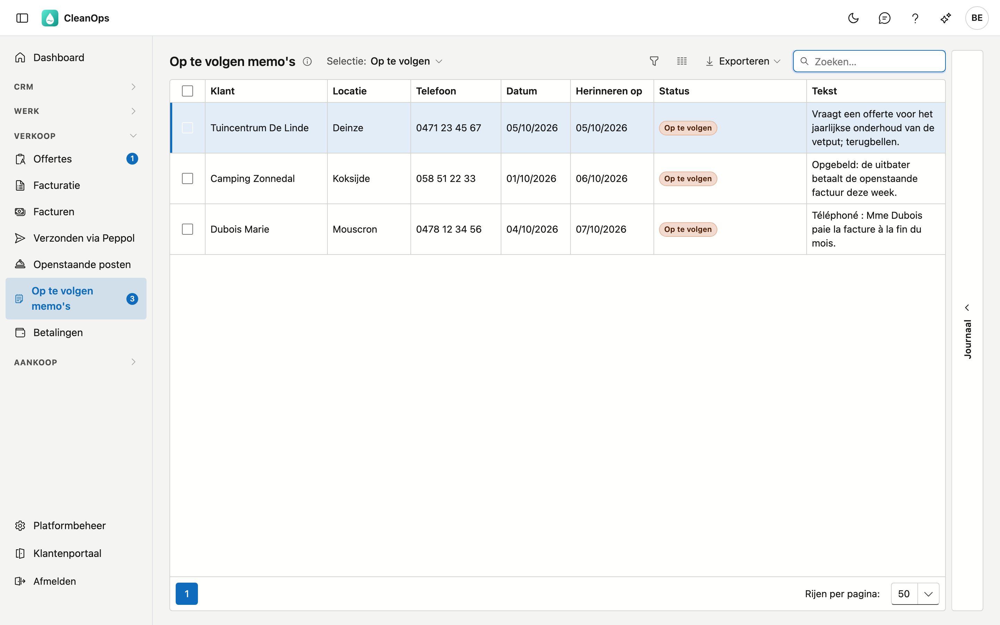

# Op te volgen memo's

Een memo is een korte notitie bij een klant: wat u aan de telefoon afsprak, wat de klant beloofde, wat u nog moet nakijken.
Geeft u een memo een datum bij **Herinneren op**, dan verschijnt ze die dag in **Op te volgen memo's**. Zo vergeet u geen
belofte van een klant en geen terugbelafspraak.

## Het scherm openen

Klik links in het menu, onder **Verkoop**, op **Op te volgen memo's**. Het getal naast het menu-item is het aantal memo's dat
vandaag op te volgen is. U ziet het scherm met het recht om de openstaande posten te bekijken.

## Een memo maken

Een memo maakt u bij de klant:

- op de klantfiche, tabblad **Memo's**, met **Nieuwe memo** (zie [Klanten](klanten.md#memos));
- of op [Openstaande posten](openstaande-posten.md#memos): vink een post aan en klik op **Memo's…**.

| Veld | Wat erin hoort |
|---|---|
| Datum | De dag van de memo, standaard vandaag. Hoogstens 10 dagen na vandaag. |
| Herinneren op | De dag waarop u de memo terug wilt zien. Leeg laten mag; dan komt ze nooit in deze lijst. Niet vóór de datum. |
| Tekst | Wat er afgesproken is. Verplicht. |

## De lijst

Kies bovenaan de **Selectie**:

| Selectie | Wat u ziet |
|---|---|
| Op te volgen | De memo's waarvan de herinneringsdatum bereikt is en die niemand afhandelde. Zo opent het scherm. |
| Komend | De memo's met een herinneringsdatum die nog voor u ligt. |
| Alles (ook afgehandeld) | Elke memo met een herinneringsdatum, ook de afgehandelde. |

Per memo ziet u de klant, zijn gemeente en telefoonnummer (de gsm, anders het vaste nummer), de datum, de herinneringsdatum,
de status en de tekst. De strook **Journaal** rechts toont wie de aangeklikte memo maakte, wijzigde en afhandelde.

## Een memo afhandelen

Vink een of meer memo's aan en klik op **Afgehandeld**: ze verdwijnen uit Op te volgen, en het getal in het menu daalt. Wie de
memo afhandelde en wanneer, staat bij de memo. **Weer op te volgen** zet ze terug.

Bij de aangevinkte memo's staan ook:

- **Memo's…** — alle memo's van die klant, om er meteen een nieuwe bij te schrijven;
- **Klant openen** — de klantfiche, met de openstaande posten en de facturen van de klant.

Dubbelklik op een memo om ze te openen. Daar kunt u de tekst aanvullen of het vinkje **Afgehandeld** zetten.

## Veelgemaakte fouten

!!! warning "Een nieuwe datum maakt de memo weer op te volgen"
    Geeft u een afgehandelde memo een andere datum bij **Herinneren op**, dan is dat een nieuwe herinnering: de memo staat die dag
    opnieuw in Op te volgen. Wilt u enkel de tekst aanvullen, laat de datum dan staan.

!!! warning "Een memo zonder herinneringsdatum komt hier nooit"
    Een memo zonder **Herinneren op** is een gewone notitie bij de klant. U vindt ze enkel op het tabblad Memo's van de klant.

## Veelgestelde vragen

**De lijst is leeg.**
Vandaag is er niets op te volgen. Kies **Komend** om te zien wat er nog aankomt, of **Alles (ook afgehandeld)**.

**Wat betekent "Afgehandeld (vorige toepassing)"?**
De memo kwam over uit uw vorige toepassing, en haar herinneringsdatum lag toen al in het verleden. Die toepassing kende geen
afhandeling; zo staan de oude herinneringen niet allemaal in Op te volgen.

**Kan ik een memo verwijderen?**
Ja: open ze en klik op **Verwijderen**. Dat is definitief. Het journaal houdt bij wie ze verwijderde.

## Zie ook

- [Klanten](klanten.md)
- [Openstaande posten](openstaande-posten.md)
