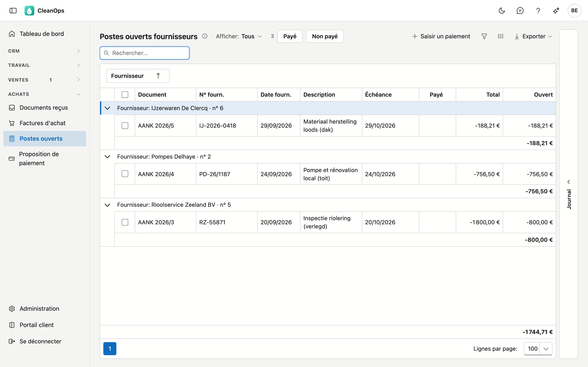

# Postes ouverts fournisseurs

Ce que vous devez encore à vos fournisseurs, par fournisseur avec son solde. C'est aussi d'ici que vous saisissez le paiement.

## Ouvrir l'écran

Cliquez à gauche dans le menu, sous **Achats**, sur **Postes ouverts**. Il vous faut le droit *Voir les achats* ; pour saisir un
paiement aussi *Saisir des paiements*.

## La liste

La liste montre les [factures d'achat](aankoopfacturen.md) et notes de crédit qui ne sont pas encore (entièrement) payées,
groupées par fournisseur. Sous chaque fournisseur figure son **solde** ; en bas de la liste, le total de tous les fournisseurs.

| Colonne | Ce que c'est |
|---|---|
| Document | le journal, l'exercice et le numéro, avec l'étiquette **note de crédit** pour une note de crédit |
| N° fourn. et Date fourn. | le numéro et la date sur le document du fournisseur |
| Description | ce qui a été acheté |
| Échéance | avec l'étiquette **échu** quand l'échéance est dépassée |
| Payé | l'étiquette **payé** pour un document que vous avez déjà payé, mais dont le paiement ne figure pas encore sur un extrait |
| Total | le montant du document |
| Ouvert | ce qui reste à payer ou à imputer |

Les montants s'affichent **comme sur l'extrait bancaire** : une facture que vous devez encore payer est négative — l'argent
sort — et une note de crédit que le fournisseur doit encore vous rembourser est positive. Le solde d'un fournisseur est donc le
montant qui bougera sur votre compte quand vous aurez tout payé.

- **Afficher** — *Échus* ne montre que les documents dont l'échéance est dépassée.
- **Rechercher** — le curseur se trouve directement dans le champ de recherche.
- **Exporter** — le bouton en haut à droite vous donne la liste sous forme de fichier.
- **Ouvrir** — double-cliquez sur une ligne pour ouvrir le document.
- **Journal** — le volet à droite montre les pièces jointes et l'historique du document sélectionné.

## Saisir un paiement

1. Cochez les documents que vous payez. Ils appartiennent à **un seul fournisseur** : un paiement concerne un seul fournisseur.
2. Cliquez sur **Saisir un paiement**.
3. La fenêtre de [Paiements](betalingen.md) s'ouvre, avec le fournisseur choisi et le montant ouvert des documents cochés déjà
   rempli. Choisissez le journal, la date et le numéro de l'extrait, et cliquez sur **Comptabiliser**.

Un document entièrement payé disparaît de cette liste. Un paiement partiel est possible : le document reste avec ce qui est encore
ouvert.

!!! note "Imputer une note de crédit"
    Cochez ensemble la facture et la note de crédit du même fournisseur. Dans la fenêtre, la facture est négative et la note de
    crédit positive ; ensemble, elles donnent le montant que vous virez réellement.

## Marquer payé

Vous avez déjà payé un document, par exemple avec le fichier SEPA de la [proposition de paiement](betalingsvoorstel.md), mais
le paiement ne figure pas encore sur un extrait ? Cochez-le, ou cliquez sur la ligne, et cliquez sur **Payé**. Le document
reste dans cette liste jusqu'à ce que vous enregistriez le paiement, mais n'entre plus dans une proposition de paiement.
**Non payé** annule ce marquage.

## Questions fréquentes

**Je ne vois pas le bouton Saisir un paiement.**
Il faut pour cela le droit *Saisir des paiements*. Demandez-le à votre administrateur.

**CleanOps dit que je ne peux cocher que des documents du même fournisseur.**
Un paiement concerne un seul fournisseur. Saisissez un paiement distinct pour chaque fournisseur.

**Pourquoi les montants sont-ils négatifs ?**
Parce qu'ils s'affichent comme sur l'extrait : payer une facture, c'est de l'argent qui sort. La même règle vaut dans
[Paiements](betalingen.md), de sorte qu'un extrait totalise le mouvement sur votre compte.

## Voir aussi

- [Paiements](betalingen.md)
- [Factures d'achat](aankoopfacturen.md)
- [Fournisseurs](leveranciers.md)
- [Proposition de paiement](betalingsvoorstel.md)
