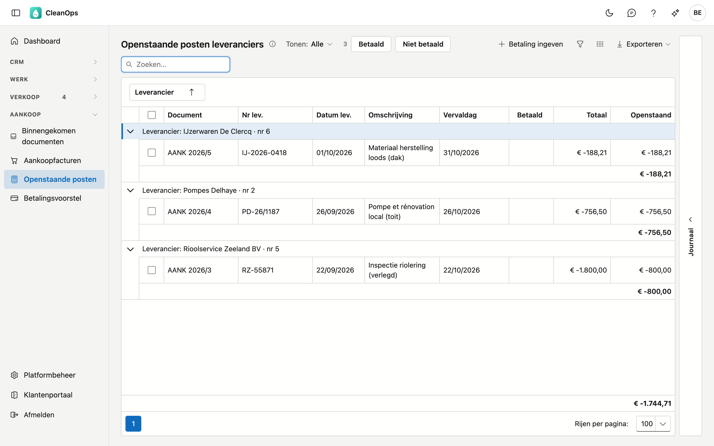

# Openstaande posten leveranciers

Wat u uw leveranciers nog moet betalen, per leverancier met zijn saldo. Van hieruit geeft u ook de betaling in.

## Het scherm openen

Klik links in het menu, onder **Aankoop**, op **Openstaande posten**. U hebt het recht *Aankoop bekijken* nodig; om een
betaling in te geven ook *Betalingen ingeven*.

## De lijst

De lijst toont de [aankoopfacturen](aankoopfacturen.md) en creditnota's die nog niet (volledig) betaald zijn, gegroepeerd per
leverancier, met zijn telefoonnummer naast de naam. Onder elke leverancier staat zijn **saldo**; onderaan de lijst het totaal van
alle leveranciers.

| Kolom | Wat het is |
|---|---|
| Document | het dagboek, het boekjaar en het nummer, met het label **creditnota** voor een creditnota |
| Nr lev. en Datum lev. | het nummer en de datum op het document van de leverancier |
| Datum | de boekingsdatum; haal ze tevoorschijn met de kolomkiezer |
| Omschrijving | wat er gekocht werd |
| Vervaldag | met het label **vervallen** wanneer de vervaldag voorbij is |
| Betaald | het label **betaald** voor een document dat u al betaalde, maar waarvan de betaling nog niet op een uittreksel staat |
| Totaal | het bedrag van het document |
| Openstaand | wat er nog betaald of verrekend moet worden |

Bedragen staan **zoals op het uittreksel van de bank**: een factuur die u nog moet betalen is negatief — het geld gaat buiten —
en een creditnota die de leverancier u nog moet terugbetalen is positief. Het saldo van een leverancier is dus het bedrag dat er
op uw rekening zal bewegen wanneer u alles betaalt.

- **Tonen** — *Vervallen* toont enkel de documenten waarvan de vervaldag voorbij is.
- **Zoeken** — de cursor staat meteen in het zoekveld.
- **Exporteren** — via de knop rechtsboven krijgt u de lijst als bestand.
- **Openen** — dubbelklik op een rij om het document te openen.
- **Journaal** — de strook rechts toont de bijlagen en het logboek van het document dat u aanklikt.

## Een betaling ingeven

1. Vink de documenten aan die u betaalt. Ze horen bij **één leverancier**: één betaling gaat over één leverancier.
2. Klik op **Betaling ingeven**.
3. Het venster van [Betalingen](betalingen.md) opent, met de leverancier gekozen en het openstaande bedrag van de aangevinkte
   documenten al ingevuld. Kies het dagboek, de datum en het nummer van het uittreksel, en klik op **Boeken**.

Een volledig betaald document verdwijnt uit deze lijst. Een deelbetaling mag: het document blijft staan met wat er nog openstaat.

!!! note "Een creditnota verrekenen"
    Vink de factuur en de creditnota van dezelfde leverancier samen aan. In het venster staat de factuur negatief en de
    creditnota positief; samen geven ze het bedrag dat u werkelijk overschrijft.

## Betaald markeren

Betaalde u een document al, bijvoorbeeld met het SEPA-bestand van het [betalingsvoorstel](betalingsvoorstel.md), maar staat
de betaling nog niet op een uittreksel? Vink het aan, of klik op de rij, en klik op **Betaald**. Het document blijft in deze
lijst staan tot u de betaling boekt, maar komt niet meer in een betalingsvoorstel. **Niet betaald** zet dat terug.

## Veelgestelde vragen

**Ik zie de knop Betaling ingeven niet.**
Daarvoor is het recht *Betalingen ingeven* nodig. Vraag het aan uw beheerder.

**CleanOps zegt dat ik enkel documenten van dezelfde leverancier mag aanvinken.**
Een betaling gaat over één leverancier. Geef voor elke leverancier een eigen betaling in.

**Waarom zijn de bedragen negatief?**
Omdat ze staan zoals op het uittreksel: een factuur betalen is geld dat buitengaat. Dezelfde afspraak geldt in
[Betalingen](betalingen.md), zodat een uittreksel optelt tot de beweging op uw rekening.

## Zie ook

- [Betalingen](betalingen.md)
- [Aankoopfacturen](aankoopfacturen.md)
- [Leveranciers](leveranciers.md)
- [Betalingsvoorstel](betalingsvoorstel.md)
