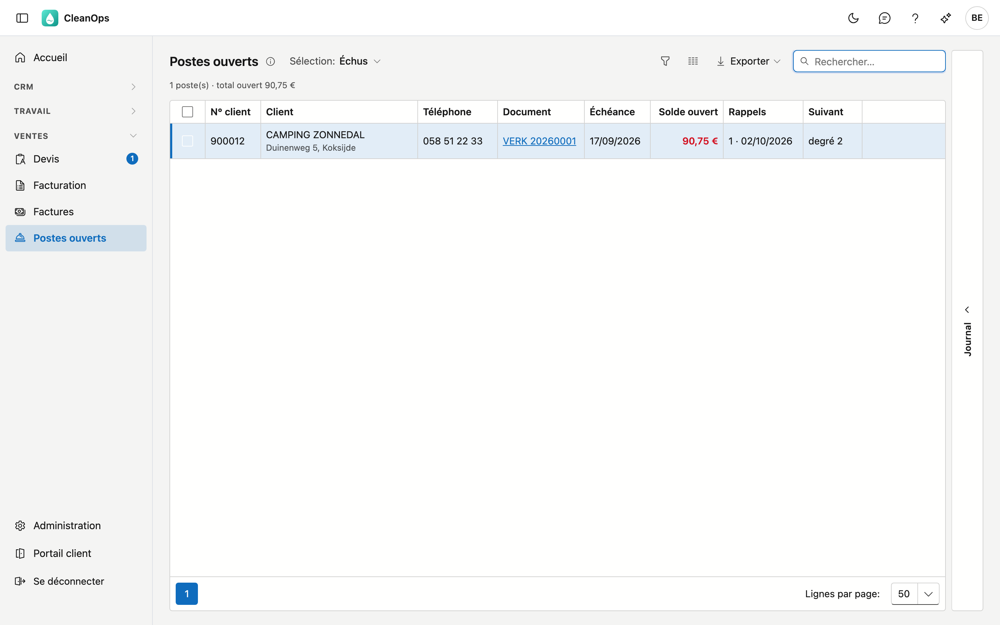
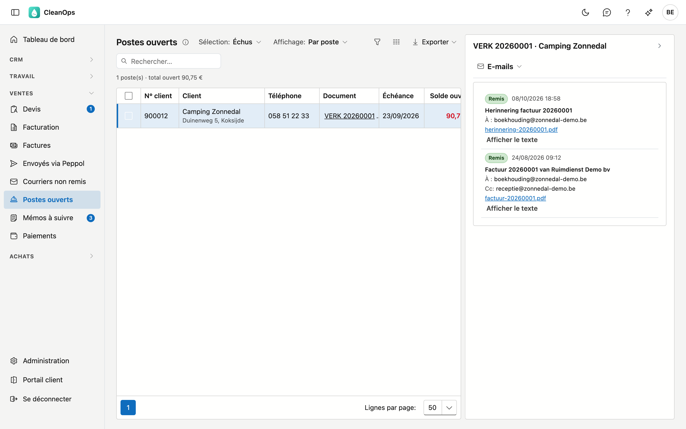
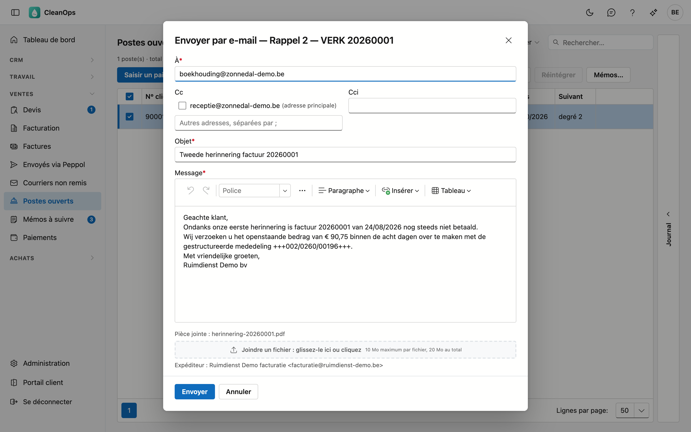
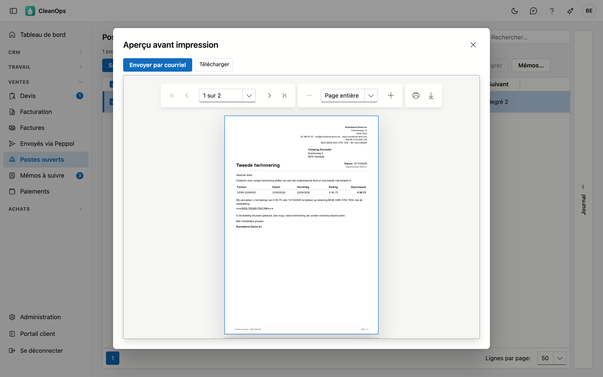
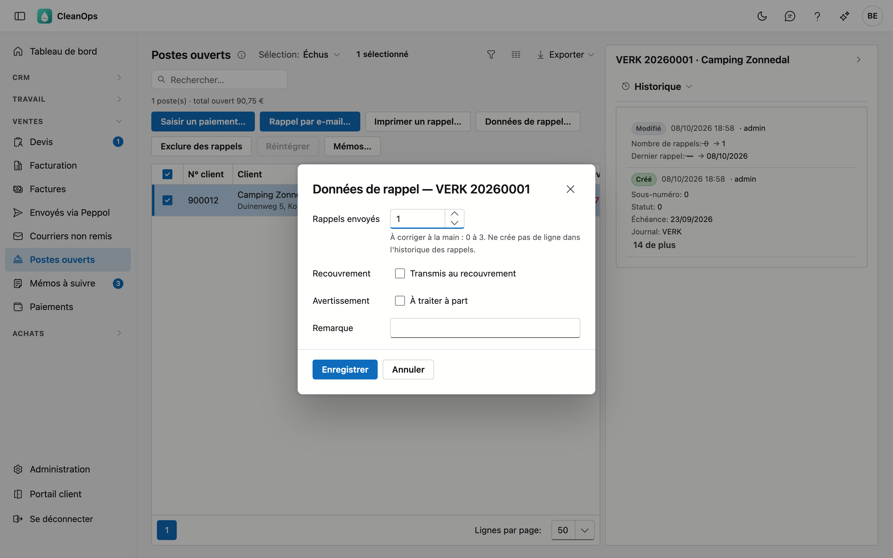

# Postes ouverts

Postes ouverts est votre gestion des rappels : les factures et notes de crédit qui ne sont pas encore (entièrement) payées. Ici,
vous voyez ce qui est échu, vous envoyez ou imprimez un rappel et vous suivez qui vous avez déjà relancé.

## Ouvrir l'écran

Dans le menu de gauche, sous **Ventes**, cliquez sur **Postes ouverts**. Vous le voyez avec le rôle **Financieel** ou en tant
qu'administrateur. Enregistrer des rappels et modifier les données de rappel demande en plus le droit *Gérer les rappels* ;
par défaut, seul l'administrateur l'a.

Le nombre à côté de **Postes ouverts** dans le menu compte les postes qui attendent un rappel suivant.

## La liste

En haut, choisissez une **Sélection** :

| Sélection | Ce que vous voyez |
|---|---|
| Échus | Les postes dont l'échéance est passée. C'est ici que vous commencez : ce qui demande un premier rappel. L'écran s'ouvre ainsi. |
| Prochain rappel | Les postes qui ont déjà reçu un rappel, datant d'au moins le délai entre deux rappels. |
| Exclus | Les postes que vous avez exclus des rappels. |
| Client sans rappels | Les postes des clients dont la case **Reçoit des rappels** est décochée sur la [fiche client](klanten.fr.md). |
| Tous les postes ouverts | Tout ce qui est ouvert, y compris les notes de crédit et les factures créditées (label *crédité*). Le total est le solde de tous les clients ensemble. |

Échus, Prochain rappel et Client sans rappels ne montrent que les clients qui **doivent encore quelque chose** au total. Si
un client a une note de crédit ouverte plus élevée que ses factures ouvertes, il n'y figure pas — un rappel lui réclamerait
ce qu'il ne doit pas. Ses postes restent visibles dans **Tous les postes ouverts**. Le nombre à côté de **Postes ouverts**
dans le menu compte de la même façon.

Le délai se règle sur la [fiche entreprise](beheer/bedrijfsfiche.fr.md), sous **Délai entre deux rappels**. Vide signifie
15 jours.

| Colonne | Contenu |
|---|---|
| N° client, Client | Pour qui, avec la rue et la commune en dessous, et la remarque s'il y en a une. |
| Téléphone | Le GSM du client, et son numéro fixe en petit en dessous. S'il n'a pas de GSM, uniquement le numéro fixe. La recherche porte sur les deux, avec ou sans espaces : *0495513191* trouve aussi *0495 51 31 91*. Dans une exportation, les numéros figurent sans espaces. |
| Document | Le journal et le numéro. Cliquez dessus pour ouvrir la facture. |
| Échéance | Quand le poste devait être payé. |
| Solde ouvert | Ce qui reste ouvert ; **en rouge** si le poste est échu. |
| Rappels | Combien de rappels sont partis, avec la date du dernier. |
| Suivant | Le degré que recevra un nouveau rappel (1, 2 ou 3) ; un tiret si le poste ne reçoit pas de rappel. |

À droite figurent les marques **recouvrement**, **avertissement**, **exclu** et **client sans rappels**.
Le sélecteur de colonnes affiche aussi **Date**, **Total**, **Payé**, **Dernier rappel** et **Remarque** comme colonnes séparées.

Cherchez par client, commune, rue, téléphone, document ou remarque. Double-cliquez sur un poste pour ouvrir la fiche client.
Sélectionnez un poste et ouvrez à droite le volet **Journal** pour son historique : qui a modifié quoi, et chaque rappel
enregistré. Choisissez en haut du volet **E-mails** pour ce qui a été envoyé par e-mail pour la facture de ce poste : la facture
elle-même et les rappels, avec leur statut de remise.

### Solde par client

Choisissez en haut **Affichage : Par client (solde)** pour la liste des soldes : une ligne par client, avec son nom, son numéro
de client et son **solde** — ce que ses postes de la sélection choisie représentent encore ensemble. Le total figure en bas. La
flèche devant un client déplie ses postes ; tout y fonctionne comme dans la liste habituelle. Choisissez **Tous les postes
ouverts** pour le solde complet ; avec **Échus**, seul ce qui est échu compte. Un solde de 0,00 € signifie que les postes de ce
client s'annulent, par exemple une facture et une note de crédit. La sélection et l'affichage restent en place quand vous ouvrez
une fiche client et revenez.

## Envoyer un rappel par e-mail

Cochez le poste et cliquez sur **Rappel par e-mail…**. Une fenêtre s'ouvre, déjà remplie :

- **À** — l'adresse e-mail de rappel du client, sinon son adresse de facturation, sinon son adresse e-mail habituelle (voir
  [Clients](klanten.fr.md)).
- **Cc** et **Cci** — les autres adresses du client figurent comme case à cocher. Vous ajoutez une autre adresse en la tapant,
  séparée par un point-virgule ; la copie fixe du texte d'e-mail y figure déjà.
- **Objet** et **Message** — le texte d'e-mail du **degré** : premier, deuxième ou dernier rappel, dans la langue de la facture,
  avec le numéro, la date, l'échéance, le solde ouvert et la communication structurée remplis. À partir du quatrième rappel, le
  client reçoit à nouveau le texte du troisième. Vous réglez ces textes dans [Textes d'e-mail](beheer/mailteksten.fr.md) ; ici,
  vous les adaptez pour cet e-mail seulement.
- En bas figurent la **Pièce jointe** — la lettre de rappel avec la facture derrière, en un seul PDF — et l'**Expéditeur** (voir
  [Expéditeurs](beheer/mailafzenders.fr.md)). **Voir** à côté de la pièce jointe l'ouvre dans un aperçu ; ce que vous avez déjà modifié dans la fenêtre reste en place.
  En haut à droite, **Fiche client ↗** ouvre la fiche du client dans un nouvel onglet.
- **Joindre un fichier** — glissez votre propre fichier dans la zone ou cliquez dessus. 10 Mo maximum par fichier et 20 Mo
  ensemble.

Cliquez sur **Envoyer**. L'e-mail part réellement chez le client. Dès qu'il est parti, CleanOps enregistre le rappel **tout seul** :
le nombre de rappels augmente d'un, avec la date du jour, et le rappel entre dans l'historique des rappels du client. L'historique
indique à quelle adresse il a été envoyé. Un e-mail qui ne part pas n'enregistre rien.

## Imprimer un rappel

Cochez le poste et cliquez sur **Imprimer un rappel…**. L'aperçu avant impression affiche la lettre de rappel, avec la facture
derrière sur une nouvelle page. C'est le même PDF que celui qui part avec **Rappel par e-mail…**.

- Le **degré** suit le nombre de rappels envoyés : **Rappel**, **Deuxième rappel**, et à partir du troisième **Dernier
  rappel**.
- La lettre demande de payer le solde ouvert dans les 8 jours, sur votre compte et avec la communication structurée de la
  facture.
- La lettre est dans la langue de la facture.

Cliquez sur **Télécharger** pour enregistrer le PDF, ou imprimez-le. Si vous voulez quand même l'envoyer par e-mail, cliquez sur
**Envoyer par courriel** : la fenêtre de **Rappel par e-mail…** s'ouvre, et ce rappel s'enregistre tout seul.

Si vous fermez l'aperçu sans l'envoyer, CleanOps demande **Enregistrer le rappel ?**. Cliquez sur **Enregistrer le rappel** si
vous imprimez la lettre ou l'envoyez vous-même : le nombre de rappels augmente d'un, avec la date du jour, et le rappel entre dans
l'historique des rappels. Cliquez sur **Annuler** si vous vouliez seulement regarder.

Pas de rappel pour une note de crédit, un poste crédité, un poste exclu, un client dont la case **Reçoit des rappels** est décochée, ou un client
qui ne doit rien au total (badge *ne doit rien* dans **Tous les postes ouverts**). Les boutons
sont alors désactivés et indiquent pourquoi.

## Données de rappel

Cochez un seul poste et cliquez sur **Données de rappel…**.

| Champ | Ce que vous indiquez |
|---|---|
| Rappels envoyés | Le nombre de rappels, à corriger à la main de 0 à 3. Cela ne crée pas de ligne dans l'historique des rappels. |
| Recouvrement | Le poste a été transmis à un bureau de recouvrement. |
| Avertissement | Le poste demande un suivi à part. |
| Remarque | Une note courte, 100 caractères au maximum. Elle figure sous le nom du client dans la liste. |

## Exclure et réintégrer

Cochez un ou plusieurs postes et cliquez sur **Exclure des rappels** : ils disparaissent de Échus et Prochain rappel, et
figurent désormais sous **Exclus**. Avec **Réintégrer**, ils reçoivent de nouveau des rappels.

## Mémos

Vous appelez un client au sujet d'une facture ouverte ? Notez tout de suite ce qui a été convenu. Cochez un poste et cliquez sur
**Mémos…** : vous voyez les mémos de ce client et vous en créez un avec **Nouveau mémo**. Avec une date dans **Rappeler le**, le
mémo apparaît ce jour-là dans [Mémos à suivre](op-te-volgen-memos.fr.md). Si vous choisissez des postes de plus d'un client, le
bouton est désactivé.

## Questions fréquentes

**Dois-je encore enregistrer un rappel envoyé par e-mail ?**
Non. Un rappel envoyé avec **Rappel par e-mail…** ou **Envoyer par courriel** s'enregistre tout seul. Seul un rappel imprimé ou
envoyé par vous-même s'enregistre à la fermeture de l'aperçu avant impression.

**Mon rappel est-il arrivé ?**
Sélectionnez le poste et choisissez dans le volet **Journal** l'onglet **E-mails**, ou ouvrez la facture et cliquez sur
**E-mails**. Un e-mail qui n'a pas atteint le client porte le statut **Rejeté** ou **Indésirable**. Vérifiez alors l'adresse du
client et renvoyez l'e-mail.

**Quelqu'un d'autre vient d'enregistrer un rappel pendant que ma fenêtre était ouverte.**
CleanOps refuse alors l'e-mail : le texte et la lettre correspondaient au degré précédent. Fermez la fenêtre et cliquez à nouveau
sur **Rappel par e-mail…**.

**Puis-je saisir un paiement ?**
Oui : sélectionnez le poste et cliquez sur **Saisir un paiement…**. Voir [Paiements](betalingen.fr.md).

**Où vois-je les rappels qu'un client a déjà reçus ?**
Sur la [fiche client](klanten.fr.md), onglet **Postes ouverts** : l'historique des rappels s'y trouve.

**Je ne vois pas les boutons Rappel par e-mail et Imprimer un rappel.**
Il faut pour cela le droit *Gérer les rappels*. Demandez-le à votre administrateur.

## Voir aussi

- [Paiements](betalingen.fr.md)
- [Factures](facturen.fr.md)
- [Textes d'e-mail](beheer/mailteksten.fr.md)
- [Clients](klanten.fr.md)
- [Mémos à suivre](op-te-volgen-memos.fr.md)
- [Fiche entreprise](beheer/bedrijfsfiche.fr.md)
