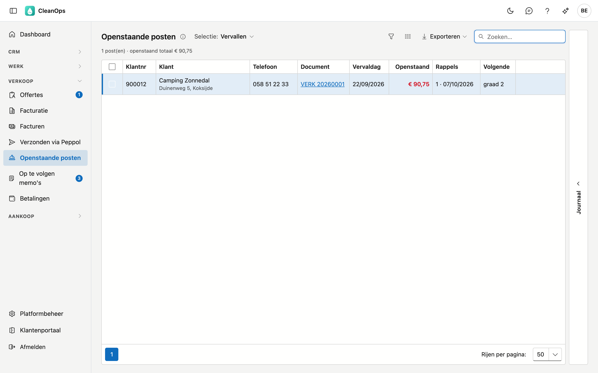
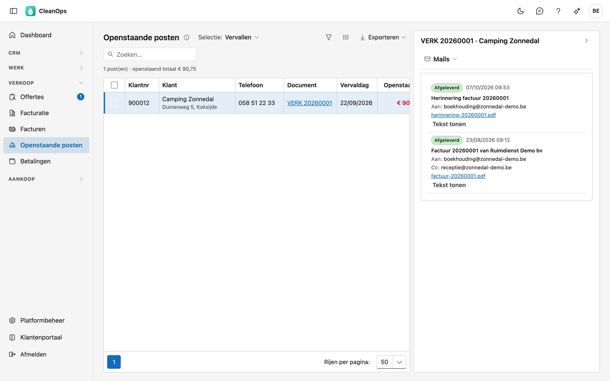
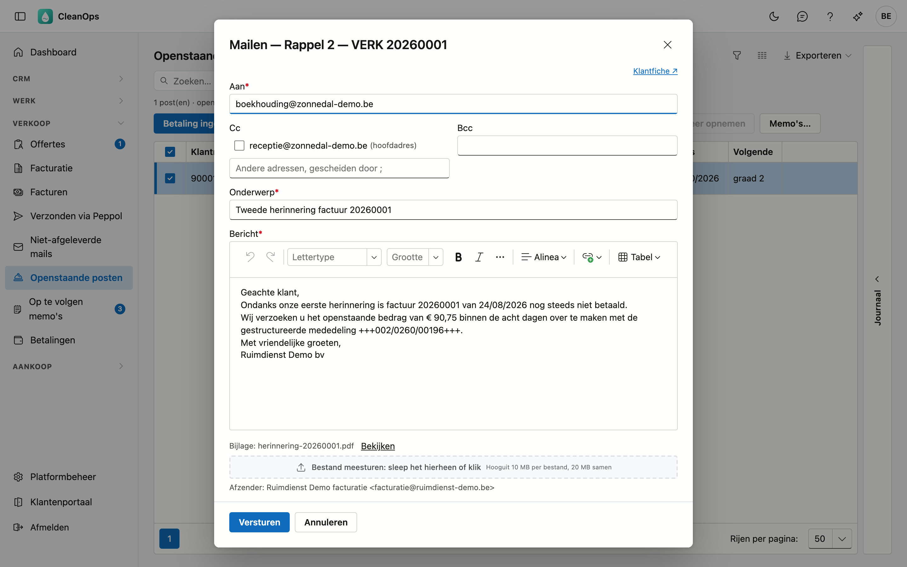
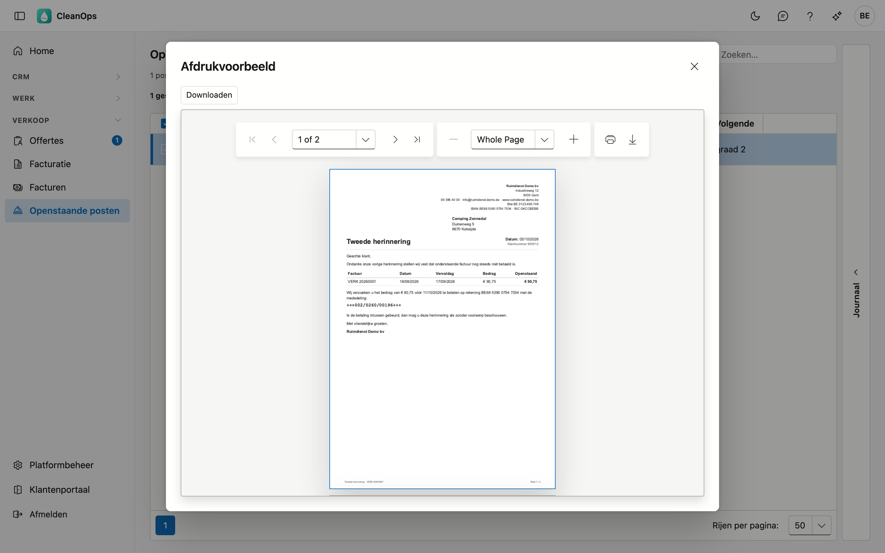
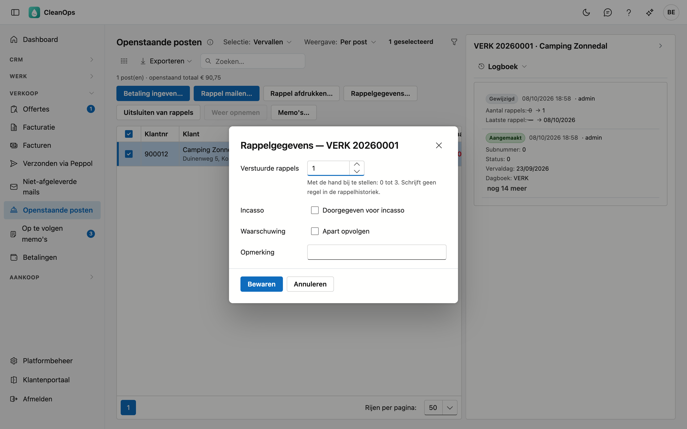

# Openstaande posten

Openstaande posten is uw rappelbeheer: de facturen en creditnota's die nog niet (volledig) betaald zijn. Hier ziet u wat
vervallen is, mailt of drukt u een rappel af en houdt u bij wie u al aanmaande.

## Het scherm openen

Klik links in het menu, onder **Verkoop**, op **Openstaande posten**. U ziet het met de rol **Financieel** of als beheerder.
Rappels inboeken en de rappelgegevens wijzigen vraagt daarnaast het recht *Rappels beheren*; dat heeft standaard enkel de
beheerder.

Het getal naast **Openstaande posten** in het menu telt de posten die aan een volgende rappel toe zijn.

## De lijst

Kies bovenaan een **Selectie**:

| Selectie | Wat u ziet |
|---|---|
| Vervallen | De posten waarvan de vervaldag voorbij is. Hier begint u: dit is wat een eerste rappel nodig heeft. Het scherm opent zo. |
| Volgende rappel | De posten die al een rappel kregen, waarvan die rappel minstens de wachttijd oud is. |
| Uitgesloten | De posten die u uitsloot van rappels. |
| Klant zonder rappels | De posten van klanten bij wie het vinkje **Ontvangt rappels** uit staat op de [klantfiche](klanten.md). |
| Alle openstaande | Alles wat openstaat, ook de creditnota's. |

Vervallen, Volgende rappel en Klant zonder rappels tonen enkel klanten die **netto iets schuldig** zijn. Heeft een klant een
openstaande creditnota die groter is dan zijn openstaande facturen, dan staat hij daar niet — een rappel zou hem aanmanen
voor iets wat hij niet verschuldigd is. U vindt zijn posten wel bij **Alle openstaande**. Het getal naast **Openstaande
posten** in het menu telt op dezelfde manier.

De wachttijd stelt u in op de [bedrijfsfiche](beheer/bedrijfsfiche.md), bij **Wachttijd tussen twee rappels**. Leeg betekent
15 dagen.

| Kolom | Wat erin staat |
|---|---|
| Klantnr, Klant | Voor wie, met de straat en de gemeente eronder, en de opmerking als die er is. |
| Telefoon | Het gsm-nummer van de klant, en zijn vaste nummer klein eronder. Heeft hij geen gsm, dan enkel het vaste nummer. Op beide kunt u zoeken. |
| Document | Het dagboek en het nummer. Klik erop om de factuur te openen. |
| Vervaldag | Wanneer de post betaald moest zijn. |
| Openstaand | Wat er nog openstaat; **in het rood** als de post vervallen is. |
| Rappels | Hoeveel rappels er al vertrokken, met de datum van de laatste. |
| Volgende | De graad die een nieuwe rappel krijgt (1, 2 of 3); een streepje als de post geen rappel krijgt. |

Rechts staan de markeringen **incasso**, **waarschuwing**, **uitgesloten** en **klant zonder rappels**.
Met de kolomkiezer haalt u ook **Datum**, **Totaal**, **Betaald**, **Laatste rappel** en **Opmerking** als aparte kolom tevoorschijn.

Zoek op klant, gemeente, straat, telefoon, document of opmerking. Dubbelklik op een post om de klantfiche te openen. Klik een post
aan en open rechts de strook **Journaal** voor zijn logboek: wie wat wijzigde en elke ingeboekte rappel. Kies bovenaan in de strook
**Mails** voor wat er over de factuur van die post gemaild werd: de factuur zelf en de rappels, met of ze afgeleverd zijn.

### Saldo per klant

Kies bovenaan **Weergave: Per klant (saldo)** voor de saldolijst: één regel per klant, met zijn naam, zijn klantnummer en
zijn **saldo** — wat zijn posten in de gekozen selectie samen nog openstaan. Onderaan staat het totaal. Met het pijltje vóór een
klant klapt u zijn posten open; daar werkt alles zoals in de gewone lijst. Kies **Alle openstaande** voor het volledige saldo;
bij **Vervallen** telt enkel wat vervallen is. Een saldo van € 0,00 betekent dat de posten van die klant elkaar opheffen,
bijvoorbeeld een factuur en een creditnota. Selectie en weergave blijven staan wanneer u een klantfiche opent en terugkeert.

## Een rappel mailen

Vink de post aan en klik op **Rappel mailen…**. Een venster opent met alles al ingevuld:

- **Aan** — het e-mailadres voor rappels van de klant, anders zijn adres voor facturen, anders zijn gewone e-mailadres (zie
  [Klanten](klanten.md)).
- **Cc** en **Bcc** — de andere adressen van de klant staan er als vinkje bij. Een ander adres typt u erbij, gescheiden door een
  puntkomma; de vaste kopie uit de mailtekst staat er al.
- **Onderwerp** en **Bericht** — de mailtekst van de **graad**: eerste, tweede of derde herinnering, in de taal van de factuur, met
  het nummer, de datum, de vervaldag, het openstaande bedrag en de gestructureerde mededeling ingevuld. Vanaf de vierde rappel
  krijgt de klant opnieuw de tekst van de derde. U stelt de teksten in bij [Mailteksten](beheer/mailteksten.md); hier past u ze
  aan voor deze ene mail.
- Onderaan staan de **Bijlage** — de rappelbrief met de factuur erachter, in één PDF — en de **Afzender** (zie
  [Mailafzenders](beheer/mailafzenders.md)).
- **Bestand meesturen** — sleep een eigen bestand in het vak of klik erop. Hooguit 10 MB per bestand en 20 MB samen.

Klik op **Versturen**. De mail vertrekt echt naar de klant. Zodra ze vertrokken is, boekt CleanOps de rappel **vanzelf** in: het
aantal rappels gaat één omhoog, met de datum van vandaag, en de rappel komt in de rappelhistoriek van de klant. In het logboek staat
naar welk adres hij gemaild werd. Een mail die niet vertrekt, boekt niets in.

## Een rappel afdrukken

Vink de post aan en klik op **Rappel afdrukken…**. Het afdrukvoorbeeld toont de rappelbrief, met de factuur erachter op een nieuw
blad. Het is dezelfde PDF die met **Rappel mailen…** meegaat.

- De **graad** volgt het aantal verstuurde rappels: **Herinnering**, **Tweede herinnering**, en vanaf de derde **Laatste
  herinnering**.
- De brief vraagt het openstaande bedrag te betalen binnen 8 dagen, op uw rekening en met de gestructureerde mededeling van de
  factuur.
- De brief staat in de taal van de factuur.

Klik op **Downloaden** om de PDF te bewaren, of druk ze af. Wilt u de rappel toch mailen, klik dan op **Doorsturen per mail**: het
venster van **Rappel mailen…** opent, en die rappel boekt zichzelf in.

Sluit u het voorbeeld zonder te mailen, dan vraagt CleanOps **Rappel inboeken?**. Klik op **Rappel inboeken** als u de brief
afdrukt of zelf verstuurt: het aantal rappels gaat één omhoog, met de datum van vandaag, en de rappel komt in de rappelhistoriek.
Klik op **Annuleren** als u enkel wilde kijken.

Geen rappel voor een creditnota, een post die uitgesloten is, een klant bij wie **Ontvangt rappels** uit staat, of een klant die
netto niets schuldig is (badge *niets schuldig* in **Alle openstaande**). De knoppen staan
dan uit, en zeggen waarom.

## Rappelgegevens

Vink één post aan en klik op **Rappelgegevens…**.

| Veld | Wat u aanduidt |
|---|---|
| Verstuurde rappels | Het aantal rappels, met de hand bij te stellen van 0 tot 3. Dit schrijft geen regel in de rappelhistoriek. |
| Incasso | De post is doorgegeven aan een incassobureau. |
| Waarschuwing | De post vraagt een aparte opvolging. |
| Opmerking | Een korte notitie, hoogstens 100 tekens. Ze staat onder de klantnaam in de lijst. |

## Uitsluiten en weer opnemen

Vink een of meer posten aan en klik op **Uitsluiten van rappels**: ze verdwijnen uit Vervallen en Volgende rappel, en staan
voortaan onder **Uitgesloten**. Met **Weer opnemen** krijgen ze opnieuw rappels.

## Memo's

Belt u een klant op over een openstaande factuur, noteer dan meteen wat er afgesproken is. Vink een post aan en klik op
**Memo's…**: u ziet de memo's van die klant en maakt er een met **Nieuwe memo**. Met een datum bij **Herinneren op** verschijnt
de memo die dag in [Op te volgen memo's](op-te-volgen-memos.md). Kiest u posten van meer dan één klant, dan staat de knop uit.

## Veelgestelde vragen

**Moet ik een gemailde rappel nog inboeken?**
Nee. Een rappel die u met **Rappel mailen…** of **Doorsturen per mail** verstuurt, boekt zichzelf in. Enkel een afgedrukte of
zelf verstuurde rappel boekt u in bij het sluiten van het afdrukvoorbeeld.

**Is mijn rappel aangekomen?**
Klik de post aan en kies in de strook **Journaal** het tabblad **Mails**, of open de factuur en klik op **Mails**. Een mail die
de klant niet bereikte, staat op **Geweigerd** of **Spam**. Kijk dan het adres van de klant na en mail opnieuw.

**Iemand anders heeft net een rappel ingeboekt terwijl mijn venster openstond.**
Dan weigert CleanOps de mail: de tekst en de brief hoorden bij de vorige graad. Sluit het venster en klik opnieuw op **Rappel
mailen…**.

**Kan ik een betaling ingeven?**
Ja: selecteer de post en klik op **Betaling ingeven…**. Zie [Betalingen](betalingen.md).

**Waar zie ik welke rappels een klant al kreeg?**
Op de [klantfiche](klanten.md), tabblad **Openstaand**: daar staat de rappelhistoriek.

**Ik zie de knoppen Rappel mailen en Rappel afdrukken niet.**
Daarvoor is het recht *Rappels beheren* nodig. Vraag het aan uw beheerder.

## Zie ook

- [Betalingen](betalingen.md)
- [Facturen](facturen.md)
- [Mailteksten](beheer/mailteksten.md)
- [Klanten](klanten.md)
- [Op te volgen memo's](op-te-volgen-memos.md)
- [Bedrijfsfiche](beheer/bedrijfsfiche.md)
