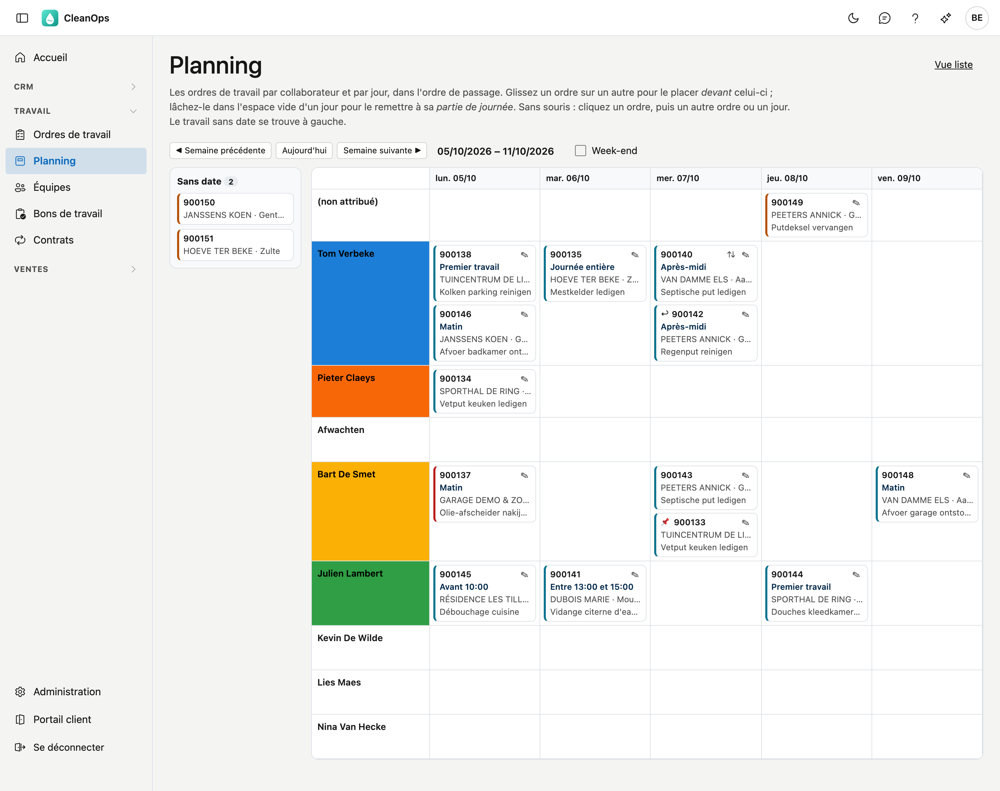
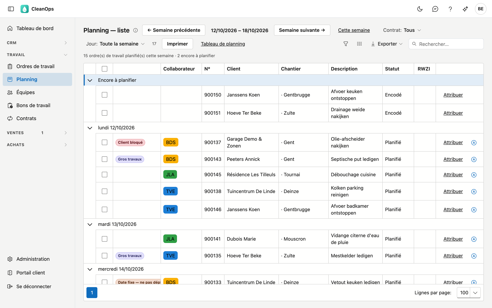
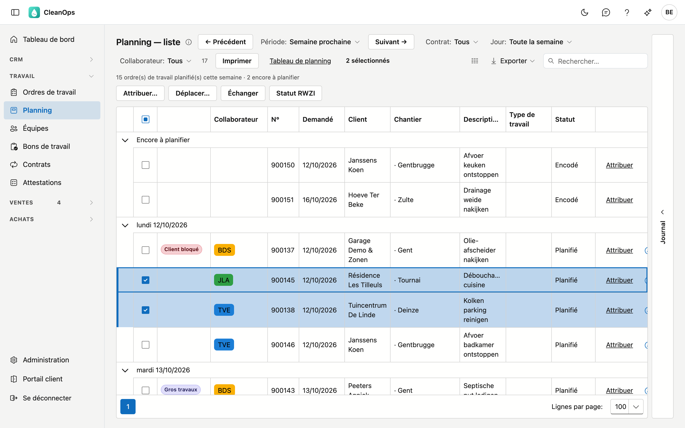
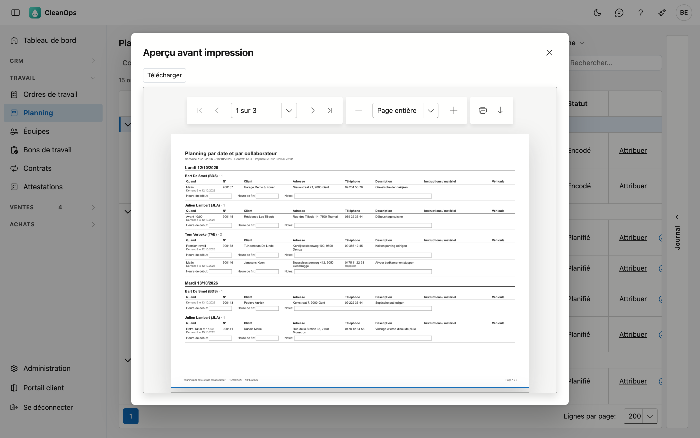

# Planning

Dans le planning, vous répartissez le travail entre vos collaborateurs et sur les jours de la semaine. Vous voyez les
mêmes ordres de travail de deux façons : sur le **tableau de planning**, vous les glissez vers un autre jour ou un
autre collaborateur, et dans la **liste du planning**, vous en attribuez plusieurs à la fois, vous ouvrez l'itinéraire
du jour d'un chauffeur et vous imprimez le planning.

## Ouvrir l'écran

Dans le menu de gauche, sous **Travail**, cliquez sur **Planning**. Le tableau de planning s'ouvre sur la semaine en
cours, le samedi et le dimanche sur la semaine suivante. Avec **Vue liste** en haut à droite, vous passez à la liste
du planning, avec **Tableau de planning** vous revenez.

Le planning ne montre que le travail encore à faire : les ordres de travail *encodés* ou *planifiés*. Un ordre
exécuté disparaît du planning.

## Le tableau de planning

- **La semaine** — choisissez une semaine avec **◀ Semaine précédente** et **Semaine suivante ▶** ;
  **Aujourd'hui** vous ramène à la semaine en cours. La case **Week-end** affiche le samedi et le dimanche. Si du
  travail est planifié un jour de week-end, ce jour est toujours affiché.
- **Les lignes** — en haut, **(non attribué)** : le travail avec une date mais sans collaborateur. En dessous, une
  ligne par collaborateur, dans l'ordre de la [liste des collaborateurs](medewerkers.fr.md). Un collaborateur qui n'est
  plus actif ou qui est pensionné n'a une ligne que si du travail est planifié pour lui cette semaine-là.
- **La couleur** — le nom du collaborateur apparaît dans sa couleur de planning. Vous la choisissez sur la
  [fiche collaborateur](medewerkers.fr.md#longlet-fiche).
- **Sans date** — à gauche se trouve le travail qui n'a pas encore de date planifiée, avec leur nombre.

### Un ordre de travail sur le tableau

Chaque carte montre le numéro, la partie de journée et le rendez-vous horaire (par exemple *Matin* ou
*Entre 13:00 et 15:00*), le client et la commune, la description et le type de travail (par exemple *vetput +/- 3 T*)
— ce dernier seulement s'il dit autre chose que la description. Si vous pointez une carte, vous voyez aussi le
chantier, le type de travail et les signaux.

| Signe | Signification |
|---|---|
| 📌 | Date fixe — ne pas déplacer. |
| ↩ | Peut être exécuté plus tôt. |
| ⇅ | Placé à la main : l'ordre reste là où le planificateur l'a mis, même devant une partie de journée plus tôt. |
| ✎ | Ouvre la fiche de l'ordre de travail. Avec **← Planning**, vous revenez à la même semaine. |

Le bord gauche de la carte en dit plus sur l'ordre :

- **bleu-vert** — planifié ;
- **orange** — le statut est encore *Encodé* ;
- **rouge** — le client est bloqué.

Si un ordre porte le code d'un collaborateur qui ne figure plus dans la liste, il se trouve sous **(non attribué)**,
avec ce code en italique en dessous.

### L'ordre dans une journée

Dans une journée, les ordres d'un collaborateur figurent dans l'ordre où ils seront exécutés :

- **par partie de journée** : **Premier travail**, **Matin**, **Journée entière**, **Après-midi**. Pour **Autre**,
  c'est l'heure du rendez-vous qui compte, et sans rendez-vous midi ;
- **pour la même partie de journée**, par code postal ;
- **ce qui est placé à la main** (⇅) reste à l'endroit où le planificateur l'a mis. Un nouvel ordre vient après le
  dernier ordre placé à la main dont la partie de journée est plus tôt ou la même.

Vous choisissez la partie de journée sur la [fiche de l'ordre de travail](werkorders.fr.md#planification-et-execution).

### Déplacer du travail

- **Vers un autre jour ou un autre collaborateur** — glissez la carte vers cette case. Le statut suit comme sur la
  fiche : avec une date et un collaborateur, l'ordre devient *Planifié*.
- **Devant un autre ordre** — lâchez la carte *sur* cette autre carte. Il est alors placé à la main (⇅).
- **Remettre à sa partie de journée** — lâchez la carte dans l'espace vide du jour. La place manuelle disparaît.
- **Sans souris** — cliquez une carte : en haut apparaît *Ordre … choisi*. Cliquez ensuite une autre carte ou un
  endroit vide d'un jour. **Annuler** ne choisit rien.
- **Planifier du travail sans date** — glissez la carte de la gauche vers un jour.

Si l'ordre porte une **date fixe**, CleanOps demande *Le déplacer quand même ?* dès que vous le glissez vers un autre
jour. Une autre place le même jour ne demande rien.

Si vous glissez un ordre de travail vers un collaborateur un jour où il est absent (congé, maladie), l'ordre reste à cette
place et CleanOps vous avertit.

!!! info "Retirer une date"
    Remettre un ordre sans date ne se fait pas sur le tableau. Vous le faites dans la liste du planning : ouvrez
    **Attribuer** et videz le **Jour planifié**. L'ordre redevient alors *Encodé*.

## La liste du planning

Les mêmes ordres sous forme de liste, groupés par jour — par défaut ceux de cette semaine. Le travail sans date se
trouve sous **Encore à planifier**. Avec **Nouvel ordre de travail** en haut à droite, vous choisissez un client et en créez un tout de suite (voir [Ordres de travail](werkorders.fr.md#un-nouvel-ordre-de-travail)).

Pour chaque ordre, vous voyez les signaux (*Date fixe — ne pas déplacer*, *Peut être exécuté plus tôt*,
*Gros travaux*, *Client bloqué*), le collaborateur dans sa couleur, le numéro, la date demandée par le client
(**Demandé**), le client, le chantier, la description, le type de travail et le statut. Avec le sélecteur de colonnes
(l'icône à côté d'**Exporter**), vous ajoutez **Quand** (partie de journée et heure convenue), **Commandé**,
**Rue + n°**, **Code postal**, **Localité** et **RWZI** ; un clic sur une colonne trie sur celle-ci, par exemple sur la
localité.

À droite se trouve le volet **Journal**. Dépliez-le pour voir l'ordre sélectionné sans quitter la liste : le client,
l'adresse et le téléphone, la date demandée et les heures, qui et avec quel véhicule, la description, les instructions
pour le collaborateur, le matériel et la remarque interne — et en dessous les pièces jointes et l'historique. Il reste
ouvert quand vous choisissez une autre ligne.

- **Période** — choisissez **Aujourd'hui**, **Semaine passée**, **Cette semaine** (par défaut), **Semaine
  prochaine**, **Ce mois-ci** ou **Mois prochain**, ou indiquez sous *Période libre* un **Du** et un **Au** puis cliquez
  sur **Appliquer**. Une période dure au maximum trois mois. **← Précédent** et **Suivant →** avancent de la longueur de
  la période : une semaine à la fois, un mois à la fois. Sous les boutons figurent le nombre d'ordres planifiés sur
  cette période et le nombre encore à planifier.
- **Contrat** — **Tous**, **Sans contrat** ou **Avec contrat** : le travail issu d'un [contrat](contracten.fr.md), ou
  les missions ponctuelles.
- **Jour** — **Toute la semaine** (ou **Toute la période**), ou un seul jour de la période. Sous les boutons figure
  alors le nombre d'ordres planifiés ce jour-là, et **Imprimer** n'imprime que ce jour. Si vous choisissez une autre
  période, **Jour** revient sur toute la période. La tuile *au planning aujourd'hui* du [tableau de bord](dashboard.md) ouvre la liste sur le jour même.
- **Collaborateur** — **Tous**, **Tous les attribués** (avec une date et un collaborateur), **Non attribués**, ou un
  seul collaborateur : vous ne voyez alors que son travail.
- **Rechercher** — le curseur est tout de suite dans le champ de recherche. La recherche porte sur le numéro, le client,
  la rue, le numéro de maison, le code postal, la localité, le téléphone, le collaborateur, le véhicule, les travaux, la
  description, le contrat et la remarque interne, ainsi que sur le jour (par exemple *06/10*), le chantier, le type de
  travail, le statut et les autres colonnes — même si la colonne n'est pas affichée. Majuscules, accents et espaces ne
  comptent pas ; chaque mot doit figurer quelque part. Les compteurs et **Imprimer** suivent la recherche.
- **Ouvrir** — double-cliquez sur une ligne pour ouvrir la fiche de l'ordre de travail. Avec **← Planning**, vous revenez
  à la même période, avec les mêmes filtres.

### Attribuer un ordre

Cliquez sur **Attribuer** dans la ligne. Choisissez le **Collaborateur** et le **Jour planifié**, puis cliquez sur
**Enregistrer**. Si vous videz le jour planifié, l'ordre retourne au travail sans date.

### Plusieurs ordres à la fois

Cochez les ordres de travail. Au-dessus de la liste apparaît ce que vous pouvez faire avec cette sélection.

| Bouton | Ce qui se passe |
|---|---|
| Attribuer… | Choisissez un collaborateur ; tous les ordres cochés vont à lui. Si vous laissez le champ vide, ils ne vont à personne. |
| Déplacer… | Choisissez un jour planifié ; tous les ordres cochés vont à ce jour, chez le même collaborateur. |
| Échanger | Le travail de deux collaborateurs est échangé. Ce n'est possible que si la sélection contient le travail d'exactement deux collaborateurs. CleanOps demande d'abord une confirmation. |
| Statut RWZI | Active RWZI là où il était désactivé et le désactive là où il était actif. CleanOps indique combien ont été activés et désactivés. |

Avec **Attribuer** et **Déplacer**, la place manuelle dans la journée disparaît : l'ordre vient à sa partie de
journée. Avec **Échanger**, l'ordre dans la journée reste.

Si vous choisissez une autre période, un autre filtre ou une autre recherche, la sélection disparaît. Ainsi, un bouton ne touche jamais du travail
que vous ne voyez plus.

### L'itinéraire du jour

Le signe d'itinéraire à côté de **Attribuer** ouvre dans Google Maps l'itinéraire de ce collaborateur ce jour-là :
depuis l'adresse de la [fiche d'entreprise](beheer/bedrijfsfiche.fr.md), par les adresses dans l'ordre du planning, et
retour. S'il n'y a pas d'adresse sur la fiche d'entreprise, l'itinéraire va de la première à la dernière adresse.

Google Maps accepte au plus 9 arrêts par itinéraire. Si la journée en compte plus, une fenêtre s'ouvre avec
l'itinéraire en parties qui se suivent : **Partie 1**, **Partie 2**, …

### Imprimer

**Imprimer** crée l'aperçu *Planning par date et par collaborateur* : ce que la liste montre maintenant, donc la même
période, le même jour, contrat, collaborateur et la même recherche. L'en-tête mentionne le collaborateur et la recherche
si vous en avez choisi. Par jour et par collaborateur figurent la partie de journée avec la date demandée par le client
(*Demandé le*), le numéro, le
client et le chantier, l'adresse, le téléphone de l'adresse (sinon celui du client, et celui de l'ordre en plus s'il est différent — avec
*Rappeler* si le client souhaite être appelé), la description,
les instructions et le matériel, et le véhicule. Sous chaque ordre figurent des cases vides **Heure de début**,
**Heure de fin** et **Notes**, que l'équipe remplit à la main. Le travail sans date se trouve à la fin sous *À planifier*.

L'aperçu s'ouvre dans une fenêtre **Aperçu avant impression**. **Télécharger** l'enregistre en PDF ; avec l'icône
d'imprimante de la visionneuse, vous l'imprimez.

## Carte et itinéraire

Sur la [fiche de l'ordre de travail](werkorders.fr.md#planification-et-execution), deux liens vers Google Maps
figurent sous l'adresse d'exécution : **Carte** montre l'adresse, **Itinéraire** le chemin pour y aller depuis
l'endroit où vous êtes.

## Questions fréquentes

**Je ne peux rien glisser, et je ne vois pas de bouton Attribuer.**
Vous pouvez seulement consulter le planning. Demandez à votre gestionnaire le droit de modifier le planning.

**Un ordre de travail ne figure pas sur le planning.**
Vérifiez qu'il a une date planifiée : sans date, il se trouve à gauche sous **Sans date**, ou sous **Encore à
planifier** dans la liste. S'il est déjà exécuté, il ne figure plus sur le planning.

**Comment remettre un ordre sans date ?**
Dans la liste du planning : **Attribuer**, videz le **Jour planifié** et cliquez sur **Enregistrer**.

**Le bouton Échanger est grisé.**
Les ordres cochés appartiennent à un seul collaborateur, ou à plus de deux. Cochez le travail d'exactement deux
collaborateurs.

**Un collaborateur n'a pas de couleur.**
Choisissez une couleur sur sa [fiche collaborateur](medewerkers.fr.md#longlet-fiche).

**L'itinéraire dans Google Maps va au mauvais endroit.**
L'itinéraire utilise l'adresse de l'ordre de travail. Corrigez l'adresse d'exécution sur la fiche de l'ordre.

## Voir aussi

- [Ordres de travail](werkorders.fr.md)
- [Collaborateurs](medewerkers.fr.md)
- [Contrats](contracten.fr.md)
