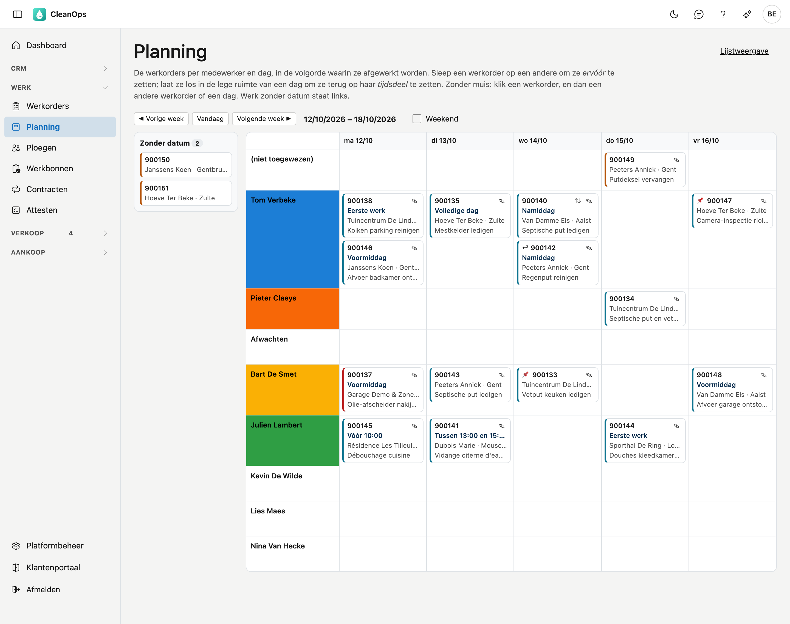
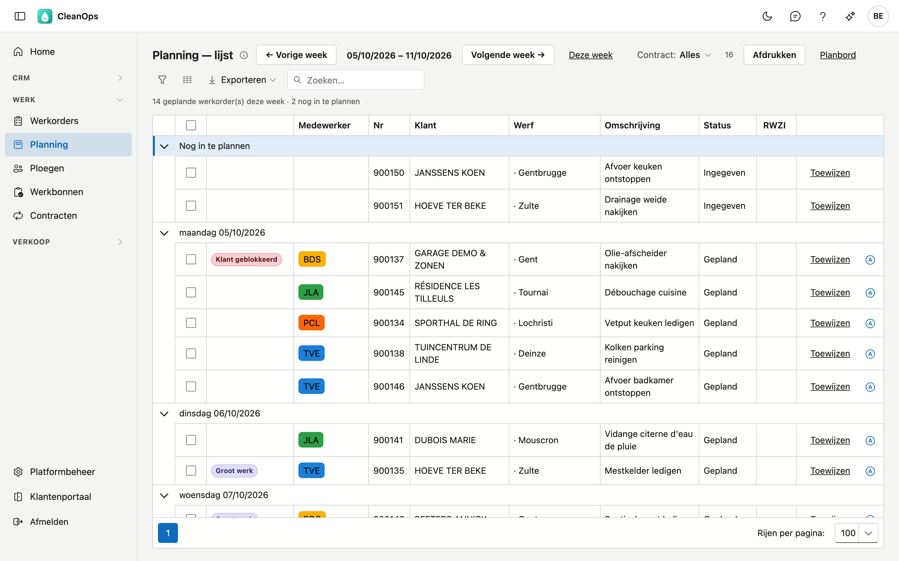
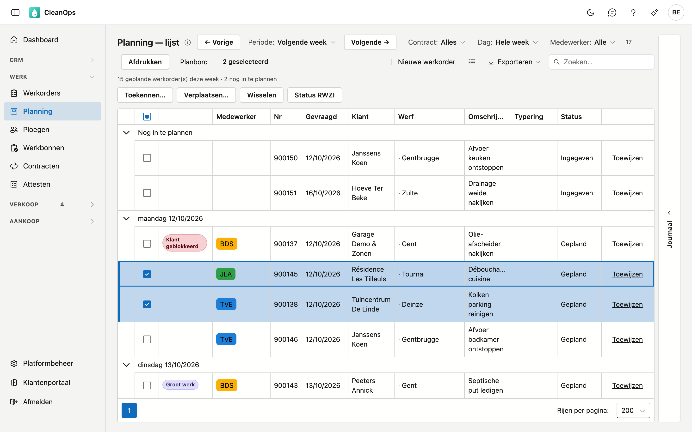
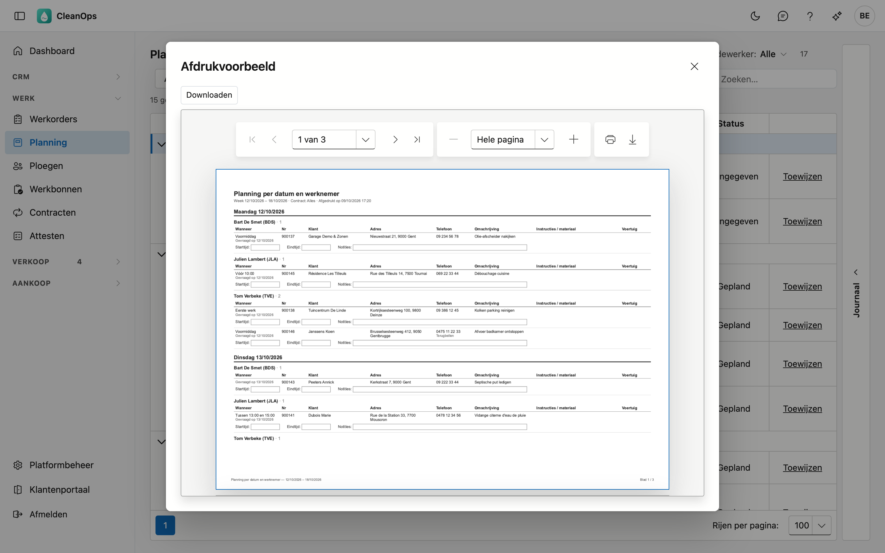

# Planning

In de planning verdeelt u het werk over uw medewerkers en over de dagen van de week. U ziet dezelfde werkorders op
twee manieren: op het **planbord** sleept u ze naar een andere dag of medewerker, en in de **planningslijst** kent u
er meerdere tegelijk toe, opent u de dagroute van een chauffeur en drukt u de planning af.

## Het scherm openen

Klik links in het menu, onder **Werk**, op **Planning**. Het planbord opent op de lopende week, op zaterdag en zondag
op de volgende week. Met **Lijstweergave** rechtsboven gaat u naar de planningslijst, met **Planbord** weer terug.

Op de planning staat enkel werk dat nog te doen is: werkorders die *ingegeven* of *gepland* zijn. Een uitgevoerde
werkorder verdwijnt van de planning.

## Het planbord

- **De week** — kies een week met **◀ Vorige week** en **Volgende week ▶**; **Vandaag** brengt u terug naar de
  lopende week. Zaterdag en zondag ziet u met het vinkje **Weekend**. Staat er op een weekenddag werk gepland, dan
  ziet u die dag altijd.
- **De rijen** — bovenaan **(niet toegewezen)**: werk met een datum maar zonder medewerker. Daaronder één rij per
  medewerker, in de volgorde van de [medewerkerslijst](medewerkers.md). Een medewerker die niet meer actief of met
  pensioen is, krijgt enkel een rij als er die week werk voor hem gepland staat.
- **De kleur** — de naam van de medewerker staat in zijn kleur in de planning. Die kiest u op de
  [medewerkerfiche](medewerkers.md#het-tabblad-fiche).
- **Zonder datum** — links staat het werk dat nog geen geplande datum heeft, met het aantal erbij.

### Een werkorder op het bord

Elke kaart toont het nummer, het tijdsdeel en de uurafspraak (bijvoorbeeld *Voormiddag* of *Tussen 13:00 en 15:00*),
de klant en de gemeente, de omschrijving en de typering (bijvoorbeeld *vetput +/- 3 T*) — die laatste enkel als ze iets
anders zegt dan de omschrijving. Wijst u een kaart aan, dan ziet u ook de werf, de typering en de signalen.

| Teken | Betekenis |
|---|---|
| 📌 | Vaste datum — niet verplaatsen. |
| ↩ | Mag vroeger uitgevoerd worden. |
| ⇅ | Met de hand geplaatst: de werkorder blijft staan waar de planner ze zette, ook vóór een vroeger tijdsdeel. |
| ✎ | Opent de werkorderfiche. Met **← Planning** komt u terug in dezelfde week. |

De rand links op de kaart zegt meer over de werkorder:

- **blauwgroen** — gepland;
- **oranje** — de status is nog *Ingegeven*;
- **rood** — de klant is geblokkeerd.

Draagt een werkorder de code van een medewerker die niet meer in de lijst staat, dan staat ze bij
**(niet toegewezen)**, met die code schuin eronder.

### De volgorde in een dag

Binnen een dag staan de werkorders van een medewerker in de volgorde waarin ze afgewerkt worden:

- **op tijdsdeel**: **Eerste werk**, **Voormiddag**, **Volledige dag**, **Namiddag**. Bij **Anders** telt het uur van
  de afspraak, en zonder afspraak het middaguur;
- **bij hetzelfde tijdsdeel** op postcode;
- **wat met de hand geplaatst is** (⇅), blijft op de plaats waar de planner het zette. Een nieuwe werkorder komt na
  de laatste handmatig geplaatste met een vroeger of hetzelfde tijdsdeel.

Het tijdsdeel kiest u op de [werkorderfiche](werkorders.md#planning-en-uitvoering).

### Werk verplaatsen

- **Naar een andere dag of medewerker** — sleep de kaart naar die cel. De status volgt zoals op de fiche: met een
  datum en een medewerker wordt de werkorder *Gepland*.
- **Vóór een andere werkorder** — laat de kaart los óp die andere kaart. Ze staat er dan met de hand geplaatst (⇅).
- **Terug op haar tijdsdeel** — laat de kaart los in de lege ruimte van de dag. De handmatige plaats vervalt.
- **Zonder muis** — klik een kaart: bovenaan staat *Werkorder … gekozen*. Klik dan een andere kaart of een lege plaats
  in een dag. Met **Annuleren** kiest u niets.
- **Werk zonder datum inplannen** — sleep de kaart van links naar een dag.

Heeft de werkorder een **vaste datum**, dan vraagt CleanOps *Toch verplaatsen?* zodra u ze naar een andere dag
sleept. Een andere plaats op dezelfde dag vraagt niets.

Sleept u een werkorder naar een medewerker op een dag dat hij afwezig is (verlof, ziekte), dan blijft de werkorder daar
staan en waarschuwt CleanOps erbij.

!!! info "Een datum weghalen"
    Zonder datum terugzetten gaat niet op het bord. Dat doet u in de planningslijst: open **Toewijzen** en maak de
    **Geplande dag** leeg. De werkorder gaat dan terug naar *Ingegeven*.

## De planningslijst

Dezelfde werkorders als een lijst, gegroepeerd per dag — standaard die van deze week. Het werk zonder datum staat onder
**Nog in te plannen**.

Per werkorder ziet u de signalen (*Vaste datum — niet verplaatsen*, *Mag vroeger uitgevoerd worden*, *Groot werk*,
*Klant geblokkeerd*), de medewerker in zijn kleur, het nummer, de datum die de klant vroeg (**Gevraagd**), de klant, de
werf, de omschrijving, de typering en de status. Met de kolomkiezer (het pictogram naast **Exporteren**) zet u er
**Wanneer** (tijdsdeel en afgesproken uur), **Besteld**, **Straat + nr**, **Postcode**, **Gemeente** en **RWZI** bij; op een
kolom klikken sorteert erop, bijvoorbeeld op gemeente.

Rechts staat de strook **Journaal**. Klap ze open om de gekozen werkorder te zien zonder de lijst te verlaten: de klant, het
adres en de telefoon, de gevraagde datum en de tijden, wie en met welk voertuig, de omschrijving, de instructies voor de
werknemer, het materiaal en de interne opmerking — en daaronder de bijlagen en het logboek. Ze blijft open terwijl u een
andere rij kiest.

- **Periode** — kies **Vandaag**, **Vorige week**, **Deze week** (de standaard), **Volgende week**, **Deze maand** of
  **Volgende maand**, of vul onder *Eigen periode* een **Van** en **Tot en met** in en klik op **Toepassen**. Een periode
  is hoogstens drie maanden lang. **← Vorige** en **Volgende →** schuiven op met de lengte van de periode: een week per
  week, een maand per maand. Onder de knoppen staat hoeveel werkorders er in die periode gepland zijn en hoeveel er nog
  in te plannen zijn.
- **Contract** — **Alles**, **Zonder contract** of **Met contract**: werk dat uit een [contract](contracten.md)
  voortkomt, of losse opdrachten.
- **Dag** — **Hele week** (of **Hele periode**), of één dag van de periode. Dan staat onder de knoppen hoeveel
  werkorders er die dag gepland zijn, en drukt **Afdrukken** enkel die dag af. Kiest u een andere periode, dan staat
  **Dag** terug op de hele periode. De tegel
  *op de planning vandaag* op het [dashboard](dashboard.md) opent de lijst op de dag van vandaag.
- **Medewerker** — **Alle**, **Alle toegewezen** (met een datum én een medewerker), **Niet toegewezen**, of één
  medewerker: dan ziet u enkel zijn werk.
- **Zoeken** — de cursor staat meteen in het zoekveld. Er wordt gezocht in het nummer, de klant, de straat, het
  huisnummer, de postcode, de gemeente, de telefoon, de medewerker, het voertuig, de werkzaamheden, de omschrijving, het
  contract en de interne opmerking, en ook in de dag (bijvoorbeeld *06/10*), de werf, de typering, de status en de
  andere kolommen — ook als die kolom niet getoond wordt. Hoofdletters, accenten en spaties tellen niet; elk woord moet
  ergens voorkomen. De tellers en **Afdrukken** volgen de zoekterm.
- **Openen** — dubbelklik op een rij om de werkorderfiche te openen. Met **← Planning** komt u terug in dezelfde
  periode, met dezelfde filters.

### Eén werkorder toewijzen

Klik in de rij op **Toewijzen**. Kies de **Medewerker** en de **Geplande dag**, en klik op **Bewaren**. Maakt u de
geplande dag leeg, dan komt de werkorder terug bij het werk zonder datum.

### Meerdere werkorders tegelijk

Vink de werkorders aan. Boven de lijst verschijnt wat u met die selectie kunt doen.

| Knop | Wat er gebeurt |
|---|---|
| Toekennen… | Kies een medewerker; alle aangevinkte werkorders gaan naar hem. Laat u het veld leeg, dan gaan ze naar niemand. |
| Verplaatsen… | Kies een geplande dag; alle aangevinkte werkorders gaan naar die dag, bij dezelfde medewerker. |
| Wisselen | Het werk van twee medewerkers wordt omgewisseld. Dit kan enkel als de selectie werk van precies twee medewerkers bevat. CleanOps vraagt eerst een bevestiging. |
| Status RWZI | Zet RWZI aan waar het uit stond en uit waar het aan stond. CleanOps meldt hoeveel er aan- en uitgezet zijn. |

Bij **Toekennen** en **Verplaatsen** vervalt de handmatige plaats in de dag: de werkorder komt op haar tijdsdeel. Bij
**Wisselen** blijft de volgorde in de dag.

Kiest u een andere periode, een ander filter of een andere zoekterm, dan vervalt de selectie. Zo raakt een knop nooit werk dat u niet meer ziet.

### De dagroute

Het routeteken naast **Toewijzen** opent in Google Maps de route van die medewerker op die dag: van het adres op de
[bedrijfsfiche](beheer/bedrijfsfiche.md), langs de adressen in de volgorde van de planning, en terug. Staat er geen
adres op de bedrijfsfiche, dan loopt de route van het eerste naar het laatste adres.

Google Maps neemt hoogstens 9 tussenstops in één route. Heeft de dag er meer, dan opent een venster met de route in
delen die op elkaar aansluiten: **Deel 1**, **Deel 2**, …

### Afdrukken

**Afdrukken** maakt het overzicht *Planning per datum en werknemer*: wat de lijst nu toont, dus dezelfde periode, dag,
contract, medewerker en zoekterm. De kop vermeldt de medewerker en de zoekterm als u er een koos. Per dag en per
medewerker staan het tijdsdeel met de datum die de klant vroeg (*Gevraagd op*), het nummer, de klant en de werf, het adres,
de telefoon van het adres (anders die van de klant, en die van de werkorder erbij als ze anders is — met
*Terugbellen* als de klant gebeld wil worden), de omschrijving, de instructies en het materiaal, en
het voertuig. Onder elke werkorder staan lege vakken **Starttijd**, **Eindtijd** en **Notities**, die de ploeg met de
hand invult. Het werk zonder datum staat achteraan onder *Nog in te plannen*.

Het overzicht opent in een **Afdrukvoorbeeld**. Met **Downloaden** bewaart u het als PDF; met het printerteken in de
kijker drukt u het af.

## Kaart en route

Op de [werkorderfiche](werkorders.md#planning-en-uitvoering) staan onder het uitvoeringsadres twee links naar Google
Maps: **Kaart** toont het adres, **Route** de weg ernaartoe van waar u nu bent.

## Veelgestelde vragen

**Ik kan niets verslepen, en ik zie geen knop Toewijzen.**
U mag de planning enkel bekijken. Vraag uw beheerder om het recht om de planning te wijzigen.

**Een werkorder staat niet op de planning.**
Kijk of ze een geplande datum heeft: zonder datum staat ze links onder **Zonder datum**, of onder **Nog in te
plannen** in de lijst. Is ze al uitgevoerd, dan staat ze niet meer op de planning.

**Hoe zet ik een werkorder terug zonder datum?**
In de planningslijst: **Toewijzen**, maak de **Geplande dag** leeg en klik op **Bewaren**.

**De knop Wisselen staat grijs.**
De aangevinkte werkorders horen bij één medewerker, of bij meer dan twee. Vink het werk van precies twee medewerkers
aan.

**Een medewerker heeft geen kleur.**
Kies een kleur op zijn [medewerkerfiche](medewerkers.md#het-tabblad-fiche).

**De route in Google Maps loopt naar de verkeerde plaats.**
De route gebruikt het adres van de werkorder. Pas het uitvoeringsadres aan op de werkorderfiche.

## Zie ook

- [Werkorders](werkorders.md)
- [Medewerkers](medewerkers.md)
- [Contracten](contracten.md)
