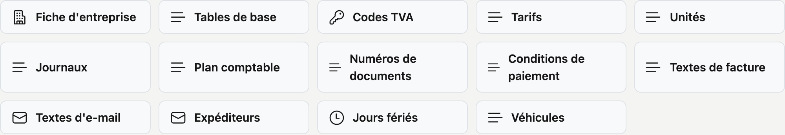

# Administration

Tous les paramètres et données de base de votre entreprise au même endroit, groupés par thème.

## Ouvrir l'écran

Cliquez sur **Administration** dans le menu de gauche.

## Ce que vous voyez

Les écrans se présentent sous forme de tuiles, groupées par thème. Si vous passez la souris sur une tuile, une
phrase apparaît qui précise l'usage de l'écran.

**Données de base** — ce qui alimente le reste de CleanOps : une ligne de devis y choisit son tarif, une facture son
code TVA et sa condition de paiement. Lors d'une nouvelle installation, c'est par là que vous commencez.

- [Fiche d'entreprise](beheer/bedrijfsfiche.fr.md) — les données de votre société et le délai entre deux rappels
- [Tables de base](beheer/basistabellen.fr.md) — les listes de choix : types de contrat, travaux, statuts de planning,
  fonctions, matériel et modes de paiement, textes standard et types de véhicule
- [Codes TVA](beheer/btw-codes.fr.md) — les taux de TVA sur les devis et les factures
- [Tarifs](beheer/tarieven.fr.md) — description et prix unitaire pour une ligne de devis
- [Unités](beheer/eenheden.fr.md) — les unités sur les tarifs, ordres de travail, devis et factures : heure, pièces, m³ …
- [Journaux](beheer/dagboeken.fr.md) — les journaux de vente, d'achat et financiers
- [Plan comptable](beheer/rekeningplan.fr.md) — les comptes généraux sur les clients et les tarifs, pour le bureau comptable
- [Numéros de documents](beheer/documentnummers.fr.md) — le numéro suivant par série et par exercice
- [Conditions de paiement](beheer/betalingstermijnen.fr.md) — comment l'échéance d'une facture est calculée
- [Textes de facture](beheer/factuurteksten.fr.md) — les textes standard au bas d'une facture
- [Textes d'e-mail](beheer/mailteksten.fr.md) — l'objet et le texte des e-mails que CleanOps envoie
- [Expéditeurs](beheer/mailafzenders.fr.md) — les adresses depuis lesquelles vos e-mails partent, et si ADM One les accepte
- [Jours fériés](beheer/feestdagen.fr.md) — les jours fériés légaux et vos propres jours de fermeture
- [Véhicules](beheer/voertuigen.fr.md) — votre parc, l'entretien et le contrôle technique

**Accès**

- [Rôles](beheer/rollen.fr.md) — quels droits appartiennent à quel rôle, et qui porte quel rôle

**Historique**

- [Corbeille](beheer/prullenbak.fr.md) — ce qui a été supprimé, et sa restauration
- [Journal des actions](beheer/actielogboek.fr.md) — qui a fait quoi et quand

La création d'un nouvel utilisateur et la reprise des données de votre application actuelle sont assurées par
ADM-Concept. Vous ne voyez pas ces écrans.

## Uniquement ce que vous pouvez ouvrir

Vous ne voyez que les tuiles pour lesquelles vous avez le droit. Si vous n'avez le droit sur aucun écran d'un groupe,
ce groupe disparaît entièrement — pas de titre sans contenu.

Deux collègues peuvent donc voir une Administration différente. S'il vous manque une tuile qu'un collègue possède,
c'est une question de droits : demandez à l'administrateur de votre environnement de les adapter dans
[Rôles](beheer/rollen.fr.md).
