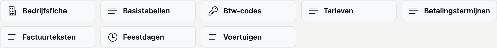

# Platformbeheer

Alle instellingen en stamgegevens van uw bedrijf op één plek, gegroepeerd per onderwerp.

## Het scherm openen

Klik links in het menu op **Platformbeheer**.

## Wat u ziet

De schermen staan als tegels, gegroepeerd per onderwerp. Gaat u met de muis over een tegel, dan verschijnt een
zin die zegt waarvoor het scherm dient.

**Stamgegevens** — wat de rest van CleanOps voedt: een offertelijn kiest hier haar tarief, een factuur haar
btw-code en betalingstermijn. Bij een nieuwe inrichting begint u hier.

- [Bedrijfsfiche](beheer/bedrijfsfiche.md) — uw eigen firmagegevens en de wachttijd tussen twee rappels
- [Basistabellen](beheer/basistabellen.md) — de keuzelijsten: contracttypes, werkzaamheden, planningstatus, functies,
  materialen en betaalwijzen, standaardteksten en soorten voertuig
- [Btw-codes](beheer/btw-codes.md) — de btw-tarieven op offertes en facturen
- [Tarieven](beheer/tarieven.md) — omschrijving en eenheidsprijs voor een offertelijn
- [Betalingstermijnen](beheer/betalingstermijnen.md) — hoe de vervaldag van een factuur berekend wordt
- [Factuurteksten](beheer/factuurteksten.md) — de standaardteksten onderaan een factuur
- [Feestdagen](beheer/feestdagen.md) — de wettelijke feestdagen en uw eigen sluitingsdagen
- [Voertuigen](beheer/voertuigen.md) — uw vloot, het onderhoud en de keuring

**Toegang**

- [Rollen](beheer/rollen.md) — welke rechten bij welke rol horen, en wie welke rol draagt

**Historiek**

- [Prullenbak](beheer/prullenbak.md) — wat verwijderd is, en het terugzetten ervan
- [Actielogboek](beheer/actielogboek.md) — wie wat wanneer deed

Een nieuwe gebruiker aanmaken en de gegevens overnemen uit uw huidige toepassing doet ADM-Concept voor u. Die
schermen ziet u niet.

## Enkel wat u mag openen

U ziet alleen de tegels waarvoor u het recht hebt. Heeft u voor geen enkel scherm uit een groep het recht, dan
valt die groep helemaal weg — u krijgt geen kop met niets eronder.

Twee collega's kunnen dus een verschillend Platformbeheer zien. Mist u een tegel die een collega wel heeft, dan is
dat een kwestie van rechten: vraag de beheerder van uw omgeving om ze bij [Rollen](beheer/rollen.md) aan te passen.
