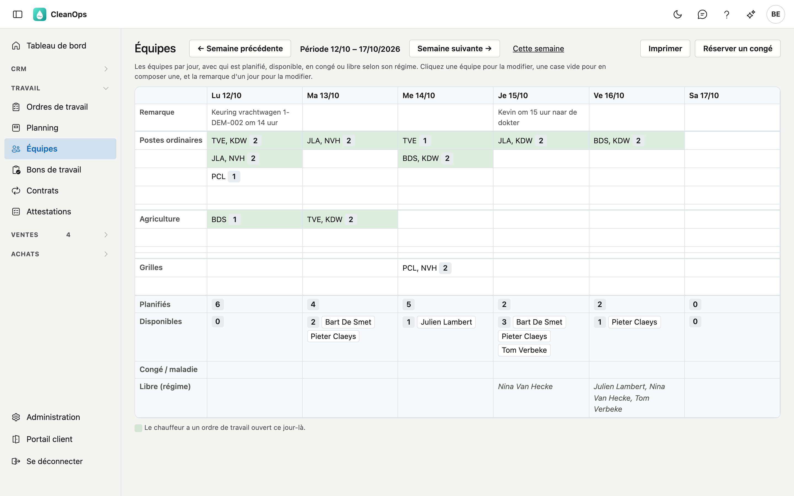
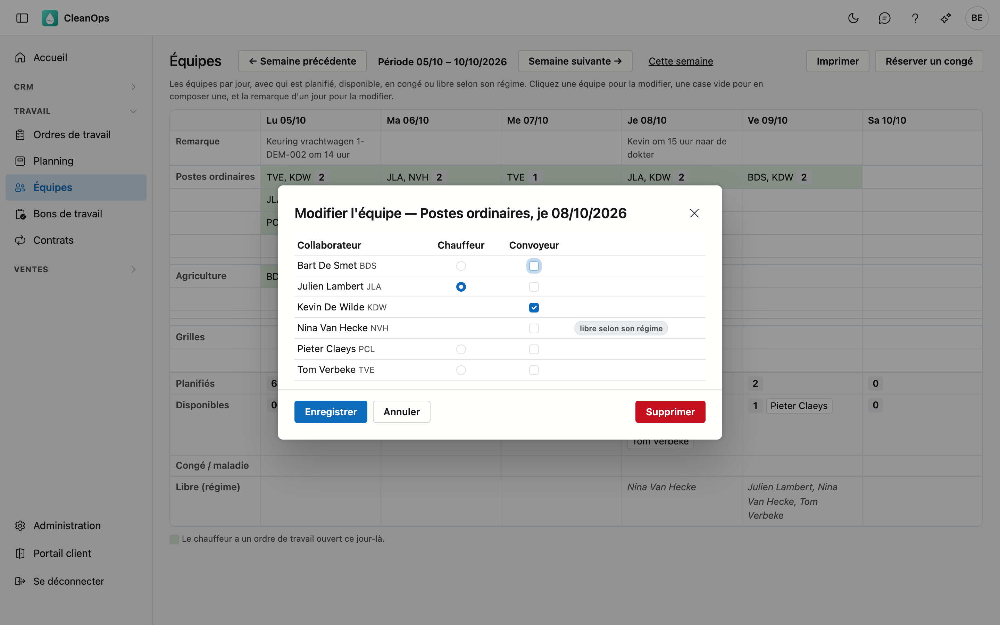
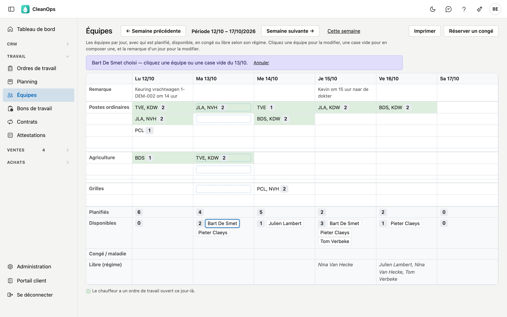
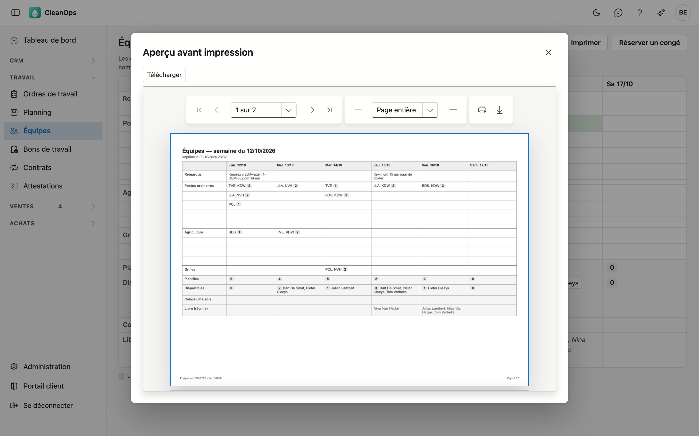

# Équipes

Dans Équipes, vous composez les équipes de chaque jour : qui conduit, et qui l'accompagne. Vous voyez tout de suite
qui est encore disponible ce jour-là, qui est en congé et qui est libre selon son régime de travail.

## Ouvrir l'écran

Dans le menu de gauche, sous **Travail**, cliquez sur **Équipes**. L'écran s'ouvre sur la semaine en cours, du lundi
au samedi. Choisissez une autre semaine avec **← Semaine précédente** et **Semaine suivante →** ; **Cette semaine**
vous ramène.

## L'aperçu

| Ligne | Contenu |
|---|---|
| Remarque | Une remarque libre pour le jour, par exemple un contrôle technique ou un rendez-vous. |
| Postes ordinaires, Agriculture, Grilles | Les équipes de ce type : les codes des membres, le chauffeur d'abord, et leur nombre. |
| Planifiés | Combien de chauffeurs et de convoyeurs font partie d'une équipe ce jour-là. |
| Disponibles | Qui ne fait partie d'aucune équipe, n'est pas en congé et travaille selon son régime. |
| Congé / maladie | Qui est en congé, en maladie ou absent pour une autre raison ce jour-là. |
| Libre (régime) | Qui ne travaille pas ce jour-là selon son régime de travail. |

Une équipe est en **vert** si le chauffeur a un ordre de travail ouvert ce jour-là. Un jour férié ou un jour de
fermeture figure sous la date.

Planifiés, Disponibles et Libre (régime) comptent les collaborateurs qui sont chauffeur ou convoyeur, actifs et déjà
en service ce jour-là. Qui a coché **Exclure du comptage d'équipe** sur sa
[fiche collaborateur](medewerkers.fr.md#longlet-fiche) n'est pas compté.

## Composer une équipe

Cliquez une case vide sous le type et le jour. La fenêtre montre qui peut ce jour-là :

- Indiquez **exactement un chauffeur**. Seul qui peut être chauffeur peut l'être.
- Cochez les **convoyeurs**. Un chauffeur peut aussi accompagner comme convoyeur.
- Qui fait déjà partie d'une autre équipe ce jour-là ou est en congé ne figure pas dans la liste.
- Qui est libre selon son régime de travail y figure bien, avec l'étiquette *libre selon son régime* : vous pouvez
  quand même le choisir.

Cliquez sur **Enregistrer**. Sans chauffeur, la fenêtre indique ce qui manque.

### Modifier ou supprimer une équipe

Cliquez l'équipe. La fenêtre s'ouvre avec le choix actuel. Le jour et le type sont fixes ; pour une équipe un autre
jour, composez-la à nouveau ce jour-là.

Si un membre ne peut plus — par exemple parce qu'il a pris congé entre-temps — il figure avec la raison. Retirez-le ;
tant qu'il y est, vous ne pouvez pas enregistrer.

**Supprimer** fait disparaître l'équipe, après confirmation. Cela ne peut pas être annulé.

### Glisser un nom

Glissez un nom de la ligne **Disponibles** vers :

- une **équipe du même jour** : la personne s'y ajoute comme convoyeur ;
- une **case vide de ce jour** : une nouvelle équipe est créée avec cette personne comme chauffeur. Si elle ne peut
  pas être chauffeur, la fenêtre s'ouvre avec elle comme convoyeur, et vous choisissez vous-même le chauffeur.

Sans souris : cliquez le nom. En haut figure *… choisi*, et les équipes et cases de ce jour sont entourées. Cliquez
ensuite l'équipe ou la case. **Annuler** ne choisit rien.

Si vous lâchez un nom sur un autre jour, rien ne se passe : CleanOps indique le jour où cette personne est disponible.

## La remarque d'un jour

Cliquez la remarque d'un jour pour la modifier. Un jour sans équipe peut aussi avoir une remarque. Une remarque vide
est effacée.

## Réserver un congé

**Réserver un congé** ouvre d'abord une fenêtre où vous choisissez le collaborateur. **Continuer** ouvre ensuite la
fenêtre de congé de la [fiche collaborateur](medewerkers.fr.md#longlet-conges), avec les mêmes champs et le même
calcul des jours de congé. Après l'enregistrement, le congé figure tout de suite dans l'aperçu.

## Imprimer

**Imprimer** crée un PDF de la semaine affichée et de la suivante, chacune sur sa propre page, avec les mêmes lignes
que l'écran. L'aperçu s'ouvre dans une fenêtre **Aperçu avant impression** : **Télécharger** l'enregistre ; avec
l'icône d'imprimante de la visionneuse, vous l'imprimez.

## Questions fréquentes

**Je ne peux rien cliquer ni glisser.**
Vous pouvez seulement consulter les équipes. Demandez à votre gestionnaire le droit *Modifier les équipes*.

**Je ne vois pas de bouton Réserver un congé.**
Il faut pour cela le droit de modifier les collaborateurs, comme sur la fiche collaborateur.

**Quelqu'un ne figure pas dans la liste de la fenêtre.**
Il fait déjà partie d'une autre équipe ce jour-là, est en congé, n'est pas actif ou pas encore en service, ou n'est
ni chauffeur ni convoyeur sur sa fiche collaborateur.

**Je veux déplacer une équipe vers un autre jour.**
Ce n'est pas possible : composez l'équipe le nouveau jour et supprimez l'ancienne.

## Voir aussi

- [Planning](planning.fr.md)
- [Collaborateurs](medewerkers.fr.md)
