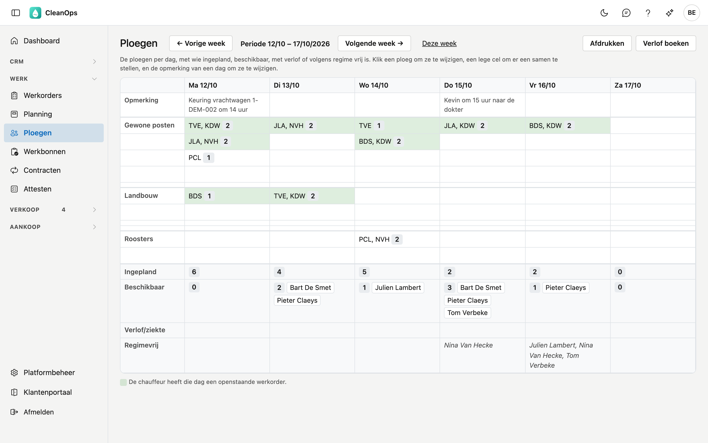
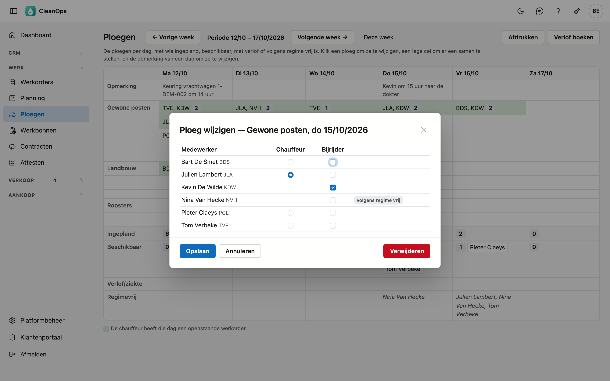
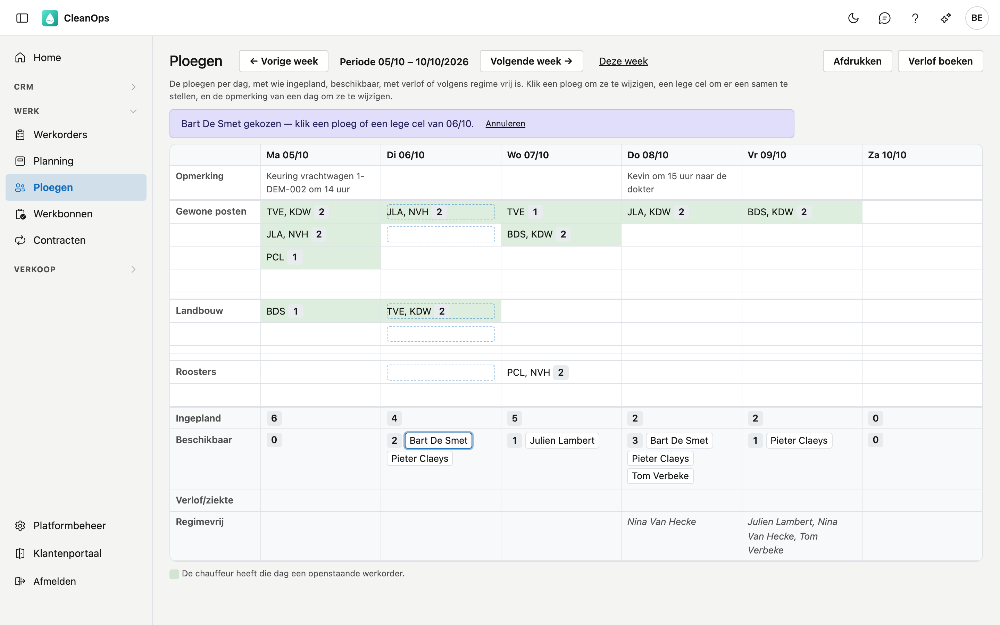
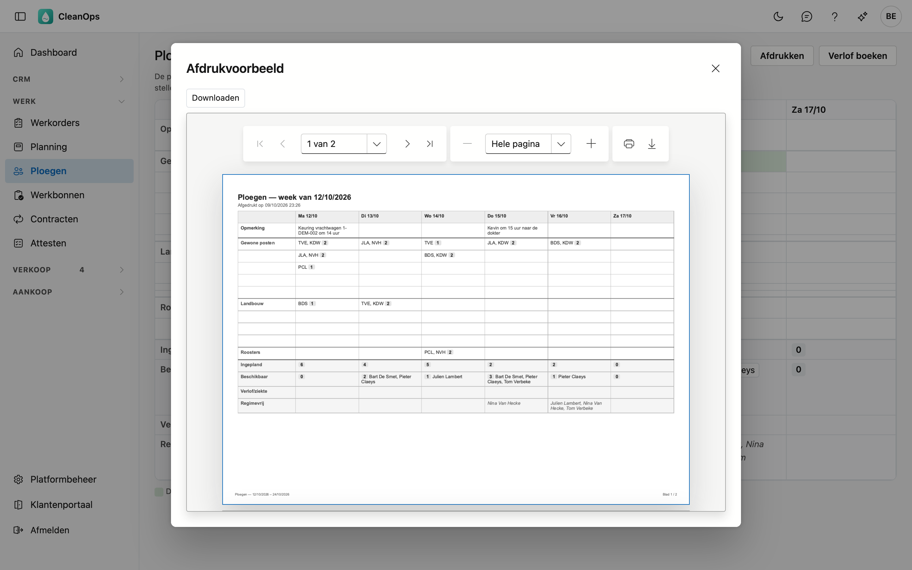

# Ploegen

Op Ploegen stelt u per dag de ploegen samen: wie rijdt, en wie rijdt er mee. U ziet meteen wie er die dag nog
beschikbaar is, wie verlof heeft en wie volgens zijn werkregime vrij is.

## Het scherm openen

Klik links in het menu, onder **Werk**, op **Ploegen**. Het scherm opent op de lopende week, van maandag tot zaterdag.
Kies een andere week met **← Vorige week** en **Volgende week →**; **Deze week** brengt u terug.

## Het overzicht

| Rij | Wat erin staat |
|---|---|
| Opmerking | Een vrije opmerking bij de dag, bijvoorbeeld een keuring of een afspraak. |
| Gewone posten, Landbouw, Roosters | De ploegen van die soort: de codes van de leden, de chauffeur eerst, en het aantal. |
| Ingepland | Hoeveel chauffeurs en bijrijders die dag in een ploeg zitten. |
| Beschikbaar | Wie nog in geen ploeg zit, geen verlof heeft en volgens zijn werkregime werkt. |
| Verlof/ziekte | Wie die dag verlof, ziekteverlof of een andere afwezigheid heeft. |
| Regimevrij | Wie volgens zijn werkregime die dag niet werkt. |

Een ploeg is **groen** als de chauffeur die dag een openstaande werkorder heeft. Een feestdag of een sluitingsdag
staat onder de datum.

Ingepland, Beschikbaar en Regimevrij tellen de medewerkers die chauffeur of bijrijder zijn, actief zijn en die dag
al in dienst waren. Wie op zijn [medewerkerfiche](medewerkers.md#het-tabblad-fiche) **Uitsluiten van ploegtelling**
aangevinkt heeft, telt niet mee.

## Een ploeg samenstellen

Klik een lege cel onder de soort en de dag. Het venster toont wie die dag kan:

- Duid **precies één chauffeur** aan. Enkel wie chauffeur mag zijn, kan dat.
- Vink de **bijrijders** aan. Ook een chauffeur mag als bijrijder mee.
- Wie die dag al in een andere ploeg zit of verlof heeft, staat niet in de lijst.
- Wie volgens zijn werkregime vrij is, staat er wél in, met het label *volgens regime vrij*: u kunt hem toch kiezen.

Klik op **Bewaren**. Zonder chauffeur zegt het venster wat er ontbreekt.

### Een ploeg wijzigen of verwijderen

Klik de ploeg. Het venster opent met de huidige keuze. Dag en soort liggen vast; wilt u een ploeg op een andere dag,
maak ze daar opnieuw.

Kan een lid intussen niet meer — bijvoorbeeld omdat het verlof heeft genomen — dan staat het er met de reden bij.
Haal het weg; zolang het erin staat, kunt u niet bewaren.

Met **Verwijderen** verdwijnt de ploeg, na een bevestiging. Dat kan niet ongedaan gemaakt worden.

### Een naam slepen

Sleep een naam uit de rij **Beschikbaar** naar:

- een **ploeg van dezelfde dag**: de persoon komt erbij als bijrijder;
- een **lege cel van die dag**: er komt een nieuwe ploeg met die persoon als chauffeur. Mag hij geen chauffeur zijn,
  dan opent het venster met hem als bijrijder, en kiest u zelf de chauffeur.

Zonder muis: klik de naam. Bovenaan staat *… gekozen*, en de ploegen en cellen van die dag zijn omlijnd. Klik dan de
ploeg of de cel. **Annuleren** kiest niets.

Laat u een naam los op een andere dag, dan gebeurt er niets: CleanOps zegt op welke dag die persoon beschikbaar is.

## De opmerking bij een dag

Klik de opmerking van een dag om ze te wijzigen. Ook een dag zonder ploeg kan een opmerking krijgen. Een lege
opmerking wordt gewist.

## Verlof boeken

**Verlof boeken** opent eerst een venster waarin u de medewerker kiest. Met **Verder** opent het verlofvenster van de
[medewerkerfiche](medewerkers.md#het-tabblad-verlof), met dezelfde velden en dezelfde berekening van de verlofdagen. Na
het bewaren staat het verlof meteen in het overzicht.

## Afdrukken

**Afdrukken** maakt een PDF van de getoonde week en de volgende, elk op een eigen blad, met dezelfde rijen als het
scherm. Het overzicht opent in een **Afdrukvoorbeeld**: **Downloaden** bewaart het, met het printerteken in de kijker
drukt u het af.

## Veelgestelde vragen

**Ik kan niets aanklikken of slepen.**
U mag de ploegen enkel bekijken. Vraag uw beheerder om het recht *Ploegen bewerken*.

**Ik zie geen knop Verlof boeken.**
Daarvoor is het recht om medewerkers te bewerken nodig, zoals op de medewerkerfiche.

**Iemand staat niet in de keuzelijst van het venster.**
Hij zit die dag al in een andere ploeg, heeft verlof, is niet actief of nog niet in dienst, of is geen chauffeur of
bijrijder op zijn medewerkerfiche.

**Ik wil een ploeg naar een andere dag verplaatsen.**
Dat kan niet: maak de ploeg op de nieuwe dag en verwijder de oude.

## Zie ook

- [Planning](planning.md)
- [Medewerkers](medewerkers.md)
