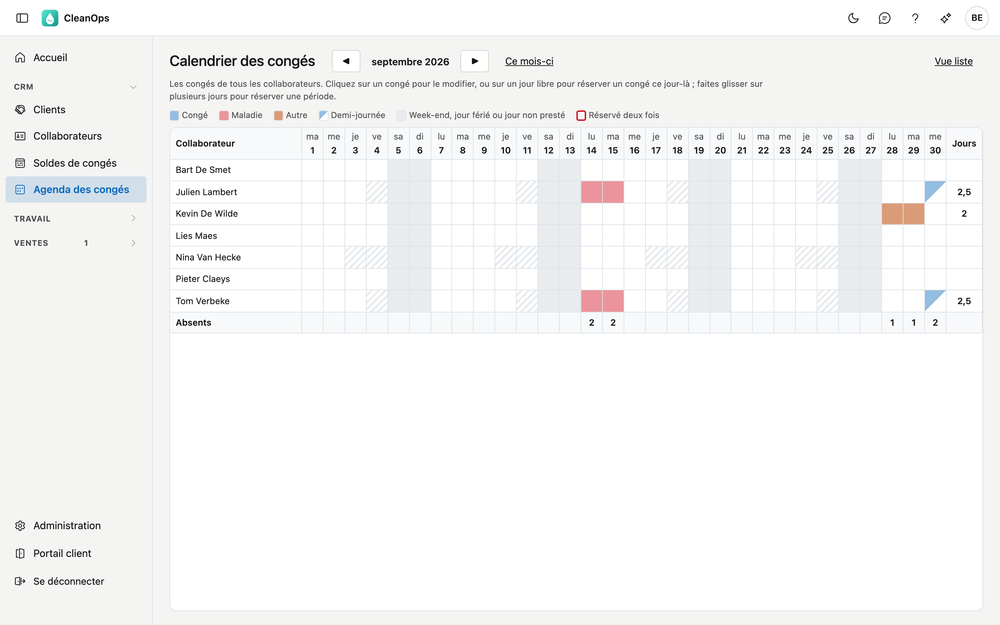
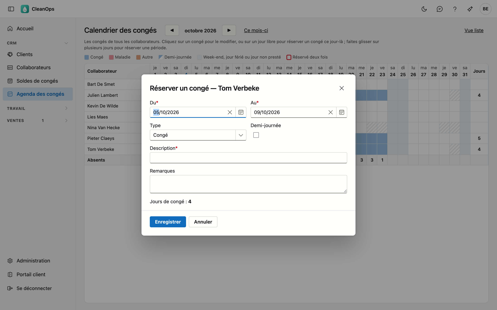
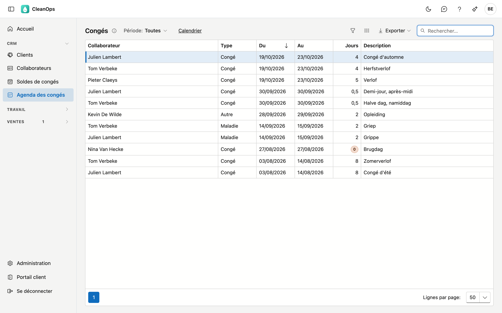

# Calendrier des congés

Le calendrier des congés montre qui est absent et quand : par mois, une ligne par collaborateur et une colonne par jour.
Vous voyez d'un coup d'œil les périodes chargées, et vous réservez ou modifiez un congé d'un clic ou en faisant glisser la
souris sur les jours.

## Ouvrir l'écran

Dans le menu de gauche, sous **CRM**, cliquez sur **Agenda des congés**. Vous le voyez avec le droit de consulter les
collaborateurs. Réserver et modifier un congé demande le droit de modifier les collaborateurs.

## Le calendrier

- **La couleur** indique le type : bleu pour *Congé*, rouge pour *Maladie*, orange pour *Autre*. Une case à moitié colorée est
  une demi-journée.
- **Le gris** signale un week-end, un jour férié ou un jour de fermeture des [jours fériés](beheer/feestdagen.fr.md). **Les
  hachures** signalent un jour où le collaborateur ne travaille pas selon son régime de travail.
- **Un bord rouge avec un 2** signifie que deux périodes de congé sont réservées pour ce jour. Ouvrez-les et corrigez.
- **Absents**, en bas, compte par jour les collaborateurs absents un jour où ils travaillent.
- **Jours**, à droite, compte par collaborateur les jours prestés avec une absence dans le mois affiché. Ce nombre vient du
  calendrier ; le solde de congés figure dans [Soldes de congés](verlofsaldi.fr.md).
- Un collaborateur qui n'est plus actif n'apparaît que dans un mois où il a un congé.

Passez à un autre mois avec **◀** et **▶**, ou revenez avec **Ce mois-ci**. Le calendrier défile dans l'écran : les jours en
haut, la ligne Absents en bas et les noms à gauche restent visibles. Passez la souris sur une case pour voir la période et la
description.

## Réserver et modifier un congé

- **Cliquez sur un congé** pour le modifier ou le supprimer.
- **Cliquez sur un jour libre** pour réserver un congé ce jour-là pour ce collaborateur.
- **Faites glisser la souris sur plusieurs jours** de la même ligne pour réserver une période : les jours s'éclairent et, au
  relâchement, la fenêtre s'ouvre avec ces dates de début et de fin.

La fenêtre est la même que sur la [fiche du collaborateur](medewerkers.fr.md#longlet-conges) : choisissez le type, indiquez
une description et enregistrez. CleanOps compte les jours de congé selon le régime de travail et les jours fériés.

## La liste

Cliquez sur **Vue liste** pour toutes les périodes de congé l'une sous l'autre : collaborateur, type, du, au, jours et
description.

- Choisissez une **Période** en haut : la liste montre les congés qui touchent cette période.
- **Rechercher**, **trier** et **exporter** fonctionnent comme dans les autres listes.
- **Double-cliquez** sur une période pour la modifier.
- Un congé à **0 jour** reçoit un avertissement : il ne compte pas dans le solde. Ouvrez-le et enregistrez-le à nouveau —
  voir [Soldes de congés](verlofsaldi.fr.md#reservations-a-0-jour).
- **Calendrier** vous ramène au calendrier.

## Questions fréquentes

**Pourquoi le nombre de jours du calendrier diffère-t-il de celui de la liste ?**
Le calendrier compte les jours prestés avec une absence dans le mois affiché, à partir du calendrier lui-même. La liste montre
le nombre enregistré lors de la réservation, pour toute la période.

**Des lignes ne correspondent à aucune personne.**
Un espace réservé qui n'est pas encore marqué comme tel dans votre application précédente compte encore comme collaborateur.
Dès qu'il reçoit la marque, il disparaît du calendrier.

## Voir aussi

- [Soldes de congés](verlofsaldi.fr.md)
- [Collaborateurs](medewerkers.fr.md)
- [Équipes](ploegen.fr.md)
- [Jours fériés](beheer/feestdagen.fr.md)
