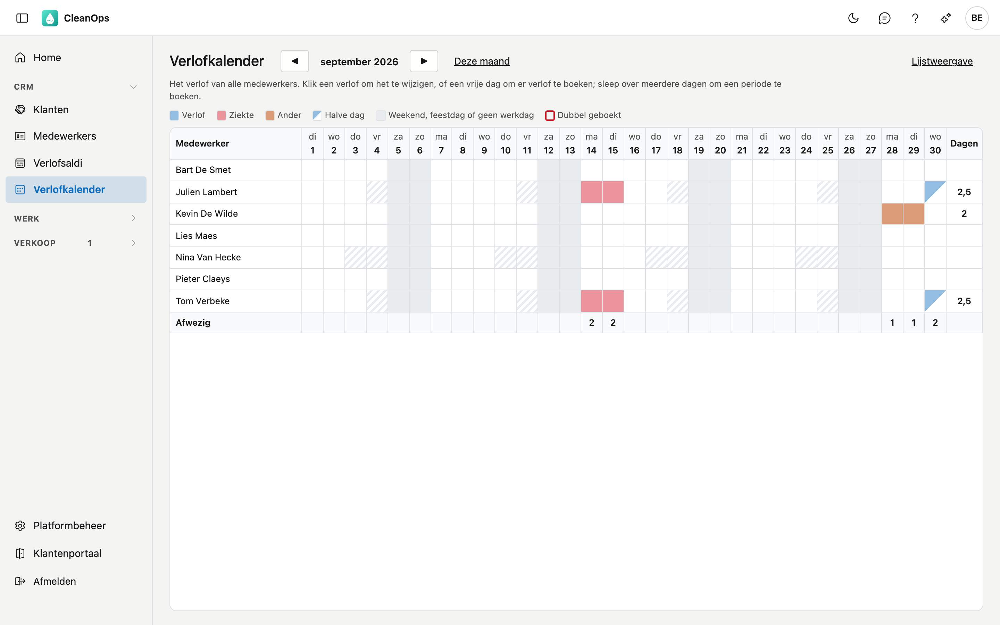
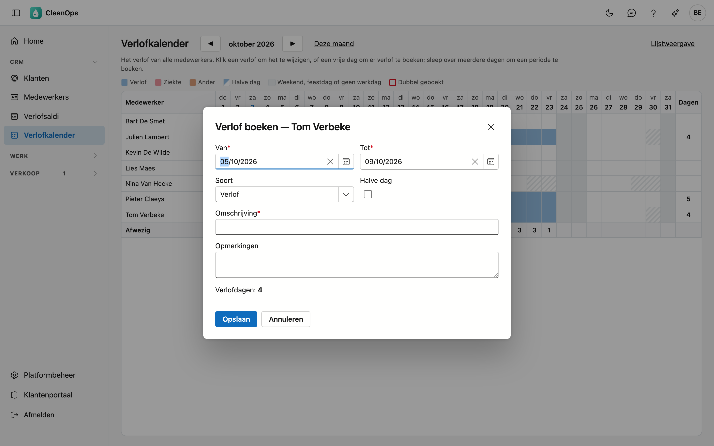
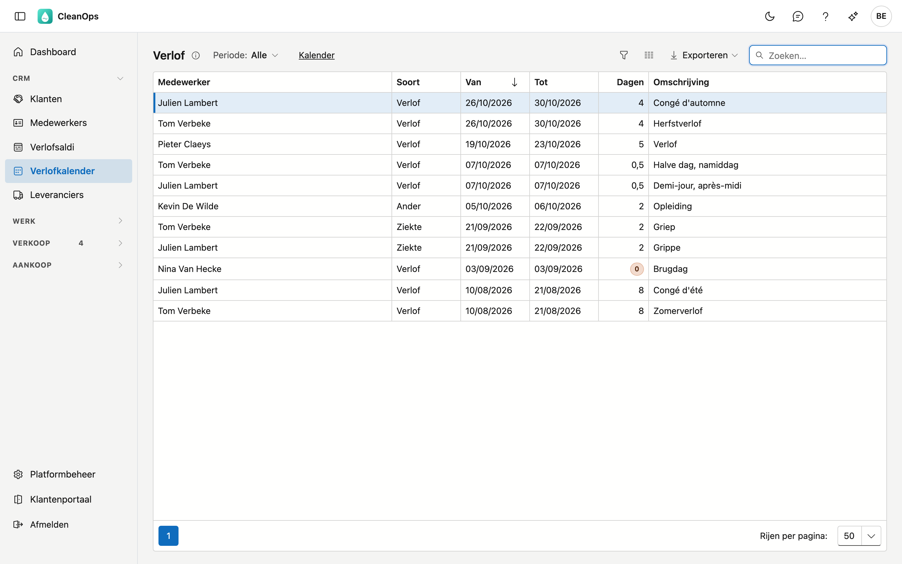

# Verlofkalender

De verlofkalender toont wie wanneer afwezig is: per maand een rij per medewerker en een kolom per dag. Hier ziet u in één
oogopslag waar het druk wordt, en boekt of wijzigt u verlof met een klik of door over de dagen te slepen.

## Het scherm openen

Klik links in het menu, onder **CRM**, op **Verlofkalender**. U ziet het met het recht om medewerkers te bekijken. Verlof
boeken en wijzigen vraagt het recht om medewerkers te bewerken.

## Het rooster

- **De kleur** zegt de soort: blauw is *Verlof*, rood *Ziekte*, oranje *Ander*. Een half gekleurd vakje is een halve dag.
- **Grijs** is een weekend, een feestdag of een sluitingsdag uit de [feestdagen](beheer/feestdagen.md). **Gearceerd** is een
  dag waarop de medewerker volgens zijn werkregime niet werkt.
- **Een rode rand met een 2** betekent dat er voor die dag twee verlofperiodes geboekt zijn. Open ze en zet het recht.
- **Afwezig**, onderaan, telt per dag hoeveel medewerkers afwezig zijn op een dag dat ze werken.
- **Dagen**, rechts, telt per medewerker de werkdagen met afwezigheid in de getoonde maand. Dat getal komt uit de kalender;
  het verlofsaldo staat in [Verlofsaldi](verlofsaldi.md).
- Wie niet meer actief is, staat er enkel bij in een maand waarin hij verlof heeft.

Blader met **◀** en **▶** naar een andere maand, of keer met **Deze maand** terug. Het rooster scrolt binnen het scherm:
de dagen bovenaan, de rij Afwezig onderaan en de namen links blijven staan. Ga met de muis over een vakje om de periode en
de omschrijving te zien.

## Verlof boeken en wijzigen

- **Klik op een verlof** om het te wijzigen of te verwijderen.
- **Klik op een vrije dag** om voor die medewerker verlof te boeken op die dag.
- **Sleep met de muis over meerdere dagen** in dezelfde rij om een periode te boeken: de dagen lichten op, en bij het loslaten
  opent het venster met die begin- en einddatum.

Het venster is hetzelfde als op de [medewerkerfiche](medewerkers.md#het-tabblad-verlof): kies de soort, vul een omschrijving
in en klik op **Bewaren**. CleanOps telt de verlofdagen volgens het werkregime en de feestdagen.

## De lijst

Klik op **Lijstweergave** voor alle verlofperiodes onder elkaar: medewerker, soort, van, tot, dagen en omschrijving.

- Kies bovenaan een **Periode**: de lijst toont het verlof dat die periode raakt.
- **Zoeken**, **sorteren** en **exporteren** werken zoals in de andere lijsten.
- **Dubbelklik** op een periode om ze te wijzigen.
- **Journaal** — de strook rechts toont het logboek van de periode die u aanklikt: wie ze boekte, en wie er later wat
  aan wijzigde, per veld met de oude en de nieuwe waarde.
- Een verlof op **0 dagen** krijgt een waarschuwing: het telt niet mee in het saldo. Open het en bewaar het opnieuw — zie
  [Verlofsaldi](verlofsaldi.md#boekingen-op-0-dagen).
- Met **Kalender** gaat u terug naar het rooster.

## Veelgestelde vragen

**Waarom verschilt het aantal dagen in het rooster van dat in de lijst?**
Het rooster telt de werkdagen met afwezigheid in de getoonde maand, uit de kalender zelf. De lijst toont het aantal dat bij het
boeken bewaard werd, voor de hele periode.

**Er staan rijen tussen die geen persoon zijn.**
Een plaatshouder die in uw vorige toepassing nog niet als plaatshouder gemarkeerd is, telt nog als medewerker. Zodra hij de
markering krijgt, verdwijnt hij uit de kalender.

## Zie ook

- [Verlofsaldi](verlofsaldi.md)
- [Medewerkers](medewerkers.md)
- [Ploegen](ploegen.md)
- [Feestdagen](beheer/feestdagen.md)
