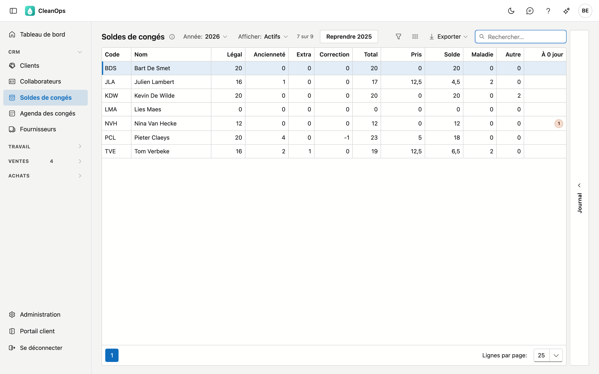
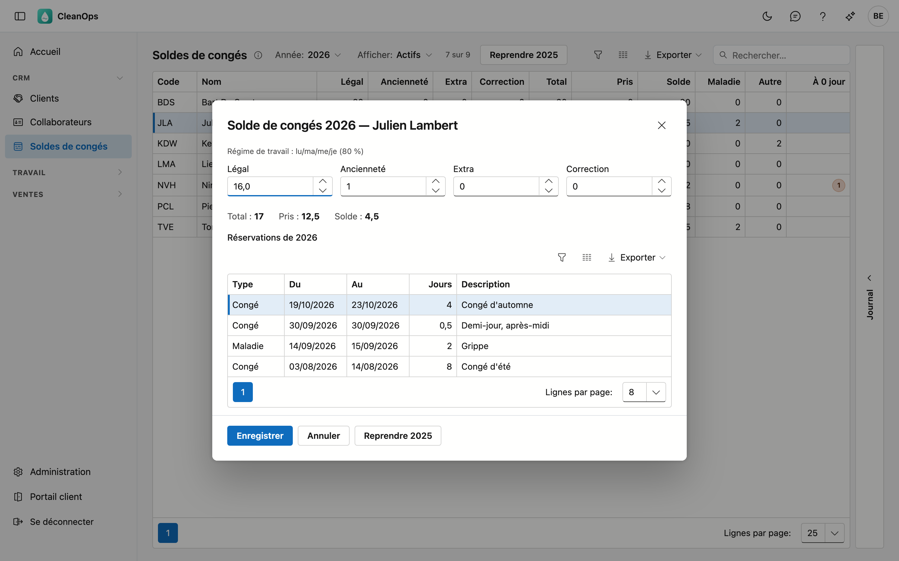

# Soldes de congés

Par année, vous voyez combien de jours de congé chaque collaborateur reçoit, combien il en a déjà pris et ce qu'il
lui reste. Ici, vous encodez l'attribution ; les congés pris, CleanOps les calcule lui-même à partir des réservations
sur la [fiche collaborateur](medewerkers.fr.md#longlet-conges).

## Ouvrir l'écran

Dans le menu à gauche, sous **CRM**, cliquez sur **Soldes de congés**.

Vous ne voyez cet écran qu'avec le droit **Gérer les soldes de congés**. Un administrateur l'a d'office. Vous le
donnez à un autre collègue via un rôle sur l'écran [Rôles](beheer/rollen.fr.md) : celui qui réserve des congés ne voit
donc pas encore combien de jours il reste à un collègue.

## La liste

Par collaborateur, vous voyez le code, le nom et les chiffres de l'année choisie :

| Colonne | Explication |
|---|---|
| Légal | Les jours de congé légaux. |
| Ancienneté | Les jours d'ancienneté. |
| Extra | Les autres jours supplémentaires. |
| Correction | Un ajustement de cette seule année. Elle peut être négative et ne passe pas à l'année suivante. |
| Total | Légal + ancienneté + extra + correction. |
| Pris | Les jours de congé pris cette année — voir [Comment les congés pris sont comptés](#comment-les-conges-pris-sont-comptes). |
| Solde | Total moins pris. En rouge si plus de jours ont été pris qu'attribués. |
| Maladie, Autre | Les jours de maladie et d'autre absence de cette année, à titre d'information. Ils ne comptent pas dans le solde. |
| À 0 jour | Le nombre de réservations de congé de cette année à 0 jour. Vide s'il n'y en a pas — voir [Réservations à 0 jour](#reservations-a-0-jour). |

- **Année** — réglée sur l'année en cours. Vous choisissez de trois ans en arrière à l'année prochaine, pour pouvoir
  préparer une nouvelle année.
- **Afficher** — réglé sur **Actifs**. Choisissez **Pensionnés** ou **Tous** pour voir aussi les autres. Un
  emplacement comme *En attente* n'y figure jamais : ce n'est pas une personne.
- **Rechercher**, **trier** et **exporter** fonctionnent comme dans les autres listes.
- **Journal** — le volet à droite montre l'historique de l'attribution du collaborateur sélectionné, pour l'année
  choisie. S'il n'a encore rien reçu cette année-là, il n'y a encore rien.

## Comment les congés pris sont comptés

CleanOps ne conserve pas les congés pris, mais les recompte chaque fois à partir des réservations de l'onglet
**Congés** du collaborateur :

- uniquement les réservations de type **Congé** — maladie et autre ne comptent pas ;
- une réservation compte dans l'année où elle **commence**, même si elle passe le nouvel an ;
- par réservation, le nombre de jours que CleanOps a calculé lors de la réservation : les jours de travail selon le
  régime de travail, sans les [jours fériés et jours de fermeture](beheer/feestdagen.fr.md).

Si vous modifiez ou supprimez une réservation, le solde s'adapte donc de lui-même.

## Modifier l'attribution

Double-cliquez sur une ligne. La fenêtre montre en haut le régime de travail du collaborateur, ensuite les quatre
champs de l'attribution, et en bas ses réservations de congé de l'année, la plus récente en haut.

| Champ | Explication |
|---|---|
| Légal, Ancienneté, Extra | De 0 à 366, avec au plus un chiffre après la virgule. Les flèches avancent par demi-journée. |
| Correction | De −366 à 366, avec au plus un chiffre après la virgule. |

**Total**, **Pris** et **Solde** sous les champs se recalculent pendant que vous tapez. Cliquez sur **Enregistrer**
pour conserver, ou sur **Annuler** pour fermer la fenêtre sans rien modifier.

Avec le bouton **Reprendre 2025** (l'année avant l'année choisie), vous remettez pour ce seul collaborateur le légal,
l'ancienneté et l'extra de l'année précédente. CleanOps demande d'abord une confirmation ; la correction reste. Si le
collaborateur n'avait rien l'année précédente, la fenêtre le signale.

## Démarrer une nouvelle année

Choisissez la nouvelle année dans **Année** et cliquez sur le bouton avec l'année précédente, par exemple **Reprendre
2025**. Après confirmation, chaque collaborateur actif qui n'a encore rien reçu pour l'année choisie reçoit
l'attribution de l'année précédente : légal, ancienneté et extra — pas la correction, qui appartient à une seule année.

- Celui qui a déjà quelque chose pour l'année choisie n'est pas touché. Une attribution à 0 partout compte comme
  « encore rien ».
- En haut apparaît pour combien de collaborateurs l'attribution a été reprise.
- Modifiez ensuite par collaborateur ce qui doit changer, par exemple un jour d'ancienneté en plus.

## Réservations à 0 jour

!!! warning "Une réservation de congé à 0 jour ne compte pas"
    Les réservations de congé reprises de l'ancien logiciel sont parfois à 0 jour : ce logiciel ne les calculait pas
    toujours. Une telle réservation ne compte pas dans **Pris**, et le solde paraît alors trop favorable.

La colonne **À 0 jour** indique combien il y en a. Dans la fenêtre du collaborateur, un message le signale, avec le
bouton **Vers le collaborateur** qui ouvre l'onglet **Congés** de sa fiche. Ouvrez-y la réservation et cliquez sur
**Enregistrer** : CleanOps calcule alors les jours selon le régime de travail.

Si la réservation tombe sur un jour où le collaborateur ne travaille pas selon son régime, elle reste à juste titre à 0.

## Questions fréquentes

**Le solde est en rouge.**
Le collaborateur a pris plus de congés qu'il ne lui en a été attribué — ou il n'a pas encore d'attribution cette
année, et le total est alors 0. Double-cliquez sur la ligne pour encoder l'attribution, ou utilisez
[Démarrer une nouvelle année](#demarrer-une-nouvelle-annee).

**Les congés pris diffèrent de ce que je suivais avant.**
CleanOps recompte chaque fois les congés pris à partir des réservations. Regardez en bas de la fenêtre quelles
réservations comptent, et dans la colonne **À 0 jour** s'il y a des réservations sans jours.

**Un collaborateur ne figure pas dans la liste.**
Regardez **Afficher** en haut et choisissez **Tous**. Un emplacement comme *En attente* n'y figure jamais.

**Qui a modifié une attribution ?**
Le [journal des actions](beheer/actielogboek.fr.md) indique qui a créé, modifié ou repris une attribution ; le volet
**Journal** montre par champ l'ancienne et la nouvelle valeur.

## Voir aussi

- [Collaborateurs](medewerkers.fr.md) — l'onglet Congés, où vous réservez les congés
- [Jours fériés](beheer/feestdagen.fr.md) — quels jours ne comptent pas
- [Rôles](beheer/rollen.fr.md) — qui peut ouvrir cet écran
