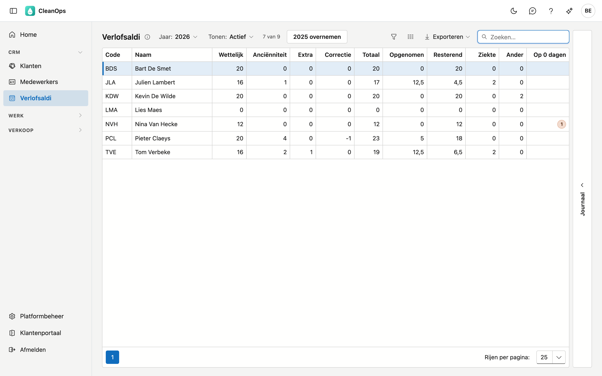
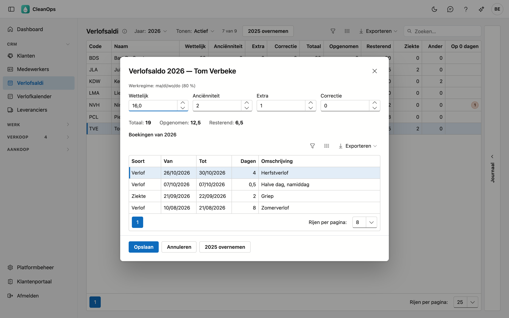

# Verlofsaldi

Per jaar ziet u hoeveel verlofdagen elke medewerker krijgt, hoeveel hij er al opnam en wat hem overblijft. Hier legt
u de toekenning vast; het opgenomen verlof rekent CleanOps zelf uit de verlofboekingen op de
[medewerkerfiche](medewerkers.md#het-tabblad-verlof).

## Het scherm openen

Klik links in het menu, onder **CRM**, op **Verlofsaldi**.

U ziet dit scherm enkel met het recht **Verlofsaldi beheren**. Een beheerder heeft het vanzelf. Een andere collega
geeft u het met een rol op het scherm [Rollen](beheer/rollen.md): wie verlof boekt, ziet daarmee nog niet hoeveel
dagen een collega overhoudt.

## De lijst

Per medewerker ziet u de code, de naam en de cijfers van het gekozen jaar:

| Kolom | Toelichting |
|---|---|
| Wettelijk | De wettelijke verlofdagen. |
| Anciënniteit | De dagen voor anciënniteit. |
| Extra | Andere bijkomende dagen. |
| Correctie | Een bijsturing van dit ene jaar. Ze mag negatief zijn en gaat niet mee naar een volgend jaar. |
| Totaal | Wettelijk + anciënniteit + extra + correctie. |
| Opgenomen | De verlofdagen die de medewerker dit jaar opnam — zie [Hoe het opgenomen verlof geteld wordt](#hoe-het-opgenomen-verlof-geteld-wordt). |
| Resterend | Totaal min opgenomen. In het rood als er meer opgenomen is dan toegekend. |
| Ziekte, Ander | De dagen ziekte en andere afwezigheid van dit jaar, ter informatie. Ze tellen niet mee in het saldo. |
| Op 0 dagen | Hoeveel verlofboekingen van dit jaar op 0 dagen staan. Leeg als er geen zijn — zie [Boekingen op 0 dagen](#boekingen-op-0-dagen). |

- **Jaar** — staat op dit jaar. U kiest van drie jaar terug tot volgend jaar, zodat u een nieuw jaar kunt voorbereiden.
- **Tonen** — staat op **Actief**. Kies **Op pensioen** of **Alles** om ook de anderen te zien. Een plaatshouder zoals
  *Afwachten* staat er nooit bij: dat is geen persoon.
- **Zoeken**, **sorteren** en **exporteren** werken zoals in de andere lijsten.
- **Journaal** — de strook rechts toont het logboek van de toekenning van de medewerker die u aanklikt, in het gekozen
  jaar. Heeft hij dat jaar nog niets gekregen, dan staat er nog niets in.

## Hoe het opgenomen verlof geteld wordt

CleanOps bewaart het opgenomen verlof niet, maar telt het telkens opnieuw uit de boekingen op het tabblad
**Verlof** van de medewerker:

- enkel boekingen van de soort **Verlof** — ziekte en ander tellen niet mee;
- een boeking telt in het jaar waarin ze **begint**, ook als ze over nieuwjaar loopt;
- per boeking het aantal dagen dat CleanOps bij het boeken rekende: de werkdagen volgens het werkregime, zonder de
  [feestdagen en sluitingsdagen](beheer/feestdagen.md).

Wijzigt of verwijdert u een boeking, dan past het saldo zich dus vanzelf aan.

## De toekenning wijzigen

Dubbelklik op een rij. Het venster toont bovenaan het werkregime van de medewerker, daaronder de vier velden van de
toekenning, en onderaan zijn verlofboekingen van dat jaar, de jongste bovenaan.

| Veld | Toelichting |
|---|---|
| Wettelijk, Anciënniteit, Extra | Van 0 tot 366, met hoogstens één cijfer na de komma. De pijltjes gaan per halve dag. |
| Correctie | Van −366 tot 366, met hoogstens één cijfer na de komma. |

**Totaal**, **Opgenomen** en **Resterend** onder de velden rekenen mee terwijl u typt. Klik op **Bewaren** om te
bewaren, of op **Annuleren** om het venster te sluiten zonder iets te wijzigen.

Met de knop **2025 overnemen** (het jaar vóór het gekozen jaar) zet u voor deze ene medewerker wettelijk, anciënniteit
en extra terug op die van vorig jaar. CleanOps vraagt eerst een bevestiging; de correctie blijft staan. Had de
medewerker vorig jaar niets, dan zegt het venster dat.

## Een nieuw jaar starten

Kies bij **Jaar** het nieuwe jaar en klik op de knop met het jaar ervoor, bijvoorbeeld **2025 overnemen**. Na een
bevestiging krijgt elke actieve medewerker die in het gekozen jaar nog niets kreeg, de toekenning van het jaar
ervoor: wettelijk, anciënniteit en extra — niet de correctie, want die hoort bij één jaar.

- Wie in het gekozen jaar al iets heeft, blijft ongemoeid. Een toekenning met overal 0 telt als "nog niets".
- Bovenaan verschijnt voor hoeveel medewerkers de toekenning overgenomen is.
- Wijzig daarna per medewerker wat anders moet, bijvoorbeeld een extra dag anciënniteit.

## Boekingen op 0 dagen

!!! warning "Een verlofboeking op 0 dagen telt niet mee"
    Verlofboekingen die uit het vorige pakket overgezet zijn, staan soms op 0 dagen: dat pakket rekende ze niet altijd
    uit. Zo'n boeking telt niet mee in **Opgenomen**, en het saldo lijkt dan te gunstig.

De kolom **Op 0 dagen** toont hoeveel het er zijn. In het venster van de medewerker staat daarover een melding met de
knop **Naar de medewerker**, die het tabblad **Verlof** van zijn fiche opent. Open daar de boeking en klik op
**Bewaren**: CleanOps rekent dan de dagen volgens het werkregime.

Valt de boeking op een dag waarop de medewerker volgens zijn werkregime niet werkt, dan blijft ze terecht op 0.

## Veelgestelde vragen

**Resterend staat in het rood.**
De medewerker nam meer verlof op dan hem toegekend is — of hij heeft dit jaar nog geen toekenning, en dan is het
totaal 0. Dubbelklik op de rij om de toekenning in te vullen, of gebruik [Een nieuw jaar starten](#een-nieuw-jaar-starten).

**Opgenomen verschilt van wat ik vroeger bijhield.**
CleanOps telt het opgenomen verlof telkens opnieuw uit de boekingen. Kijk onderaan het venster welke boekingen
meetellen, en in de kolom **Op 0 dagen** of er boekingen zonder dagen zijn.

**Een medewerker staat niet in de lijst.**
Kijk bovenaan bij **Tonen** en kies **Alles**. Een plaatshouder staat er nooit bij.

**Wie heeft een toekenning gewijzigd?**
Het [actielogboek](beheer/actielogboek.md) houdt bij wie een toekenning aanmaakte, wijzigde of overnam; de strook
**Journaal** toont per veld de oude en de nieuwe waarde.

## Zie ook

- [Medewerkers](medewerkers.md) — het tabblad Verlof, waar u verlof boekt
- [Feestdagen](beheer/feestdagen.md) — welke dagen niet meetellen
- [Rollen](beheer/rollen.md) — wie dit scherm mag openen
