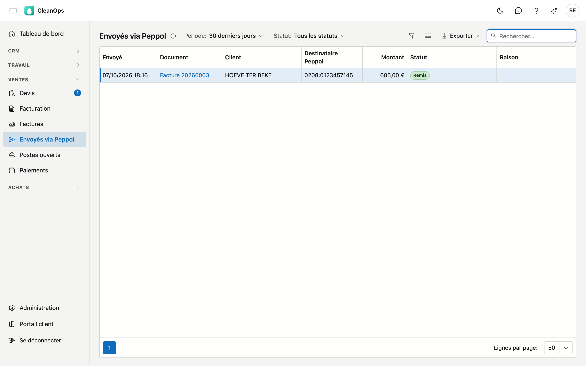

# Envoyés via Peppol

Envoyés via Peppol montre les factures et notes de crédit que CleanOps a envoyées en factures électroniques via Peppol, et si
elles sont arrivées chez le client. Utilisez cet écran pour vérifier qu'une facture électronique a été remise, et pour retrouver
un envoi échoué.

## Ouvrir l'écran

Cliquez à gauche dans le menu, sous **Ventes**, sur **Envoyés via Peppol**. Vous le voyez avec le droit de consulter la
facturation.

## La liste

Choisissez en haut la **Période** (les 7 ou 30 derniers jours, les 90 derniers jours ou les 12 derniers mois) et éventuellement un
**Statut**.

| Colonne | Contenu |
|---|---|
| Envoyé | Quand la facture électronique est partie. |
| Document | La facture ou la note de crédit. Cliquez dessus pour l'ouvrir. |
| Client | Pour qui. |
| Destinataire Peppol | L'identifiant Peppol vers lequel elle est partie. |
| Montant | Le total de la facture électronique. |
| Statut | Où en est la facture électronique (voir ci-dessous). |
| Raison | Pourquoi elle a échoué ou a été refusée. |

| Statut | Signification |
|---|---|
| Accepté | Le réseau Peppol a accepté la facture électronique — pas encore qu'elle est arrivée. |
| En file d'attente | Un incident temporaire ; ADM One l'envoie lui-même dès que possible. |
| En cours d'envoi | ADM One est en train de l'envoyer. |
| Incertain | On ne sait pas si le réseau l'a acceptée. ADM-Concept vérifie. |
| Remis | Elle est arrivée chez le client, généralement en moins d'une minute. |
| Échoué | Elle n'est pas arrivée. La raison figure dans la colonne Raison. |
| Refusé | Le client l'a refusée. La raison figure dans la colonne Raison. |

Double-cliquez sur une ligne pour ouvrir la facture. L'envoi se fait sur la facture elle-même, avec **Envoyer…** (voir
[Factures](facturen.fr.md)).

## Erreurs fréquentes

!!! warning "Accepté n'est pas encore remis"
    Si une facture électronique reste sur **Accepté**, le réseau n'a pas encore confirmé. Comptez en minutes, pas en secondes. Si
    elle y est encore après une heure, signalez-le à ADM-Concept.

!!! warning "Ne pas renvoyer en file d'attente ou incertain"
    ADM One envoie lui-même une facture électronique en file d'attente, et vérifie une incertaine. Un nouvel envoi n'est possible
    qu'en cas d'**Échoué** ou de **Refusé**.

## Questions fréquentes

**La liste est vide.**
CleanOps n'a pas envoyé de factures électroniques dans la période choisie. Choisissez une période plus longue. Si ADM One ne
répond pas, l'écran le dit séparément : ce n'est pas la même chose qu'« aucun envoi ».

**Je ne vois pas les factures électroniques de mon application précédente.**
La liste montre ce que CleanOps a envoyé. Une facture envoyée par votre application précédente est bien marquée comme envoyée
avec *Peppol*, mais son statut de remise n'est pas toujours disponible ici.

## Voir aussi

- [Factures](facturen.fr.md)
- [Fiche entreprise](beheer/bedrijfsfiche.fr.md)
- [Clients](klanten.fr.md)
