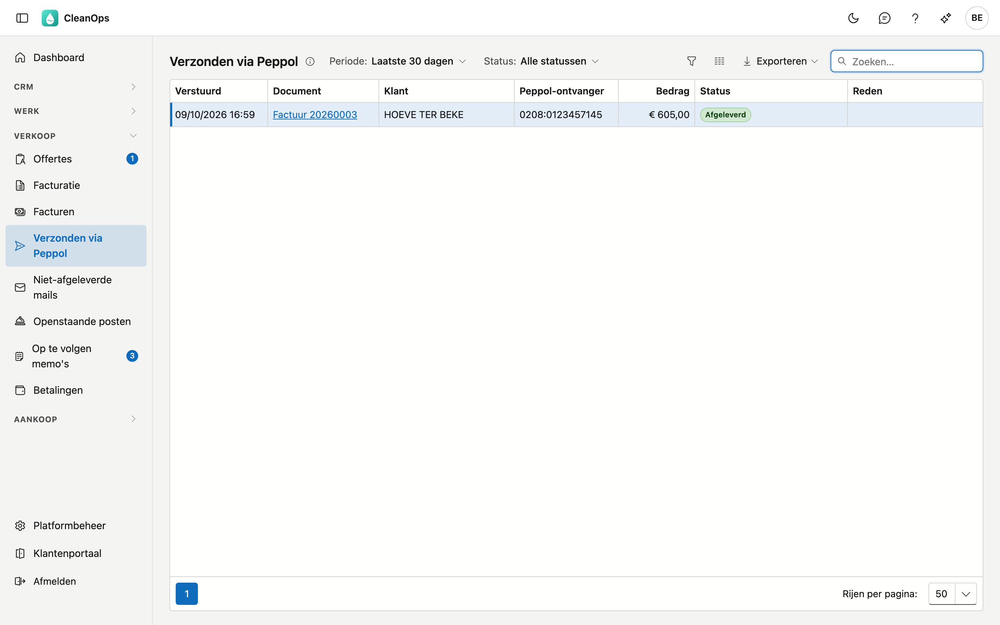

# Verzonden via Peppol

Verzonden via Peppol toont de facturen en creditnota's die CleanOps als e-factuur via Peppol verstuurde, en of ze bij de klant
aankwamen. Gebruik het scherm om na te gaan of een e-factuur afgeleverd is, en om een mislukte terug te vinden.

## Het scherm openen

Klik links in het menu, onder **Verkoop**, op **Verzonden via Peppol**. U ziet het met het recht om de facturatie te bekijken.

## De lijst

Kies bovenaan de **Periode** (de laatste 7 of 30 dagen, de laatste 90 dagen of de laatste 12 maanden) en eventueel een **Status**.
Twee keuzes groeperen: **Niet afgeleverd** (alles wat nog niet aankwam) en **Mislukt of geweigerd** (wat opnieuw moet). Raakte er
in de periode iets niet afgeleverd, of wacht er nog iets op de bevestiging van de ontvanger, dan zegt een melding boven de lijst
hoeveel.

| Kolom | Wat erin staat |
|---|---|
| Verstuurd | Wanneer de e-factuur vertrok. |
| Document | De factuur of creditnota. Klik erop om ze te openen. |
| Klant | Voor wie. |
| Peppol-ontvanger | Het Peppol-ID waarnaar ze vertrok. |
| Bedrag | Het totaal van de e-factuur. |
| Status | Waar de e-factuur nu is (zie hieronder). |
| Reden | Waarom ze mislukte of geweigerd werd. |

| Status | Wat het betekent |
|---|---|
| Aangeboden | Het Peppol-netwerk nam de e-factuur aan — nog niet dat ze aankwam. |
| In de wachtrij | Een tijdelijke storing; ADM One verstuurt ze zelf zodra het kan. |
| Wordt verstuurd | ADM One is ze aan het versturen. |
| Onzeker | Onbekend of het netwerk ze aannam. ADM-Concept zoekt het uit. |
| Afgeleverd | Ze kwam aan bij de klant, doorgaans binnen de minuut. |
| Mislukt | Ze kwam niet aan. De reden staat in de kolom Reden. |
| Geweigerd | De klant weigerde ze. De reden staat in de kolom Reden. |

Dubbelklik op een rij om de factuur te openen. Versturen doet u op de factuur zelf, met **Versturen…** (zie [Facturen](facturen.md)).

## Veelgemaakte fouten

!!! warning "Aangeboden is nog niet afgeleverd"
    Blijft een e-factuur op **Aangeboden** staan, dan kwam er nog geen bevestiging van het netwerk. Reken op minuten, niet seconden.
    Staat ze er na een uur nog, meld het dan aan ADM-Concept.

!!! warning "Niet opnieuw versturen bij In de wachtrij of Onzeker"
    ADM One verstuurt een e-factuur in de wachtrij zelf, en zoekt een onzekere uit. Opnieuw versturen kan pas bij **Mislukt** of
    **Geweigerd**.

## Veelgestelde vragen

**De lijst is leeg.**
In de gekozen periode verstuurde CleanOps geen e-facturen. Kies een langere periode. Antwoordt ADM One niet, dan zegt het scherm
dat apart: dat is iets anders dan "niets verstuurd".

**Ik zie de e-facturen van mijn vorige toepassing niet.**
De lijst toont wat CleanOps verstuurde. Een factuur die uw vorige toepassing verstuurde, staat wel op verstuurd met *Peppol*, maar
haar afleverstatus is hier niet altijd beschikbaar.

## Zie ook

- [Facturen](facturen.md)
- [Bedrijfsfiche](beheer/bedrijfsfiche.md)
- [Klanten](klanten.md)
