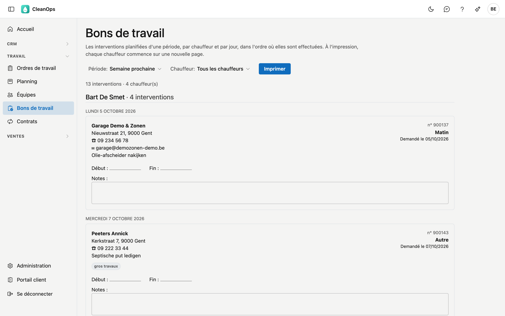

# Bons de travail

Sur Bons de travail, vous imprimez les bons que les chauffeurs emportent : tous les ordres de travail planifiés d'une
période, par chauffeur et par jour, dans l'ordre où ils sont effectués. Sur chaque bon, le chauffeur note à la main son
heure de début, son heure de fin et ses remarques.

## Ouvrir l'écran

Dans le menu de gauche, sous **Travail**, cliquez sur **Bons de travail**. L'écran s'ouvre sur aujourd'hui.

## Choisir une période et un chauffeur

- **Période** : choisissez **Aujourd'hui**, **Cette semaine**, **Semaine prochaine**, **Ce mois-ci** ou
  **Mois prochain**. Sous **Période libre**, vous indiquez vous-même une date de début et de fin, puis vous
  cliquez sur **Appliquer**. Les deux dates sont nécessaires, et la date de début ne peut pas être postérieure à la
  date de fin.
- **Chauffeur** : n'affiche que les bons de ce chauffeur. **Tous les chauffeurs** affiche tout le monde.

En haut figure le nombre d'interventions et de chauffeurs de la période.

## Quels ordres de travail figurent sur un bon

Un ordre de travail figure sur un bon de travail s'il a le statut **Planifié**, une date planifiée dans la période et
un chauffeur. Un travail sans date ou sans chauffeur ne peut pas figurer sur un bon : il n'y a ni jour ni personne à
qui le remettre. Vous planifiez les ordres de travail dans le [Planning](planning.fr.md).

Les bons sont classés par chauffeur, puis par jour, et dans la journée dans le même ordre que sur le
[tableau de planning](planning.fr.md#lordre-dans-une-journee).

## Ce qui figure sur un bon

| Partie | Contenu |
|---|---|
| Client | Le nom du client, avec le nom du chantier s'il y en a un. |
| Adresse, téléphone, e-mail | L'adresse d'exécution et son téléphone. L'e-mail est celui de l'adresse d'exécution, sinon celui du client. |
| En haut à droite | Le numéro de l'ordre de travail, la partie de la journée, l'accord d'heure (par exemple *Avant 17:00*) et la date demandée par le client (*Demandé le*). |
| Travail | La description du travail, les instructions et le matériel de l'ordre de travail. |
| Étiquettes | *appeler d'abord* (tant que le client n'a pas été rappelé), *attestation requise*, *gros travaux*, *rapport caméra*, *station d'épuration*, le véhicule et le convoyeur. |
| Début, Fin, Notes | Des cases que le chauffeur remplit à la main. Si l'heure de début ou de fin figure déjà sur l'ordre de travail, elle est sur la ligne. |

## Imprimer

**Imprimer** ouvre la fenêtre d'impression de votre navigateur. Sur papier :

- chaque chauffeur commence sur une **nouvelle page** : il emporte sa propre pile ;
- un bon n'est **jamais coupé** sur deux pages ;
- le **jour** reste avec le premier bon de ce jour.

Seuls les bons sont imprimés, pas le menu ni les boutons. **Imprimer** est grisé tant qu'il n'y a pas de bons.

## Questions fréquentes

**Un ordre de travail ne figure pas sur les bons.**
Il n'a pas le statut Planifié, pas de date planifiée dans la période ou pas de chauffeur. Ouvrez-le dans le
[Planning](planning.fr.md) ou dans les [Ordres de travail](werkorders.fr.md).

**Le message « Aucune intervention planifiée » apparaît, alors que du travail est planifié.**
Regardez la période et le chauffeur en haut : le message indique de quelles dates et de quel chauffeur il s'agit.

**Dans quelle langue sont les bons ?**
Dans la langue de votre écran. Les bons sont destinés à vos propres chauffeurs, pas au client.

**Je veux enregistrer un bon en PDF.**
Dans la fenêtre d'impression de votre navigateur, choisissez un PDF au lieu d'une imprimante (dans Chrome
*Enregistrer au format PDF*, sur un Mac le bouton **PDF**).

## Voir aussi

- [Planning](planning.fr.md)
- [Ordres de travail](werkorders.fr.md)
- [Collaborateurs](medewerkers.fr.md)
