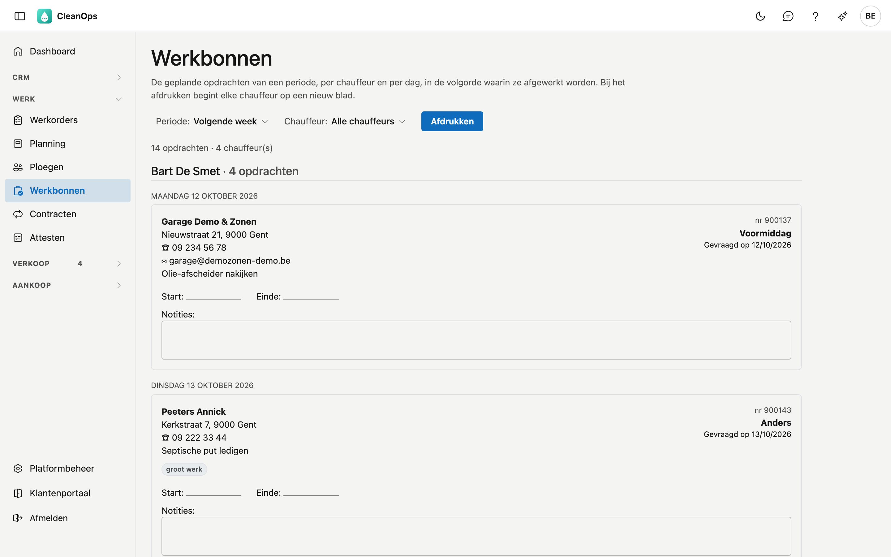

# Werkbonnen

Op Werkbonnen drukt u de bonnen af die de chauffeurs meekrijgen: alle geplande werkorders van een periode, per
chauffeur en per dag, in de volgorde waarin ze afgewerkt worden. Op elke bon vult de chauffeur zijn start- en einduur
en zijn notities met de hand in.

## Het scherm openen

Klik links in het menu, onder **Werk**, op **Werkbonnen**. Het scherm opent op vandaag.

## Een periode en een chauffeur kiezen

- **Periode**: kies **Vandaag**, **Deze week**, **Volgende week**, **Deze maand** of **Volgende maand**. Onder
  **Eigen periode** vult u zelf een begin- en einddatum in en klikt u op **Toepassen**. Beide datums zijn nodig, en
  de begindatum mag niet na de einddatum liggen.
- **Chauffeur**: toont enkel de bonnen van die chauffeur. **Alle chauffeurs** toont iedereen.

Bovenaan staat hoeveel opdrachten en chauffeurs er in de periode vallen.

## Welke werkorders op een werkbon komen

Een werkorder komt op een werkbon als ze de status **Gepland** heeft, een geplande datum in de periode en een
chauffeur. Werk zonder datum of zonder chauffeur kan niet op een bon: er is geen dag en niemand om hem aan te geven.
U plant werkorders in op de [Planning](planning.md).

De bonnen staan per chauffeur, dan per dag, en binnen de dag in dezelfde volgorde als op het
[planbord](planning.md#de-volgorde-in-een-dag).

## Wat er op een bon staat

| Deel | Wat erin staat |
|---|---|
| Klant | De naam van de klant, met de werfnaam als die er is. |
| Adres, telefoon, e-mail | Het uitvoeringsadres en zijn telefoon, anders die van de klant; staat er op de werkorder een ander nummer, dan komt dat erbij. De e-mail is die van het uitvoeringsadres, anders die van de klant. |
| Rechts bovenaan | Het nummer van de werkorder, het tijdsdeel (behalve *Anders*), de uurafspraak (bijvoorbeeld *Vóór 17:00*) en de datum die de klant vroeg (*Gevraagd op*). |
| Werk | De omschrijving van het werk, de instructies en het materiaal van de werkorder. |
| Labels | *eerst bellen* (als er nog niet teruggebeld is), *attest vereist*, *groot werk*, *cameraverslag*, *RWZI*, het voertuig en de bijrijder. |
| Start, Einde, Notities | Vakken die de chauffeur met de hand invult. Staat het start- of einduur al op de werkorder, dan staat het op de lijn. |

## Afdrukken

**Afdrukken** opent het afdrukvenster van uw browser. Op papier:

- krijgt elke chauffeur **per dag een eigen blad**, met bovenaan zijn naam, zijn code en de dag: hij krijgt zijn eigen stapel
  mee, en een tweede dag begint niet halverwege een blad;
- wordt een bon **nooit over twee bladen** gesplitst.

Enkel de bonnen komen op papier, het menu en de knoppen niet. **Afdrukken** is grijs zolang er geen bonnen zijn.

## Veelgestelde vragen

**Een werkorder staat er niet bij.**
Ze heeft niet de status Gepland, geen geplande datum in de periode of geen chauffeur. Open ze op de
[Planning](planning.md) of in [Werkorders](werkorders.md).

**Er staat "Geen geplande opdrachten", maar er is wel werk gepland.**
Kijk naar de periode en de chauffeur bovenaan: de melding zegt over welke datums en welke chauffeur ze gaat.

**In welke taal staan de bonnen?**
In de taal van uw scherm. De bonnen gaan naar uw eigen chauffeurs, niet naar de klant.

**Ik wil een bon als PDF bewaren.**
Kies in het afdrukvenster van uw browser een PDF in plaats van een printer (in Chrome *Opslaan als PDF*, op een Mac de knop **PDF**).

## Zie ook

- [Planning](planning.md)
- [Werkorders](werkorders.md)
- [Medewerkers](medewerkers.md)
