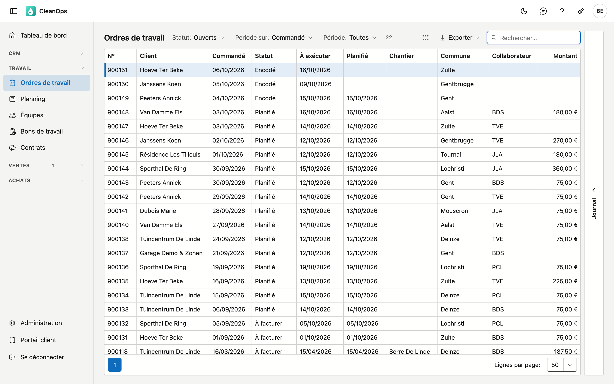
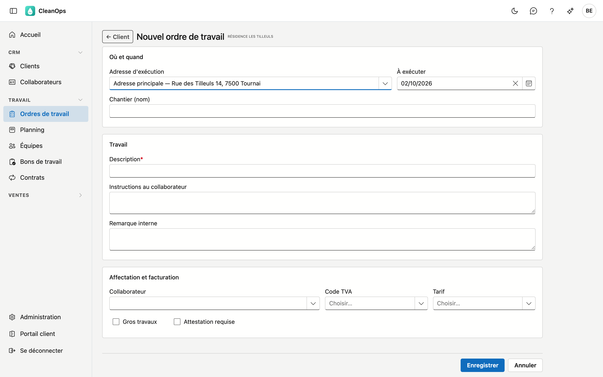
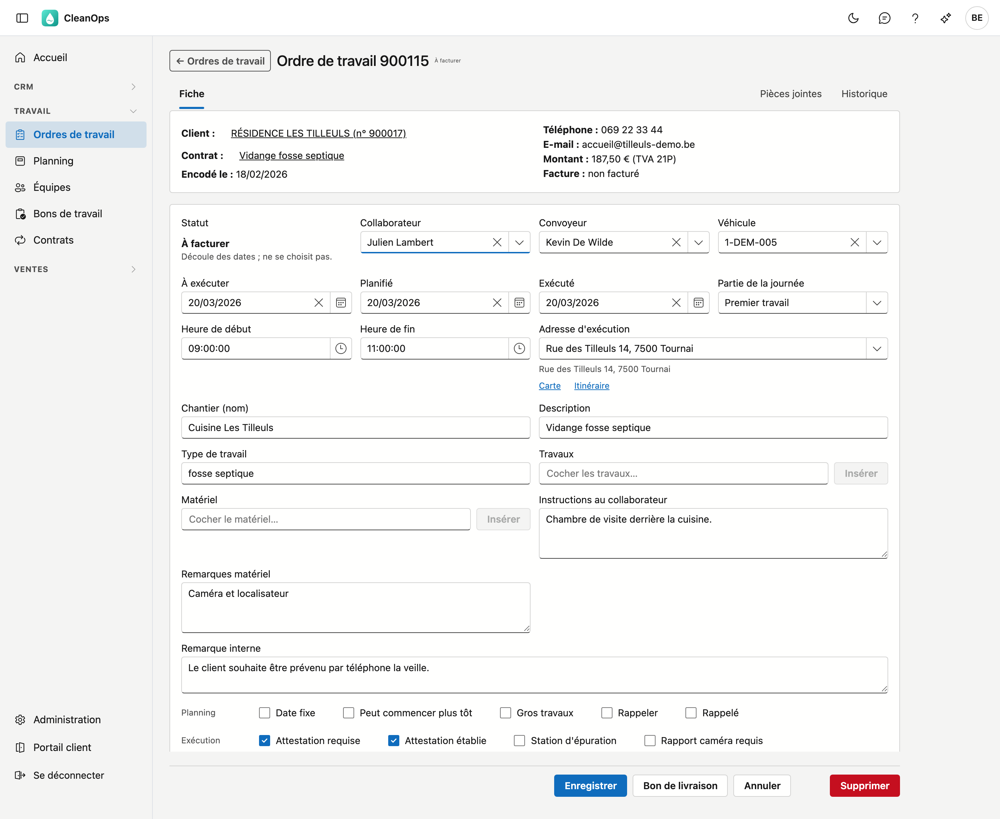
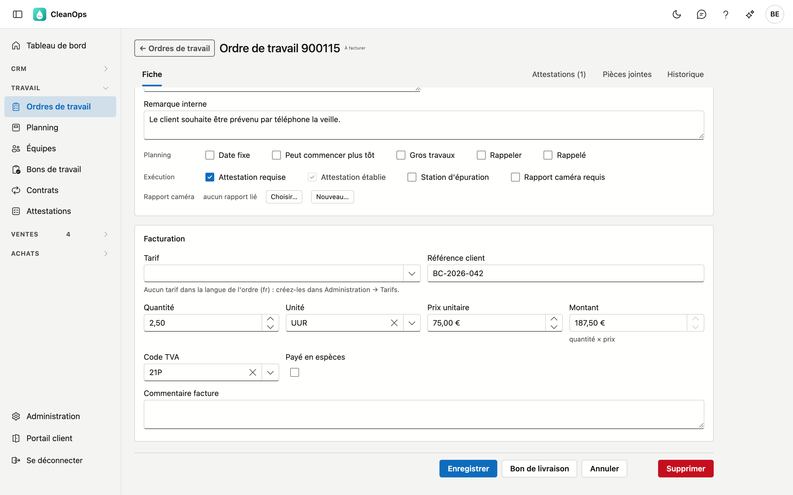
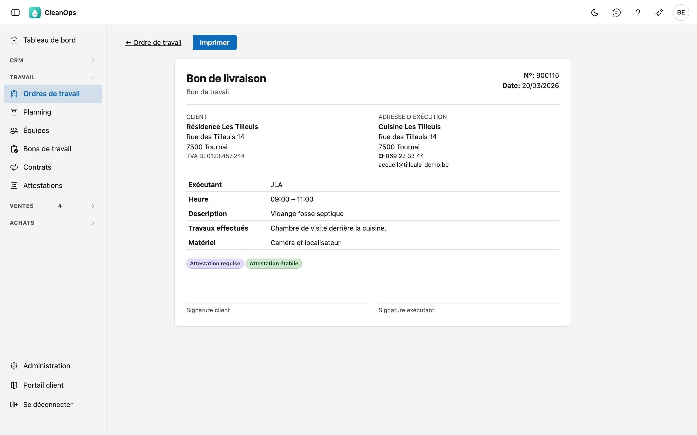
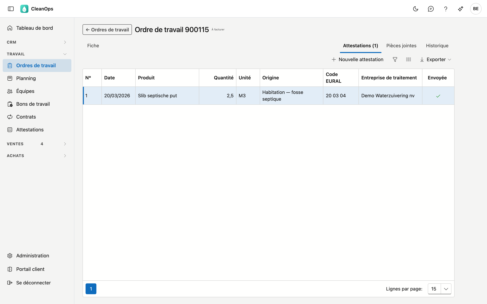

# Ordres de travail

Un ordre de travail est une mission pour vos équipes : ce qu'il faut faire, chez quel client, à quelle adresse,
quand et par qui. Les ordres de travail naissent d'un [contrat](contracten.fr.md), ou vous les créez vous-même pour
une mission ponctuelle.

## Ouvrir l'écran

Dans le menu de gauche, sous **Travail**, cliquez sur **Ordres de travail**.

## La liste

Pour chaque ordre, vous voyez le numéro, le client, la date de commande, le statut, les dates **Planifié** et
**Exécuté**, la commune, le **tarif** (le travail à faire), le collaborateur et le montant. Un ordre avec **Gros
travaux** apparaît en vert clair.

Contrat, À exécuter, Chantier, Quantité, Unité, Prix unit., Facture, Date facture et Comptant sont masqués par défaut,
pour que la liste tienne aussi sur un écran plus petit : le sélecteur de colonnes les affiche. Si un ordre est facturé, le
statut l'indique déjà ; le numéro de facture se retrouve aussi via **Rechercher**.

- **Statut** — la liste s'ouvre sur **Ouverts** : tout ce qui est encodé, planifié ou à facturer. Choisissez un
  statut, ou **Tous les statuts** pour voir aussi les ordres facturés.
- **Compteur** — à côté des filtres figure le nombre d'ordres de travail de la sélection. Si vous ouvrez la liste depuis le
  [tableau de bord](dashboard.md), c'est le chiffre de la tuile.
- **Période sur** et **Période** — choisissez d'abord la date sur laquelle vous filtrez (**Commandé**, **Planifié**
  ou **Exécuté**), puis la période. Avec **Planifié**, les choix fixes regardent vers l'avant ; avec **Commandé** et
  **Exécuté**, vers l'arrière.
- **Tarif** — tapez une partie de la description et choisissez le tarif : la liste ne montre alors que les ordres de
  travail avec ce tarif. Les tarifs archivés y figurent aussi, car des ordres plus anciens les portent encore. La croix
  efface votre choix.
- **Client** — le bouton **Ordres de travail** de la [fiche client](klanten.md#les-boutons-en-bas) ouvre cette liste
  avec uniquement les ordres de ce client, tous statuts confondus. En haut figure alors **Client :** suivi du nom ; la
  croix à côté affiche à nouveau les ordres de tous les clients.
- **Rechercher** — le curseur est directement dans le champ de recherche. La recherche porte sur le numéro, le client (par nom ou numéro de client),
  le chantier, l'adresse, le téléphone, le collaborateur, le véhicule, la description, les instructions, la remarque
  interne, le numéro de facture et le numéro de contrat. Les accents et les espaces n'ont pas d'importance : *Liege* trouve
  aussi *Liège*, et *0475123456* trouve aussi *0475 12 34 56*.
- **Trier** — cliquez sur un titre de colonne ; un second clic inverse l'ordre.
- **Exporter** — le bouton en haut à droite vous donne la liste, telle qu'elle est filtrée, sous forme de fichier. Si la
  sélection est trop grande pour un seul fichier, CleanOps indique combien de lignes il contient ; affinez alors votre
  filtre.
- **Ouvrir** — double-cliquez sur une ligne. Quand vous revenez à la liste, vos filtres sont toujours là.
- **Journal** — le volet de droite montre les pièces jointes et l'historique de l'ordre sélectionné dans la liste.

## Un nouvel ordre de travail

Un nouvel ordre de travail se crée depuis la fiche du [client](klanten.fr.md) : cliquez en bas sur
**Nouvel ordre de travail**. Ou commencez dans cette liste ou dans la [liste du planning](planning.fr.md#la-liste-du-planning) : cliquez en haut à droite sur
**Nouvel ordre de travail**, cherchez le client par nom ou numéro et cliquez sur **choisir**. **Annuler** vous ramène alors à la
liste, avec vos filtres.

| Champ | Explication |
|---|---|
| Adresse d'exécution | L'adresse principale du client ou l'une de ses adresses d'exécution. Si le client a exactement une adresse d'exécution, elle est déjà choisie (aussi pour un ordre issu d'un devis). L'instruction de travail, le matériel et les remarques de l'adresse sont repris sur l'ordre. Si l'adresse n'existe pas encore, cliquez sur **Nouvelle adresse d'exécution** ; **Ouvrir l'adresse** vous permet de modifier l'adresse choisie. Après **Enregistrer**, vous revenez avec cette adresse choisie et tout ce que vous aviez déjà rempli. Si des contrats sont en cours à l'adresse choisie, un message les cite ; si le travail appartient à un contrat, liez-le après l'enregistrement avec **Lier…** sur la fiche. **Historique…** montre les ordres précédents à cette adresse ; **Insérer** place les instructions, le matériel et la remarque interne de l'ordre choisi après ce qui figure déjà. |
| À exécuter | Le jour où le travail doit être fait. Si ce jour est déjà passé, CleanOps demande d'abord *Enregistrer quand même ?* lors de **Enregistrer** — enregistrer un travail après coup est permis. |
| Chantier (nom) | Un nom reconnaissable pour le lieu, 30 caractères au maximum. |
| Description * | Ce qu'il faut faire, 35 caractères au maximum. Si vous choisissez un tarif alors que le champ est vide ou porte encore le texte d'un tarif précédent, CleanOps y inscrit la description du tarif ; vous pouvez la modifier. Sur la facture figure le texte du tarif s'il y en a un, sinon cette description. |
| Instructions au collaborateur | Ce que l'équipe doit savoir sur place. |
| Remarque interne | Pour vos propres collaborateurs ; ce texte ne figure pas sur le bon de livraison. |
| Collaborateur, Code TVA, Tarif | Vous pouvez les choisir maintenant, ou plus tard sur la fiche. Si le collaborateur est absent à la date *À exécuter* (congé, maladie), un message le signale ; vous pouvez quand même le choisir. |
| Gros travaux, Attestation requise | Voir [les cases à cocher](#les-cases-a-cocher) plus bas. |

Au-dessus des champs, CleanOps signale ce que vous devez savoir avant d'encoder :

- le client est **bloqué** — vous pouvez continuer normalement ;
- le client ou l'adresse n'accepte **plus de nouvelles commandes** — à l'**enregistrement**, CleanOps demande d'abord
  *Enregistrer quand même ?* ;
- l'adresse est **difficilement ou pas accessible** certains jours — à titre d'information pour choisir une date.

Après **Enregistrer**, la fiche du nouvel ordre s'ouvre.

## La fiche de l'ordre de travail

En haut figurent le numéro et le statut. En dessous, une carte avec les faits autour de l'ordre : le client, le
contrat dont il est issu, le devis dont il découle, la date d'encodage, le téléphone de l'ordre, l'e-mail de l'adresse — ou du
client, si l'adresse n'en a pas —, le montant avec le code TVA, et la facture. Cliquez sur le client ou le contrat pour l'ouvrir. Si le client est bloqué,
**Client bloqué** figure à côté du nom ; vous pouvez continuer normalement.

### Lier un ordre de travail isolé à un contrat

Si un ordre de travail que vous avez créé vous-même appartient tout de même à un contrat, cliquez sur **Lier…** à côté de
**Contrat : non** et choisissez l'un des contrats en cours du client (un contrat en pause porte la mention *(en pause)*). S'il y a
déjà un ordre de travail ouvert pour ce contrat, la fenêtre l'indique, avec sa date : vérifiez qu'il ne s'agit pas d'un doublon.
**Lier** enregistre tout de suite.

Le lien est une étiquette. Le tarif, l'adresse et les instructions de l'ordre de travail restent tels quels, et l'ordre ne compte
pas comme un passage du contrat : les passages que le contrat crée lui-même s'y ajoutent normalement. La fiche indique *(lié à la
main)*, et **Détacher** retire le lien. Un ordre de travail issu du contrat lui-même ne peut pas être détaché, et un ordre
facturé ne peut plus être lié.

### Planification et exécution

| Champ | Explication |
|---|---|
| Statut | Découle des dates ; vous ne le choisissez pas vous-même. Voir [le statut](#le-statut). |
| Collaborateur, Convoyeur, Véhicule | Qui fait le travail, qui l'accompagne et avec quel véhicule. Comme convoyeur, vous choisissez parmi les collaborateurs désignés pour cela. Si le collaborateur est absent le jour planifié, un message figure sous son nom. |
| À exécuter | Si vous déplacez cette date, **Planifié** suit — tant que l'ordre n'est pas exécuté. |
| Planifié, Exécuté | Le jour où le travail est planifié et le jour où il a été fait. Si vous déplacez **Planifié** vers un jour déjà passé, CleanOps demande d'abord *Enregistrer quand même ?* lors de **Enregistrer**. |
| Partie de la journée | Premier travail, Matin, Après-midi, Journée entière ou Autre. Avec **Autre**, un accord d'heure apparaît : *avant*, *entre* ou *après* une heure. La partie de la journée détermine l'[ordre dans le planning](planning.fr.md#lordre-dans-une-journee). |
| Heure de début, Heure de fin | Quand le travail a réellement commencé et fini. Une heure de fin avant l'heure de début est refusée. |
| Adresse d'exécution | Si vous choisissez une autre adresse, son instruction de travail, son matériel et ses remarques s'ajoutent ; ce qui y figurait déjà reste. Sous l'adresse figure son numéro de téléphone (ou celui du client, si l'adresse n'en a pas), et **Carte** et **Itinéraire** ouvrent l'adresse et le chemin pour y aller dans Google Maps. Si l'adresse **n'accepte plus de nouvelles commandes**, ou si elle est **difficile ou impossible d'accès** certains jours, c'est indiqué en dessous aussi — à titre d'information : l'ordre de travail s'enregistre normalement. **Nouvelle adresse d'exécution** et **Ouvrir l'adresse** créent ou modifient une adresse ; après **Enregistrer**, elle est choisie — enregistrez alors l'ordre de travail. **Historique…** montre les ordres précédents à cette adresse, du plus récent au plus ancien ; choisissez-en un et cliquez sur **Insérer** (ou double-cliquez) : ses instructions, son matériel et sa remarque interne viennent après ce qui figure déjà — ce qui y est déjà ne s'ajoute pas une seconde fois. Enregistrez ensuite l'ordre. Le lien **Tous les ordres de cette adresse** ouvre la fiche de l'adresse dans un nouvel onglet. |
| Chantier (nom), Description | Comme pour un nouvel ordre. |
| Type de travail | Une courte description du travail, par exemple *fosse septique*. |
| Travaux, Matériel | Cochez ce qui s'applique et cliquez sur **Insérer** : les lignes choisies vont dans **Instructions au collaborateur** ou **Remarques matériel**, où vous pouvez encore les compléter. |
| Instructions au collaborateur, Remarques matériel | Ce que l'équipe doit faire et emporter. Les deux figurent sur le bon de livraison. |
| Remarque interne | Pour vos propres collaborateurs. |

Si l'ordre porte le code d'un collaborateur qui n'est plus dans la liste, vous voyez ce code suivi de
*n'est plus dans la liste*. Il reste jusqu'à ce que vous choisissiez quelqu'un d'autre.

### Les cases à cocher

| Ligne | Case | Signification |
|---|---|---|
| Planning | Date fixe | L'ordre ne peut pas être déplacé. L'emporte sur *Peut commencer plus tôt* si les deux sont cochées. Si vous modifiez la date planifiée sur la fiche, un message rappelle le jour convenu. |
| | Peut commencer plus tôt | Le travail peut être exécuté plus tôt que prévu. |
| | Gros travaux | Une mission importante ; elle figure comme étiquette sur le bon de livraison. |
| | Rappeler, Rappelé | Le client souhaite être appelé ; cochez la seconde case une fois que c'est fait. |
| Exécution | Attestation requise, Attestation établie | Une attestation accompagne ce travail. Vous ne cochez pas **Attestation établie** vous-même : elle est cochée dès que l'ordre de travail a une attestation (voir [Attestations](#attestations) plus bas). Les deux figurent comme étiquette sur le bon de livraison. |
| | Station d'épuration | Le travail concerne une station d'épuration. |
| | Rapport caméra requis | Un rapport caméra accompagne ce travail. |

### Le statut

| Statut | Quand |
|---|---|
| Encodé | Il n'y a pas encore de date planifiée. |
| Planifié | Il y a une date planifiée et un collaborateur. |
| À facturer | Il y a une date d'exécution. |
| Facturé | L'ordre figure sur une facture, ou le client a payé en espèces. |

Si vous modifiez une date, la fiche montre aussitôt le statut que l'ordre recevra à l'enregistrement.

### Facturation

En bas de la fiche figure ce qui sera facturé.

| Champ | Explication |
|---|---|
| Tarif | Choisissez un tarif, et CleanOps remplit l'unité, le prix unitaire, le code TVA et le commentaire de facture, ainsi que la description si vous n'y avez rien tapé vous-même. La quantité reste. Si vous videz le tarif, ces champs restent. |
| Référence client | Le numéro de commande ou la référence du client, 30 caractères au maximum. Figure sur la facture. |
| Quantité, Unité, Prix unitaire | Ce qui est facturé. Une correction se fait avec une quantité négative. |
| Montant | Quantité × prix unitaire, calculé par CleanOps. Le saisir à la main n'est possible que si la quantité et le prix unitaire sont tous deux à zéro, par exemple pour un forfait. |
| Code TVA | Le code TVA de l'ordre. |
| Payé en espèces | Le client a payé sur place. L'ordre ne passe alors pas en facturation. |
| Commentaire facture | Un texte qui figure sur la facture pour cet ordre. |

À l'enregistrement, CleanOps refuse deux choses : une unité sans quantité, et un prix unitaire négatif.

S'il manque un montant ou un code TVA, la fiche affiche **Pas encore facturable** avec ce qui manque. Vous pouvez
enregistrer l'ordre normalement, mais il n'arrive sur une facture que lorsque les deux sont remplis.

Une fois l'ordre facturé, ces données sont figées. S'il faut y changer quelque chose, créditez la facture.

### Le bon de livraison

**Bon de livraison** ouvre le bon que l'équipe emporte et que le client signe, dans la langue du client. On y trouve
le client, l'adresse d'exécution avec son téléphone et son e-mail (sinon ceux du client ; un autre numéro sur
l'ordre s'y ajoute), l'exécutant, l'heure, la description, les
instructions, le matériel et les signatures. **Imprimer** n'imprime que le bon.

Le bon montre ce qui est enregistré. Si vous avez modifié quelque chose, *enregistrez d'abord* apparaît à côté du
bouton, et vous ne pouvez l'ouvrir qu'après **Enregistrer**.

### Attestations

En haut à droite de la fiche figure l'onglet **Attestations**, avec le nombre d'attestations de traitement de cet ordre de
travail. **Nouvelle attestation** en établit une ; double-cliquez sur une attestation pour l'ouvrir, l'imprimer ou
l'envoyer par e-mail. Tout sur l'attestation elle-même se trouve dans [Attestations](attesten.fr.md).

### Pièces jointes et Historique

En haut à droite de la fiche figurent **Pièces jointes** — les documents de cet ordre — et **Historique** : qui a
modifié quel champ, quand, et de quelle valeur à quelle valeur.

!!! info "Tous les liens ne sont pas des liens pour tout le monde"
    Vous ne pouvez cliquer sur le numéro du devis ou de la facture que si vous avez accès à cette partie. Sinon, il
    figure comme texte.

## Supprimer un ordre de travail

**Supprimer**, en bas de la fiche, place l'ordre dans la [corbeille](beheer/prullenbak.fr.md). Un ordre facturé ne
peut pas être supprimé.

## Questions fréquentes

**Je ne peux pas choisir le statut.**
Le statut découle des dates. Remplissez une date planifiée et un collaborateur pour *Planifié*, une date d'exécution
pour *À facturer*.

**Je ne peux pas modifier le montant.**
Le montant vaut quantité × prix unitaire. Pour un montant propre, mettez la quantité et le prix unitaire à zéro. Si
l'ordre est facturé, il est figé.

**Le bouton Bon de livraison ne fonctionne pas.**
Vous avez modifié quelque chose qui n'est pas encore enregistré. Cliquez d'abord sur **Enregistrer**.

**Je reçois « Une unité sans quantité n'est pas possible ».**
Indiquez une quantité, ou videz l'unité.
