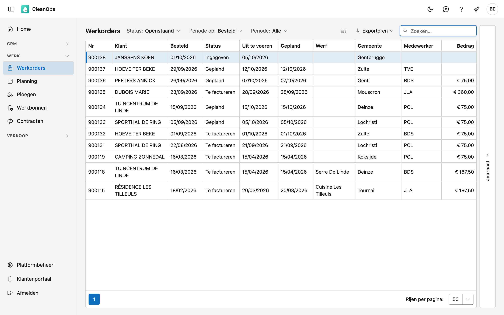
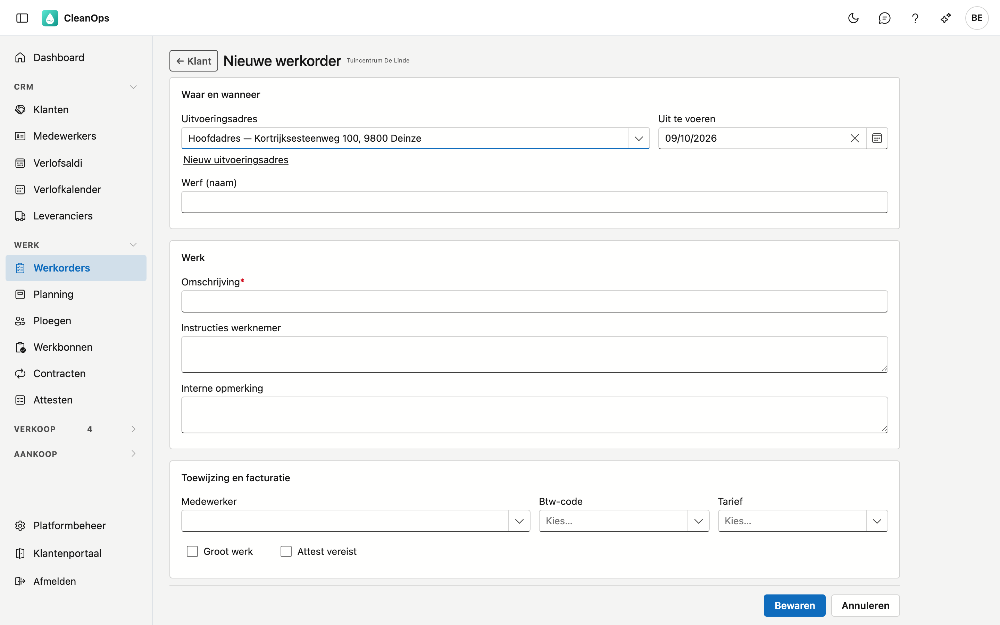
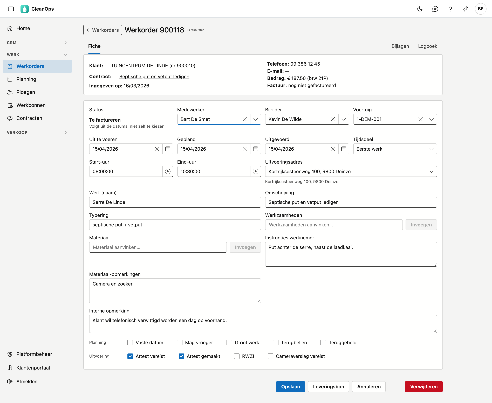
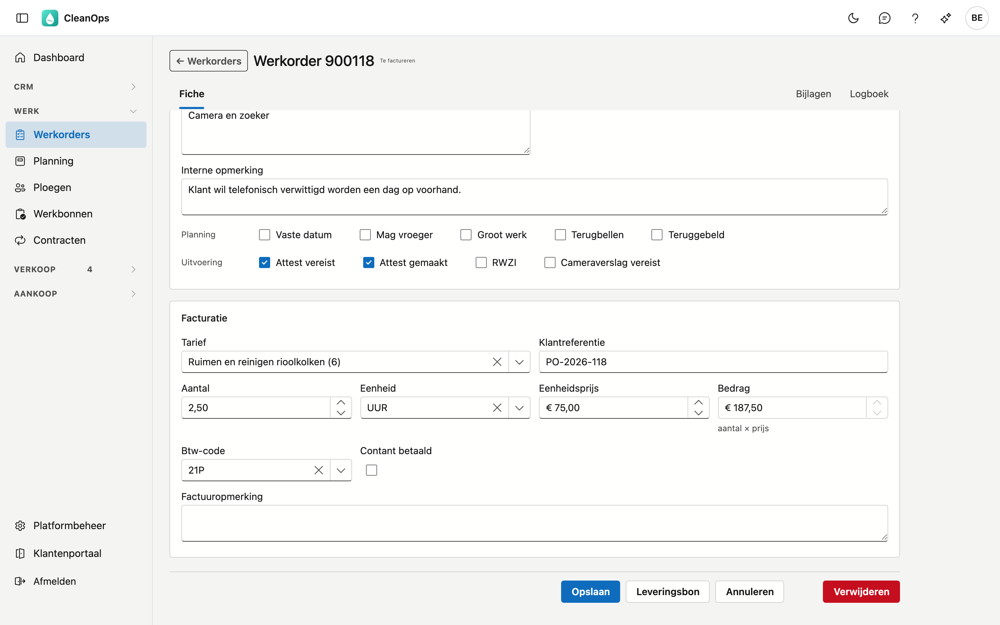
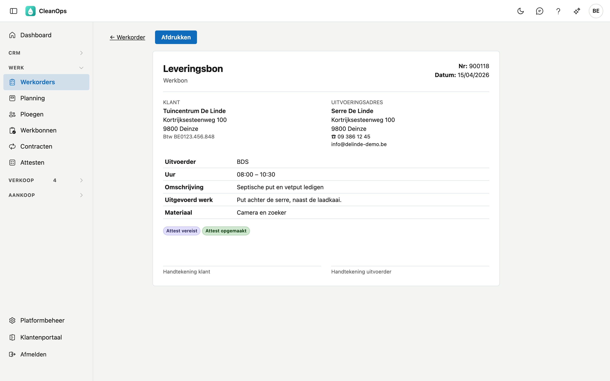
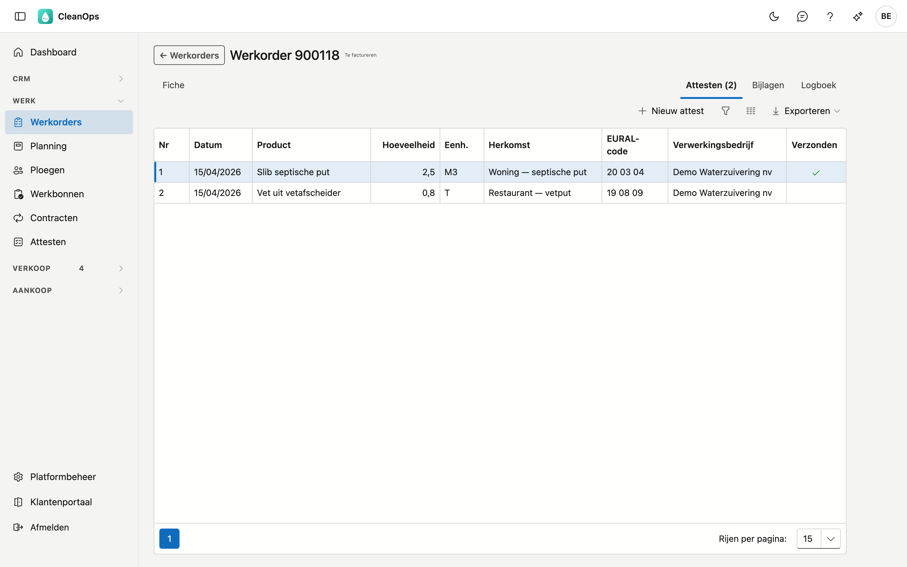

# Werkorders

Een werkorder is één opdracht voor uw ploegen: wat er moet gebeuren, bij welke klant, op welk adres, wanneer en door
wie. Werkorders ontstaan uit een [contract](contracten.md), of u maakt ze zelf aan voor een losse opdracht.

## Het scherm openen

Klik links in het menu, onder **Werk**, op **Werkorders**.

## De lijst

Per werkorder ziet u het nummer, de klant, de datum waarop ze besteld werd, de status, de datums **Gepland** en
**Uitgevoerd**, de gemeente, het **tarief** (wat er gedaan wordt), de medewerker en het bedrag. Een werkorder met
**Groot werk** staat lichtgroen.

Contract, Uit te voeren, Werf, Aantal, Eenheid, Eenheidsprijs, Factuur, Factuurdatum, Creditnota en Contant staan standaard verborgen,
zodat de lijst ook op een kleiner scherm past: met de kolomkiezer zet u ze erbij. Is een werkorder gefactureerd, dan zegt
de status dat al; het factuurnummer vindt u ook via **Zoeken**. De kolom **Creditnota** toont het nummer van de creditnota als de
factuur van de werkorder gecrediteerd is.

- **Status** — de lijst opent op **Openstaand**: alles wat ingegeven, gepland of te factureren is. Kies één status, of
  **Alle statussen** om ook de gefactureerde werkorders te zien.
- **Teller** — naast de filters staat hoeveel werkorders de selectie telt. Opent u de lijst vanaf het
  [dashboard](dashboard.md), dan is dat het getal van de tegel.
- **Periode op** en **Periode** — kies eerst op welke datum u filtert (**Besteld**, **Gepland**, **Uitgevoerd** of
  **Gefactureerd**), en dan de periode. Bij **Gepland** kijken de vaste keuzes vooruit, bij de andere terug.
  **Gefactureerd** filtert op de factuurdatum van het werk: zo vindt u alles wat in een bepaalde maand gefactureerd is.
  Werkorders die in uw vorige toepassing zonder factuurdatum staan, vindt u met deze keuze niet.
- **Tarief** — typ een deel van de omschrijving en kies het tarief: de lijst toont dan enkel de werkorders met dat
  tarief. Ook gearchiveerde tarieven staan erin, want oudere werkorders dragen ze nog. Het kruisje wist uw keuze.
- **Klant** — de knop **Werkorders** op de [klantfiche](klanten.md#de-knoppen-onderaan) opent deze lijst met enkel de
  werkorders van die klant, over alle statussen. Bovenaan staat dan **Klant:** met de naam; het kruisje ernaast toont
  weer de werkorders van alle klanten.
- **Zoeken** — de cursor staat meteen in het zoekveld. Er wordt gezocht in het nummer, de klant (op naam of klantnummer), de werf, het adres,
  het telefoonnummer, de medewerker, het voertuig, de omschrijving, de instructies, de interne opmerking, het
  factuurnummer en het contractnummer. Accenten en spaties maken niet uit: *Liege* vindt ook *Liège*, *0475123456*
  vindt ook *0475 12 34 56*, en *dewaele* vindt ook de klant *De Waele*.
- **Sorteren** — klik op een kolomtitel; nog eens klikken keert de volgorde om.
- **Exporteren** — via de knop rechtsboven krijgt u de lijst zoals ze nu gefilterd is als bestand. Is de selectie te
  groot voor één bestand, dan zegt CleanOps hoeveel regels erin staan; verfijn dan uw filter.
- **Openen** — dubbelklik op een rij. Keert u terug naar de lijst, dan staan uw filters er nog.
- **Journaal** — de strook rechts toont de bijlagen en het logboek van de werkorder die u in de lijst aanklikt.

## Een nieuwe werkorder

Een nieuwe werkorder maakt u op de fiche van de [klant](klanten.md): klik onderaan op **Nieuwe werkorder**. Of begin
in deze lijst of in de [planningslijst](planning.md#de-planningslijst): klik rechtsboven op **Nieuwe werkorder**, zoek de klant
op naam of nummer en klik op **kies**. **Annuleren** brengt u dan terug naar de lijst, met uw filters.

| Veld | Toelichting |
|---|---|
| Uitvoeringsadres | Het hoofdadres van de klant of een van zijn uitvoeringsadressen. Heeft de klant precies één uitvoeringsadres, dan staat dat al gekozen (ook bij een werkorder uit een offerte). De werkinstructie, het materiaal en de opmerkingen van het adres komen op de werkorder. Staat het adres er nog niet, klik dan op **Nieuw uitvoeringsadres**; met **Adres openen** past u het gekozen adres aan. Na **Bewaren** keert u terug, met dat adres gekozen en alles wat u al invulde. Lopen er op het gekozen adres contracten, dan noemt een melding ze; hoort de opdracht bij een contract, koppel ze dan na het bewaren met **Koppelen…** op de fiche. **Historiek…** toont de vorige werkorders op dat adres; met **Invoegen** komen de instructies, het materiaal en de interne opmerking van de gekozen werkorder achter wat er al staat. |
| Uit te voeren | De dag waarop het werk moet gebeuren. Ligt die dag al achter u, dan vraagt CleanOps bij **Bewaren** eerst *Toch inboeken?* — werk achteraf inboeken mag. |
| Werf (naam) | Een herkenbare naam voor de plaats, hoogstens 30 tekens. |
| Omschrijving * | Wat er moet gebeuren, hoogstens 35 tekens. Kiest u een tarief terwijl het veld leeg is of nog de tekst van een vorig tarief draagt, dan vult CleanOps de omschrijving van het tarief in; u kunt ze aanpassen. Op de factuur staat bij een tarief de tarieftekst, zonder tarief deze omschrijving. |
| Instructies werknemer | Wat de ploeg ter plaatse moet weten. |
| Interne opmerking | Voor uw eigen mensen; deze tekst komt niet op de leveringsbon. Kiest u een uitvoeringsadres, dan staat hier vanzelf de interne opmerking van de vorige werkorder op dat adres, met eronder uit welke werkorder ze komt; had die er geen, dan de opmerking van het adres zelf. U kunt de tekst aanpassen of wissen. Wat u zelf al typte, blijft staan. |
| Medewerker, Btw-code, Tarief | Mag u nu al kiezen, of later op de fiche. Is de medewerker afwezig op de datum *Uit te voeren* (verlof, ziekte), dan zegt een melding dat; u kunt hem toch kiezen. |
| Groot werk, Attest vereist | Zie [de vinkjes](#de-vinkjes) hieronder. |

Boven de velden meldt CleanOps wat u moet weten vóór u inboekt:

- de klant is **geblokkeerd** — u kunt gewoon verder;
- de klant of het adres aanvaardt **geen nieuwe opdrachten** — bij **Bewaren** vraagt CleanOps eerst *Toch inboeken?*;
- het adres is op sommige dagen **moeilijk of niet bereikbaar** — ter informatie bij het kiezen van een datum.

Na **Bewaren** opent de fiche van de nieuwe werkorder.

## De werkorderfiche

Bovenaan staan het nummer en de status. Daaronder een kaart met de feiten rond de werkorder: de klant, het contract
waaruit ze voortkomt, de offerte waaruit ze ontstond, de datum van ingave, de telefoon van de werkorder, het e-mailadres van het
adres — of van de klant, als het adres er geen heeft —, het bedrag met de btw-code, en de factuur. Klik op de klant of het contract om het te openen. Is de klant geblokkeerd, dan
staat er **Klant geblokkeerd** naast de naam; u kunt gewoon verder.

### Een losse werkorder aan een contract koppelen

Hoort een werkorder die u zelf aanmaakte toch bij een contract, klik dan naast **Contract: nee** op **Koppelen…** en kies een van
de lopende contracten van de klant (een gepauzeerd contract staat er met *(gepauzeerd)* bij). Loopt er al een open werkorder van
dat contract, dan noemt het venster die, met haar datum: kijk na of het geen dubbel is. **Koppelen** bewaart meteen.

De koppeling is een label. Het tarief, het adres en de instructies van de werkorder blijven zoals ze zijn, en de werkorder telt
niet als een beurt van het contract: de beurten die het contract zelf maakt, komen er gewoon bij. De fiche zegt *(met de hand
gekoppeld)*, en met **Ontkoppelen** haalt u de koppeling weer weg. Een werkorder die uit het contract zelf komt, kunt u niet
ontkoppelen, en een gefactureerde werkorder koppelt u niet meer.

### Planning en uitvoering

| Veld | Toelichting |
|---|---|
| Status | Volgt uit de datums, u kiest hem niet zelf. Zie [de status](#de-status). |
| Medewerker, Bijrijder, Voertuig | Wie het werk doet, wie meerijdt en met welk voertuig. Als bijrijder kiest u uit de medewerkers die daarvoor aangeduid zijn. Is de medewerker afwezig op de geplande dag, dan staat er een melding onder zijn naam. |
| Uit te voeren | Verzet u deze datum, dan schuift **Gepland** mee — zolang de werkorder niet uitgevoerd is. |
| Gepland, Uitgevoerd | De dag waarop het werk gepland staat en de dag waarop het gedaan is. Verzet u **Gepland** naar een dag die al voorbij is, dan vraagt CleanOps bij **Bewaren** eerst *Toch bewaren?*. |
| Tijdsdeel | Eerste werk, Voormiddag, Namiddag, Volledige dag of Anders. Bij **Anders** verschijnt een uurafspraak: *vóór*, *tussen* of *na* een uur. Het tijdsdeel bepaalt de [volgorde in de planning](planning.md#de-volgorde-in-een-dag). |
| Start-uur, Eind-uur | Wanneer het werk werkelijk begon en eindigde. Een eind-uur vóór het start-uur wordt geweigerd. |
| Uitvoeringsadres | Kiest u een ander adres, dan komen zijn werkinstructie, materiaal en opmerkingen erbij; wat er al stond, blijft staan. Onder het adres staat zijn telefoonnummer (of dat van de klant, als het adres er geen heeft), en openen **Kaart** en **Route** het adres en de weg ernaartoe in Google Maps. Aanvaardt het adres **geen nieuwe opdrachten**, of is het op sommige dagen **moeilijk of niet bereikbaar**, dan staat dat er ook onder — ter informatie: de werkorder bewaart gewoon. Met **Nieuw uitvoeringsadres** en **Adres openen** maakt of wijzigt u een adres; na **Bewaren** staat het gekozen — bewaar dan de werkorder. **Historiek…** toont de vorige werkorders op dit adres, de nieuwste eerst; kies er een en klik op **Invoegen** (of dubbelklik): zijn instructies, materiaal en interne opmerking komen achter wat er al staat — wat er al in staat, komt er niet nog eens bij. Bewaar daarna de werkorder. De link **Alle werkorders op dit adres** opent de adresfiche in een nieuw tabblad. |
| Werf (naam), Omschrijving | Zoals bij een nieuwe werkorder. |
| Typering | Een korte typering van het werk, bijvoorbeeld *septische put + vetput*. |
| Werkzaamheden, Materiaal | Vink aan wat van toepassing is en klik op **Invoegen**: de gekozen regels komen in **Instructies werknemer** of **Materiaal-opmerkingen**, waar u ze nog kunt aanvullen. |
| Instructies werknemer, Materiaal-opmerkingen | Wat de ploeg moet doen en meenemen. Beide komen op de leveringsbon. |
| Interne opmerking | Voor uw eigen mensen. |

Draagt de werkorder de code van een medewerker die niet meer in de lijst staat, dan ziet u die code met *niet meer in
de lijst* erbij. Ze blijft staan tot u iemand anders kiest.

### De vinkjes

| Rij | Vinkje | Betekenis |
|---|---|---|
| Planning | Vaste datum | De werkorder mag niet verplaatst worden. Wint van *Mag vroeger* als beide aangevinkt zijn. Wijzigt u op de fiche de geplande datum, dan herinnert een melding u aan de afgesproken dag. |
| | Mag vroeger | Het werk mag vroeger uitgevoerd worden dan gepland. |
| | Groot werk | Een grote opdracht; het staat als label op de leveringsbon. |
| | Terugbellen, Teruggebeld | De klant wil gebeld worden; vink het tweede aan zodra dat gebeurd is. |
| Uitvoering | Attest vereist, Attest gemaakt | Er hoort een attest bij dit werk. **Attest gemaakt** zet u niet zelf: het staat aan zodra de werkorder een attest heeft (zie [Attesten](#attesten) hieronder). Beide staan als label op de leveringsbon. |
| | RWZI | Rioolwaterzuiveringsinstallatie. |
| | Cameraverslag vereist | Er hoort een cameraverslag bij dit werk. |

### De status

| Status | Wanneer |
|---|---|
| Ingegeven | Er is nog geen geplande datum. |
| Gepland | Er is een geplande datum én een medewerker. |
| Te factureren | Er is een uitvoeringsdatum. |
| Gefactureerd | De werkorder staat op een factuur, of de klant betaalde contant. |

Wijzigt u een datum, dan toont de fiche meteen welke status de werkorder bij het bewaren krijgt.

### Facturatie

Onderaan de fiche staat wat er gefactureerd wordt.

| Veld | Toelichting |
|---|---|
| Tarief | De lijst toont de tarieven in de taal van de werkorder. Dat is de taal van de klant: wijzigt die, dan volgt een werkorder die nog niet gefactureerd is bij de eerstvolgende bewaring. Kies een tarief, en CleanOps vult de eenheid, de eenheidsprijs, de btw-code en de factuuropmerking in, en de omschrijving als u daar zelf niets typte. Het aantal blijft staan. Maakt u het tarief leeg, dan blijven die velden staan. |
| Klantreferentie | Het bestelnummer of de referentie van de klant, hoogstens 30 tekens. Komt op de factuur. |
| Aantal, Eenheid, Eenheidsprijs | Wat er gefactureerd wordt. Een correctie boekt u met een negatief aantal. |
| Bedrag | Aantal × eenheidsprijs, door CleanOps gerekend. Met de hand invullen kan enkel als aantal en eenheidsprijs allebei nul zijn, bijvoorbeeld voor een forfait. |
| Btw-code | De btw-code van de werkorder. |
| Contant betaald | De klant betaalde ter plaatse. De werkorder gaat dan niet naar de facturatie. |
| Factuuropmerking | Een tekst die op de factuur bij deze werkorder komt. |

Bij het bewaren weigert CleanOps twee dingen: een eenheid zonder aantal, en een negatieve eenheidsprijs.

Ontbreekt er een bedrag of een btw-code, dan staat er **Nog niet te factureren** met wat er ontbreekt. U kunt de
werkorder gewoon bewaren, maar ze komt pas op een factuur als beide ingevuld zijn.

Is de werkorder gefactureerd, dan liggen deze gegevens vast. Moet er iets aan veranderen, crediteer dan de factuur.
Is de factuur gecrediteerd, dan staat dat onder het factuurnummer op de fiche: *gecrediteerd met creditnota …*, met een link
naar de creditnota.

### De leveringsbon

Met **Leveringsbon** opent de bon die de ploeg meeneemt en de klant ondertekent, in de taal van de klant. Daarop
staan de klant, het uitvoeringsadres met zijn telefoonnummer en e-mailadres (anders die van de klant; een ander
nummer op de werkorder komt erbij), de naam van de uitvoerder, het uur, de omschrijving,
de instructies onder **Opdracht**, het materiaal en de handtekeningen. De datum staat er altijd als dag/maand/jaar.
Met **Afdrukken** drukt u enkel de bon af.

De bon toont wat bewaard is. Hebt u iets gewijzigd, dan staat naast de knop *eerst bewaren* en kunt u hem pas
openen na **Bewaren**.

### Attesten

Rechts bovenaan de fiche staat het tabblad **Attesten**, met het aantal verwerkingsattesten van deze werkorder. Met
**Nieuw attest** maakt u er een; dubbelklik op een attest om het te openen, af te drukken of te mailen. Alles over het
attest zelf staat bij [Attesten](attesten.md).

### Bijlagen en Logboek

Rechts bovenaan de fiche staan **Bijlagen** — de documenten bij deze werkorder — en **Logboek**: wie welk veld
wijzigde, wanneer, en van welke waarde naar welke.

!!! info "Niet elke link is voor iedereen een link"
    Het nummer van de offerte of de factuur kunt u enkel aanklikken als u dat onderdeel mag openen. Anders staat
    het er als tekst.

## Een werkorder verwijderen

**Verwijderen** onderaan de fiche legt de werkorder in de [prullenbak](beheer/prullenbak.md). Een gefactureerde
werkorder kunt u niet verwijderen.

## Veelgestelde vragen

**Ik kan de status niet kiezen.**
De status volgt uit de datums. Vul een geplande datum en een medewerker in voor *Gepland*, een uitvoeringsdatum voor
*Te factureren*.

**Ik kan het bedrag niet aanpassen.**
Het bedrag is aantal × eenheidsprijs. Wilt u een eigen bedrag, zet dan aantal en eenheidsprijs op nul. Is de werkorder
gefactureerd, dan ligt het vast.

**De knop Leveringsbon werkt niet.**
U hebt iets gewijzigd dat nog niet bewaard is. Klik eerst op **Bewaren**.

**Ik krijg "Een eenheid zonder aantal kan niet".**
Vul een aantal in, of maak de eenheid leeg.
